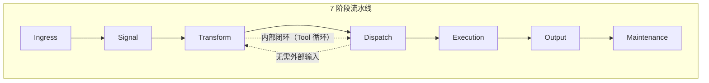
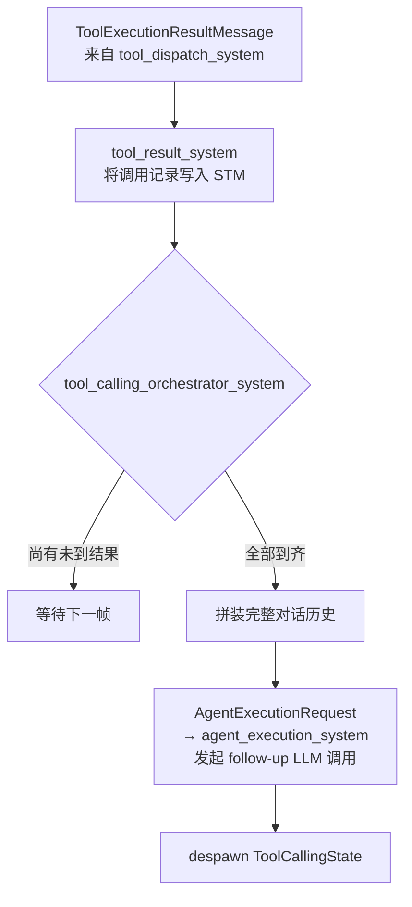
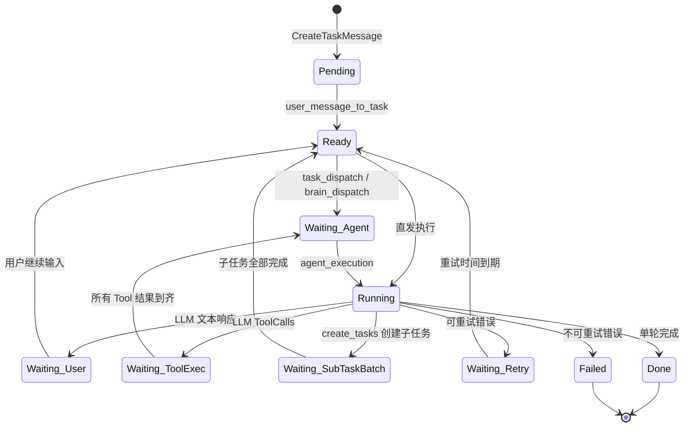
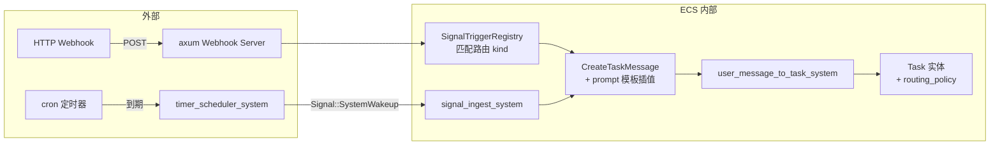

# AI Harness 数据流转指南

> 本文档以__数据流转__为主线，帮助项目评估者与架构审查者快速理解 AI Harness 框架的运转方式。
> 目标读者：具备软件工程基础但首次接触 AI Harness 的开发者。
>
> 本文档不涉及具体配置、环境变量或扩展机制。关于配置与扩展开发，请参考 [configuration.md](configuration.md) 与 [plugin-development.md](plugin-development.md)。

## 1. 框架全景

### 1.1 核心架构：ECS 流水线

AI Harness 构建在 Bevy ECS 之上，通过 __SystemSet__ 严格组织执行顺序。
每帧 `app.update()` 按以下 7 个阶段顺序执行：



两个要点：

- __外部输入__（用户键盘、IM 消息、Webhook）每次从 Ingress 进入，完整经过所有阶段。
- __Task 内部工作流__（Tool 调用循环、子任务调度）在 Transform ↔ Dispatch ↔ Execution 之间自动推进，依赖内部消息驱动，不等待外部输入。

### 1.2 阶段职责速览

| 阶段 | 一句话职责 | 数据形态变化典型 |
|------|-----------|----------------|
| __Ingress__ | 从外部世界采集输入 | 键盘事件 → `Signal` |
| __Signal__ | 瞬时信号转为标准化消息 | `Signal` → `UserInputMessage`/`RetryReadyMessage` |
| __Transform__ | 数据变换 + 状态迁移 + 响应处理 | `Message` → `Task` 实体；LLM 结果 → ToolCalls/文本输出 |
| __Dispatch__ | 决策分发 | Ready Task → `AgentExecutionRequest`；工具请求 → 工具执行 |
| __Execution__ | 提交异步 LLM 执行 | `AgentExecutionRequest` → tokio 通道 → 异步回注结果 |
| __Output__ | 推送给前端 | `UserOutputMessage` → EngineEvent → TUI/IM |
| __Maintenance__ | Agent 生命周期与记忆管理 | 创建/清理 Agent；压缩 STM；治理经验候选 |

### 1.3 数据分类

在管线中流转的数据分为两类：

- __实体（Entity）__：跨帧存活，承载状态。附加 Component 标记状态，多帧内被不同 System 查询和修改
- __消息（Message）__：ECS Message Component，通常单帧内消费。由一个 System 生产，由 Consumer System 消费后 despawn

## 2. 关键数据结构速览

### 2.1 实体类

| 数据结构 | 创建位置 | 一句话职责 | 生命周期 |
|---------|---------|-----------|---------|
| __Task__ | `user_message_to_task_system` | 用户意图的载体，贯穿全流程的主实体 | 创建 → 状态流转 → Done/Failed |
| __ShortTermMemory__ | 随 Task 同时创建 | 记录 Task 的对话历史（User/LLM/Tool 条目） | 随 Task 同生同灭 |
| __Agent__ | `load_agents_system` / `agent_factory_system` | LLM 执行能力的载体 | Persistent 永久；TaskScoped 随 Task 销毁 |
| __LongTermMemory__ | `init_agent_memory_system` | Agent 的跨任务知识沉淀，含衰退淘汰机制 | 随 Agent 持久化 |
| __ToolCallingState__ | `llm_response_system` | 跟踪 LLM 一次返回的多条 Tool 调用进度 | 跨帧存活，结果到齐后 despawn |
| __WorkItem__ | 治理触发 System | 摘要/评估/经验收集等内部治理工作的统一执行单元 | 创建 → 分发 → 执行 → 写回 |
| __SubTaskBatchState__ | `sub_task_batch_block_system` | 跟踪一批子任务的完成进度 | 全部完成后 despawn |

### 2.2 消息类

| 数据结构 | 生产者 | 消费者 | 传递内容 |
|---------|-------|-------|---------|
| __Signal__ | Ingress System / 重试检查 | `signal_ingest_system` | 外部事件的瞬时信号 |
| __UserInputMessage__ | `signal_ingest_system` | `command_parse_system` / 路由系统 | 标准化的用户文本输入 |
| __CreateTaskMessage__ | 路由系统 | `user_message_to_task_system` | "创建新任务"指令 |
| __ContinueTaskMessage__ | 路由系统 | `continue_task_system` | "继续已有对话"指令 |
| __AgentExecutionRequest__ | Dispatch / Transform | `agent_execution_system` | 含 prompt + 工具定义 + 对话历史的结构化 LLM 请求 |
| __AgentExecutionResult__ | 异步通道回注 | `ingest_execution_results_system` | LLM 返回的文本 / ToolCalls / 错误 |
| __ToolExecutionRequestMessage__ | `llm_response_system` | `tool_dispatch_system` | LLM 要求调用的工具名称与 JSON 参数 |
| __ToolExecutionResultMessage__ | `tool_dispatch_system` | `tool_result_system` / 编排系统 | 工具执行结果或错误 |
| __UserOutputMessage__ | `llm_response_system` | `frontend_output_system` | 展示给用户的 LLM 文本回复 |
| __SystemOutputMessage__ | 各 System | `frontend_output_system` | 系统通知（不进入 STM） |
| __ToolConfirmationRequest/Response__ | 工具系统 / 前端 | 前端 / 确认系统 | 工具使用审批请求与用户响应 |
| __SubTaskBatchCreatedMessage__ | `create_tasks` 工具 | `sub_task_batch_block_system` | 子任务批次创建 |
| __SubTaskCompletedMessage__ | `task_termination_system` | `sub_task_completion_system` | 子任务完成通知 |
| __AgentSpawnRequestMessage__ | `create_tasks` 工具 | `agent_factory_system` | TaskScoped Agent 创建请求 |

### 2.3 主线关系

```text
Task  →  为什么做，做到哪了
  ├── ShortTermMemory →  已经说了什么
  ├── delegate Agent  →  谁来执行
  └── WorkItem        →  还需要做的内部工作
```

## 3. 逐阶段展开

### 3.1 Ingress 阶段

__职责__：从外部世界采集输入，转换为 ECS 内部信号。

__System 清单：__

| System | 行为 |
|--------|------|
| `tick_clock_system` | 更新全局时钟 `Clock`，确保同帧内各 System 读取一致时间 |
| `frontend_input_system` | 轮询 TUI 前端：文本 → `Signal::user_input`；确认 → `ToolConfirmationResponseMessage` |
| `input_ingress_system` | 从 `InputReceiver` 通道读取外部输入（IM 消息 / Shutdown） |

__数据变化：__

```text
用户键盘文本     → Signal { kind: UserInput, payload: "帮我写个脚本" }
TUI 确认按钮     → ToolConfirmationResponseMessage
IM 通道消息      → ExternalInput::TextWithChannel → Signal::user_input
Shutdown 信号    → ShutdownState.requested = true
```

### 3.2 Signal 阶段

__职责__：将瞬时信号转换为标准化消息供下游消费。

__System 清单：__

| System | 行为 |
|--------|------|
| `retry_wakeup_system` | 轮询 Waiting(RetryBackoff) 的 Task，到达重试时间时 spawn `Signal::RetryWakeup` |
| `signal_ingest_system` | 消费所有 Signal 实体，转换为对应 Message 后 despawn Signal |

__数据变化：__

```text
Signal::UserInput      → UserInputMessage { content: "帮我写个脚本" }
Signal::RetryWakeup    → RetryReadyMessage { task_id: xxx }
```

### 3.3 Transform 阶段（核心）

__职责__：数据转换与状态迁移的核心层。System 最多、分支最密集。

__System 清单：__

| System | 行为 |
|--------|------|
| `command_parse_system` | 解析用户输入中的斜杠命令（`/btw`、`/finish`、`/summarize`、`/remember`） |
| `finish_task_system` | 消费 `FinishTaskMessage`，标记 Task 为 Done |
| `user_input_routing_system` | 路由决策：有 Waiting(User) 的 Task → 继续对话；无 → 创建新任务 |
| `user_message_to_task_system` | 创建 `(Task, ShortTermMemory)` 实体对 |
| `continue_task_system` | 追加用户输入到 STM，恢复 Task 为 Ready |
| `retry_ready_system` | 将 Task 从 Waiting(RetryBackoff) 恢复为 Ready |
| `ingest_execution_results_system` | 从异步 channel 读取 LLM 执行结果 |
| `llm_response_system` | __核心 System__：处理 LLM 结果 → 文本输出 / ToolCalls / 错误 |
| `tool_calling_orchestrator_system` | 收集 Tool 结果，全部到齐后拼装对话并发起 follow-up LLM 请求 |
| `tool_result_system` | 将 Tool 执行结果写入 STM |
| `task_termination_system` | Task 到达终态时清理状态、停止 shell session、发送子任务完成通知 |
| `sub_task_completion_system` | 更新 SubTaskBatchState，全部完成时唤醒父 Task |
| `sub_task_batch_block_system` | 将父 Task 阻塞为 Waiting(SubTaskBatch) |

#### 用户输入 → 任务创建

```mermaid
graph TD
    UIM[UserInputMessage] --> CP{command_parse_system}
    CP -->|"/finish"| FT[FinishTaskMessage]
    CP -->|"/summarize"| SR[SummarizationRequestMessage]
    CP -->|"/remember"| SK[写入 SharedKnowledgeBase]
    CP -->|普通文本| RS{user_input_routing_system}

    RS -->|有 Waiting(User) 的 Task| CT[ContinueTaskMessage]
    CT --> CTS[continue_task_system<br/>追加输入到 STM<br/>Task → Ready]

    RS -->|无 Waiting(User) 的 Task| CRM[CreateTaskMessage]
    CRM --> UMT[user_message_to_task_system<br/>创建 Task + STM 实体对]
```

创建后的 Task 实体初始状态：

```text
Task {
    id: Uuid::new_v4(),
    content: "帮我写个脚本",
    status: Pending,       → 随后变为 Ready
    delegate: None,
    multi_turn: true,       ← 支持多轮对话
    origin_channel: Some("tui:{user}"),  ← 来源通道
}
ShortTermMemory {
    entries: [{ role: User, content: "帮我写个脚本" }],
    estimated_tokens: ~10,
}
```

#### LLM 结果处理

```mermaid
graph TD
    AER[AgentExecutionResultMessage] --> LRS{llm_response_system}

    LRS -->|文本响应| UOM[UserOutputMessage<br/>→ 追加到 STM + 前端输出<br/>Task → Waiting(User)]
    LRS -->|ToolCalls| TCS[创建 ToolCallingState<br/>Task → Waiting(ToolExecution)]
    LRS -->|可重试错误| RET[Task.schedule_retry<br/>→ Waiting(RetryBackoff)]
    LRS -->|不可重试错误| FAI[Task.mark_failed]
```

ToolCallingState 的状态：

```text
ToolCallingState {
    task_id, agent_id,
    pending_tool_call_ids: ["call_abc", "call_def"],  ← LLM 请求调用的工具 ID 列表
    conversation: [历史消息 + 当前 Assistant 消息],
    iteration: 1,                                       ← 当前轮次
}
```

#### Tool 调用循环



#### Task 终态处理

```text
Task 变为 Done / Failed
    → task_termination_system:
        ├─ 清理 ToolCallingState
        ├─ 停止关联的 shell sessions
        ├─ 如果是子任务 → SubTaskCompletedMessage
        │   → sub_task_completion_system → 更新 BatchState
        │   → on_subtask_completed_check_waiting → 全部完成唤醒父 Task
        └─ 触发 Summarization WorkItem
```

### 3.4 Dispatch 阶段

__职责__：负责任务到 Agent 的分配决策和工具权限检查。

__System 清单：__

| System | 行为 |
|--------|------|
| `brain_dispatch_system` | Brain 模式：将 Ready Task 交给 Brain Agent 做智能调度决策 |
| `task_dispatch_system` | __核心 System__：按 tag 匹配 Agent + 构建含 STM/LTM 的 prompt |
| `workitem_dispatch_system` | 为治理型 WorkItem（摘要/评估/经验收集）匹配 Agent |
| `tool_dispatch_system` | 检查工具权限：Allow→执行 Confirm→审批 Deny→拒绝 |
| `evaluation_trigger_system` | 检测 Task 对话轮数，达到阈值时创建 Evaluation WorkItem |
| `approval_dispatch_system` | 处理父 Agent 审批请求（当前为 MVP 自动通过） |
| `tool_confirmation_result_system` | 处理用户对工具确认的响应 |

__分发决策流：__

```mermaid
graph TD
    T[Task { status: Ready }] --> BD{brain_dispatch_system}
    BD -->|Brain 启用| BRAIN[Brain Agent 决策<br/>→ 选择执行 Agent]
    BD -->|子任务 / 无 Brain| TD[task_dispatch_system<br/>tag 匹配 Agent]

    TD --> BUILD[构建 prompt<br/>Task.content + STM 历史 + LTM.Relevant]
    BUILD --> AER[AgentExecutionRequest<br/>→ agent_execution_system]

    TER[ToolExecutionRequestMessage] --> TDISP{tool_dispatch_system}
    TDISP -->|Allow| EXEC[直接执行<br/>→ ToolExecutionResultMessage]
    TDISP -->|Confirm| CF{有父 Agent?}
    CF -->|是| PAR[父 Agent 审批<br/>→ approval_dispatch_system]
    CF -->|否| USR[用户确认<br/>→ ToolConfirmationRequestMessage]
    TDISP -->|Deny| ERR[错误结果<br/>→ ToolExecutionResultMessage]
```

一次典型分发的 AgentExecutionRequest 结构：

```text
AgentExecutionRequest {
    agent_id: "default-llm-agent",
    request_kind: LlmCompletion,
    prompt: "帮我写个脚本",
    system_prompt: "[Agent 系统提示] + [LongTermMemory.Core] + [LongTermMemory.Relevant]",
    tools: [create_tasks, shell_exec, shell_start, ...],
    conversation: None,  ← 首次请求无结构历史
                          ← follow-up 时会携带完整 Conversation
}
```

### 3.5 Execution 阶段

__职责__：将 Agent 执行请求提交给异步运行时，不阻塞 ECS 主循环。

__System 清单：__

| System | 行为 |
|--------|------|
| `agent_execution_system` | 消费 AgentExecutionRequest，通过 genai → tokio 执行 LLM 调用 |
| `agent_termination_system` | Agent 终止时触发经验收集 |
| `experience_collection_dispatch_system` | 派发经验收集的 follow-up 请求 |

__数据变化：__

```text
AgentExecutionRequest → agent_execution_system:
    1. 通过 genai 构造 LLM API 请求（含 prompt + 工具定义 + 对话历史）
    2. 提交 tokio 异步执行
    3. 如果是 LlmCompletion → Task.status = Running
    4. 执行完成后通过 channel 回注结果

    异步完成后:
    → AgentExecutionResult
    → ingest_execution_results_system
    → llm_response_system 处理结果

    ★ 关键设计：Execution 阶段不阻塞 ECS 主循环。
      LLM 请求耗时较长时，其他 Task 可以继续推进。
```

### 3.6 Output 阶段

__职责__：将 ECS 内部状态变化推送给所有已注册前端。

__System 清单：__

| System | 行为 |
|--------|------|
| `frontend_output_system` | 将 UserOutputMessage/SystemOutputMessage/状态变更推送给前端 |
| `tool_confirmation_request_system` | 将审批请求转为前端可渲染的事件 |

__数据变化：__

```text
UserOutputMessage → frontend_output_system:
    → 追加到 STM（作为 Assistant 条目）
    → EngineEvent::UserOutput → TUI 渲染显示
    → 如有 origin_channel → 同时推送到对应的 IM 通道（Telegram/QQ）

ToolConfirmationRequestMessage:
    → EngineEvent::ApprovalRequest → TUI 显示确认弹窗
    → IM 通道用户收到文本："是否允许执行 shell_exec？\n1. 允许\n2. 拒绝"
    → 用户回复 "1" → 回注 ToolConfirmationResponseMessage

SystemOutputMessage:
    → EngineEvent::SystemNotification（系统通知，不进入 STM）
```

### 3.7 Maintenance 阶段

__职责__：Agent 生命周期管理、记忆压缩与经验治理。

__System 清单：__

| System | 行为 |
|--------|------|
| `load_agents_system` | Startup 阶段：加载 agents.toml，创建所有 Persistent Agent 实体 |
| `agent_factory_system` | 处理 AgentSpawnRequestMessage，创建 TaskScoped Agent |
| `memory_compression_system` | STM token 数超阈值 → 创建 Summarization WorkItem 压缩 |
| `summarization_dispatch_system` | 将摘要请求转换为 WorkItem |
| `experience_governance_system` | 治理经验候选：Knowledge → LTM；Skill → SKILL.md；default → IncubationProposal |
| `experience_collection_completion_system` | 经验收集完成后清理 TaskScoped Agent |

__数据变化：__

```text
agents.toml → load_agents_system（仅一次启动）
    → Agent 实体 { name: "default-llm-agent", kind: Persistent, tags: ["default"] }

AgentSpawnRequestMessage → agent_factory_system
    → Agent 实体 { kind: TaskScoped, parent_agent_id: xxx }
    → 随父 Task 终止而自动清理

STM.estimated_tokens > THRESHOLD
    → memory_compression_system
    → Summarization WorkItem
    → workitem_dispatch_system → 分发到 summarizer Agent 执行
    → 结果写回 STM.summary_prefix

Agent 终止
    → ExperienceCollection WorkItem
    → experience_governance_system:
        ├─ Knowledge → 父 Agent 的 LongTermMemory 追加
        ├─ Skill → 用户确认后写 SKILL.md 目录
        └─ default Agent → 生成 IncubationProposal（用于孵化新 Agent profile）
```

## 4. Task 状态机全景

### 4.1 状态定义

| 状态 | 含义 |
|------|------|
| `Pending` | 刚创建，尚未设置为 Ready |
| `Ready` | 就绪待分发 |
| `Running` | LLM 正在执行中 |
| `Waiting(reason)` | 等待某条件满足后继续 |
| `Done` | 成功完成 |
| `Failed(reason)` | 失败终止 |

### 4.2 完整状态流转



### 4.3 状态变更位置一览

| 迁移 | 发生阶段 | 触发 System |
|------|---------|------------|
| Pending → Ready | Transform | `user_message_to_task_system` |
| Ready → Waiting(Agent) | Dispatch | `task_dispatch_system` / `brain_dispatch_system` |
| Waiting(Agent) → Running | Execution | `agent_execution_system` |
| Running → Waiting(User) | Transform | `llm_response_system`（文本响应后） |
| Running → Waiting(ToolExec) | Transform | `llm_response_system`（LLM 返回 ToolCalls 后） |
| Running → Waiting(SubTaskBatch) | Transform | `sub_task_batch_block_system` |
| Running → Waiting(RetryBackoff) | Transform | `llm_response_system`（可重试错误） |
| Running → Done | Transform | `task_termination_system` |
| Running → Failed | Transform | `task_termination_system` |
| Waiting(User) → Ready | Transform | `continue_task_system` |
| Waiting(ToolExec) → Waiting(Agent) | Transform | `tool_calling_orchestrator_system`（结果到齐） |
| Waiting(RetryBackoff) → Ready | Signal + Transform | `retry_wakeup_system` → `retry_ready_system` |
| Waiting(SubTaskBatch) → Waiting(ToolExec) | Transform | `on_subtask_completed_check_waiting` |

## 5. 补充路径

### 5.1 信号触发路径（Webhook / Timer）

与用户交互不同，信号触发路径由外部事件或定时器驱动，无需等待人工输入。



__与用户输入任务的关键差异：__

| 维度 | 用户输入任务 | 信号触发任务 |
|------|------------|------------|
| origin_channel | 用户来源通道 | None（无用户来源） |
| output_channel | 同 origin_channel | routing_policy 指定 |
| approval_channel | 同 origin_channel | routing_policy 指定 |
| 审批交互 | TUI 弹窗 / IM 文本回复 | 通过 approval_channel 推送 |

### 5.2 IM 通道透传路径

当框架通过 Telegram、QQ 等 IM 平台接入时，数据流增加了一层"通道感知"。

```text
用户 IM 消息
  → Channel Adapter（轮询 / WebSocket）
  → ExternalInput::TextWithChannel { content, channel_id }
  → input_ingress_system → Signal::user_input
  → 正常流程 → Task.origin_channel = Some(channel_id)

LLM 文本回复
  → UserOutputMessage
  → frontend_output_system
  → 检查 Task.routing_policy.output_channel
  → 通过 ChannelManager.send() 推送到对应 IM 会话
  → 附加任务短 ID 前缀如 "[a1b2c3d4]"

审批请求（无 TUI 场景）
  → ToolConfirmationRequestMessage
  → IM 用户收到文本选项
  → 用户回复选项编号 → 回注 ConfirmationResponse
```

__IM 通道隔离规则：__

- 文本输入仅路由到同一通道中 Waiting(User) 的 Task
- 斜杠命令（`/finish`、`/summarize`、`/btw`）限定在发出通道内生效
- 子任务继承父任务的 origin_channel

## 附录：System 与阶段对照总表

| 阶段 | System | 主要消费数据 | 主要产出数据 |
|------|--------|------------|------------|
| Ingress | `tick_clock_system` | 系统时间 | Clock 资源 |
| Ingress | `frontend_input_system` | 前端轮询结果 | Signal, ToolConfirmationResponseMessage |
| Ingress | `input_ingress_system` | ExternalInput 通道 | Signal, ToolConfirmationResponseMessage |
| Signal | `retry_wakeup_system` | Task.status | Signal::RetryWakeup |
| Signal | `signal_ingest_system` | Signal | UserInputMessage, RetryReadyMessage |
| Transform | `command_parse_system` | UserInputMessage | 命令处理或放行 |
| Transform | `finish_task_system` | FinishTaskMessage | Task → Done |
| Transform | `user_input_routing_system` | UserInputMessage | CreateTaskMessage / ContinueTaskMessage |
| Transform | `user_message_to_task_system` | CreateTaskMessage | Task + STM 实体 |
| Transform | `continue_task_system` | ContinueTaskMessage | STM 追加 + Task → Ready |
| Transform | `retry_ready_system` | RetryReadyMessage | Task → Ready |
| Transform | `ingest_execution_results_system` | 异步通道 | AgentExecutionResultMessage |
| Transform | `llm_response_system` | AgentExecutionResultMessage | UserOutputMessage / ToolCallingState + 工具请求 |
| Transform | `tool_calling_orchestrator_system` | ToolExecutionResultMessage | follow-up AgentExecutionRequest |
| Transform | `tool_result_system` | ToolExecutionResultMessage | STM 记录 |
| Transform | `task_termination_system` | Task 终态 | 清理 + 子任务通知 |
| Transform | `sub_task_completion_system` | SubTaskCompletedMessage | SubTaskBatchState 更新 |
| Transform | `sub_task_batch_block_system` | SubTaskBatchCreatedMessage | 父 Task → Waiting(SubTaskBatch) |
| Dispatch | `brain_dispatch_system` | Task Ready | Brain 决策 / 执行请求 |
| Dispatch | `task_dispatch_system` | Task Ready | AgentExecutionRequest（含 prompt） |
| Dispatch | `workitem_dispatch_system` | WorkItem Pending | AgentExecutionRequest |
| Dispatch | `tool_dispatch_system` | ToolExecutionRequestMessage | ToolExecutionResultMessage / 审批请求 |
| Dispatch | `evaluation_trigger_system` | 对话轮数 | Evaluation WorkItem |
| Dispatch | `approval_dispatch_system` | ApprovalRequestMessage | 审批结果（MVP 自动通过） |
| Dispatch | `tool_confirmation_result_system` | ToolConfirmationResponseMessage | 恢复/取消工具执行 |
| Execution | `agent_execution_system` | AgentExecutionRequest | tokio 异步执行 + Task → Running |
| Execution | `agent_termination_system` | Agent 终止事件 | 经验收集触发 |
| Execution | `experience_collection_dispatch_system` | 经验收集触发 | ExperienceCollection WorkItem |
| Output | `frontend_output_system` | UserOutputMessage / SystemOutputMessage | EngineEvent → 前端/IM |
| Output | `tool_confirmation_request_system` | ToolConfirmationRequestMessage | 前端审批事件 |
| Maintenance | `load_agents_system` | agents.toml | Persistent Agent 实体 |
| Maintenance | `agent_factory_system` | AgentSpawnRequestMessage | TaskScoped Agent 实体 |
| Maintenance | `memory_compression_system` | STM 超阈值 | Summarization WorkItem |
| Maintenance | `summarization_dispatch_system` | SummarizationRequestMessage | Summarization WorkItem |
| Maintenance | `experience_governance_system` | 经验候选 | LTM 写入 / SKILL.md 生成 |
| Maintenance | `experience_collection_completion_system` | TaskScoped Agent | Agent 清理 |
