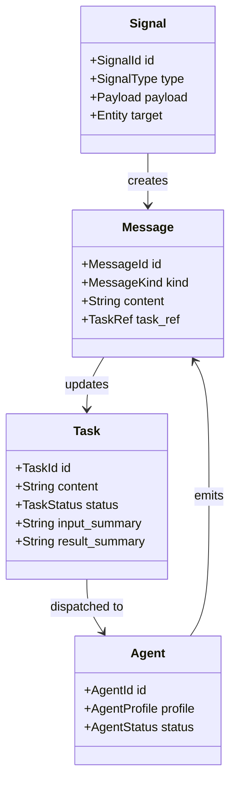
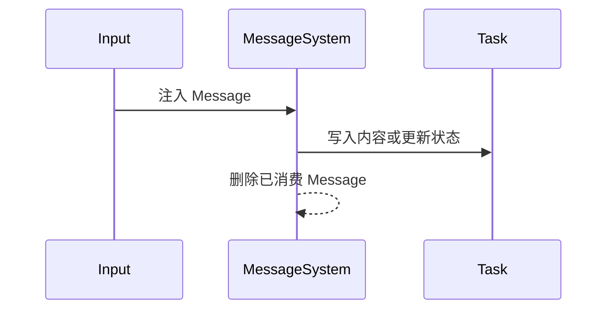
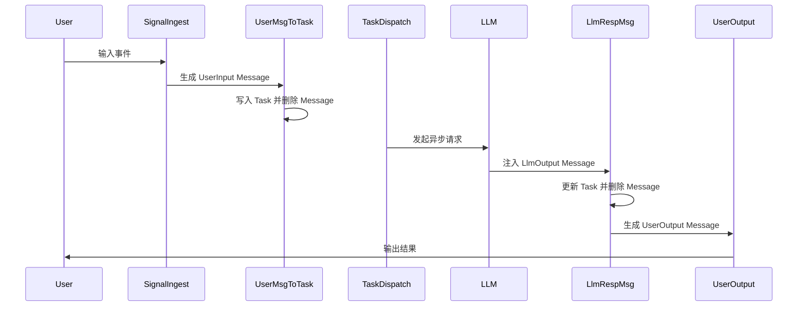

# Harness Core 设计（废弃）

> 此文档已废弃，新设计见 `docs/design/2026-05-10-core-flow-design.md`

## Harness Core 设计

本文档描述基于 Bevy ECS 的 AI Harness `core` 层设计。

这一版设计重点遵循两个约束：

- 层级保持简单，不构建复杂链式依赖
- 每个 system 只做一件容易理解的事，并且只和相邻阶段交互

当前第一批核心实体为：

1. `Agent`
2. `Message`
3. `Signal`
4. `Task`

其中最关键的约束是：

- `Task` 是主要的持久工作单元
- `Message` 只是处理中间态，不是长期上下文容器
- `Signal` 负责触发
- `Agent` 负责执行

## Core 目标

- 用最少的实体完成从输入到执行再到输出的闭环
- 让 system 的边界清晰，单看名字就能理解职责
- 避免 system 之间共享过多内部状态
- 避免实体之间形成深层级引用和长期链式关系
- 让后续增加 `Memory`、`Tool`、`Planner` 时仍能保持结构稳定

## 总体原则

### 1. 相邻层通信

推荐只允许相邻层传递数据，不允许 system 直接跨多层操作。

推荐路径：

`Signal -> Message -> Task -> Message -> Output`

或者：

`Task -> Signal -> Message`

这意味着：

- `Signal System` 不直接修改复杂任务逻辑
- `LLM Message System` 不直接决定调度策略
- `Output System` 不反向修改任务内部状态

### 2. Message 是短生命周期实体

`Message` 不是长期存在的上下文对象，而是阶段之间传输数据的中间载体。

例如：

- 用户输入先进入一个 `Message`
- 某个 message 处理 system 读取后，把内容写入 `Task`
- 该 `Message` 完成使命后立刻删除
- LLM 异步返回时，再重新注入一个新的 `Message`
- 后续 system 再消费它，并继续推进 `Task` 或输出给用户

因此，`Message` 更接近“处理管道中的信封”，而不是“会话历史”。

### 3. Task 承担稳定状态

真正需要长期保留的内容应该进入 `Task`，而不是停留在 `Message` 上。

例如：

- 当前用户目标
- 任务执行状态
- 已归并的输入摘要
- 当前等待原因
- 最终结果摘要

### 4. System 只做单向转换

每个 system 最好符合以下模式：

- 读取一种主要输入
- 产出一种明确结果
- 不顺手处理别的阶段逻辑

例如：

- `UserMessageToTaskSystem` 只负责把用户消息转成任务输入
- `TaskDispatchSystem` 只负责挑出可执行任务并发起执行
- `LlmResponseMessageSystem` 只负责消费 LLM 返回消息并更新任务

## 核心实体

### Agent

`Agent` 表示执行任务的智能体，但在 `core` 层中它不承担复杂消息历史管理。

建议职责：

- 持有身份信息
- 声明能力边界
- 标记当前是否可接单
- 作为任务执行方被调度

建议字段：

- `id`
- `profile`
- `status`
- `capabilities`
- `memory_ref`

建议保持简单：

- `Agent` 不存完整消息历史
- `Agent` 不直接拥有任务树
- `Agent` 不直接缓存大块上下文

### Message

`Message` 是一个短生命周期的中间处理实体，用于在不同 system 之间搬运一次性数据。

它的设计重点不是“保存历史”，而是“完成一次转换”。

典型来源：

- 用户输入
- LLM 异步输出
- 工具回调输出
- 系统内部转换结果

典型去向：

- 写入 `Task`
- 输出给用户
- 转成新的 `Signal`

建议字段：

- `id`
- `kind`: 如 `UserInput`、`LlmOutput`、`ToolOutput`、`UserOutput`
- `content`
- `source`
- `target`
- `task_ref`: 可选
- `created_at`

关键约束：

- `Message` 默认短生命周期
- `Message` 被处理后应尽快移除
- `Message` 不作为长期上下文来源
- `Task` 不应该长期持有 `Message` 实体引用

### Signal

`Signal` 是系统中的触发器，用于表达“需要开始某个动作”。

典型用途：

- 有新用户输入
- 某个任务可被调度
- LLM 请求已完成
- 某个等待状态应被唤醒

建议字段：

- `id`
- `type`
- `target`
- `payload`
- `created_at`
- `expiration_at`

关键约束：

- `Signal` 只表达触发，不表达长期业务状态
- `Signal` 应短生命周期
- `Signal` 可转为 `Message`，但不直接承担复杂业务更新

### Task

`Task` 是 `core` 层真正的中心实体，是唯一应该长期存在并持续演化的业务对象。

建议职责：

- 存储当前工作目标
- 存储已吸收的输入内容
- 存储当前执行状态
- 标记当前处理者和等待原因
- 存储最终输出摘要

建议字段：

- `id`
- `content`: 当前任务的标准化描述
- `creator`
- `delegate`
- `status`
- `input_summary`
- `result_summary`
- `waiting_reason`
- `priority`
- `created_at`
- `updated_at`

关键约束：

- `Task` 保存稳定状态
- `Task` 不依赖 `Message` 长期存在
- `Task` 之间关系尽量简单，默认不做复杂树结构

如果暂时不需要复杂拆解，甚至可以不引入 `parent_task`，先保持单层任务模型。

## 推荐的最简层级

为避免复杂链式依赖，建议在 `core` 层只保留以下简单层级：

1. 输入触发层：`Signal`
2. 中间搬运层：`Message`
3. 持久状态层：`Task`
4. 执行主体层：`Agent`

重点是：

- `Signal` 不挂在 `Task -> Message -> Signal` 的长链上
- `Message` 不成为长期节点
- `Task` 不维护大量子实体引用
- `Agent` 和 `Task` 的关系仅保持“谁在执行谁”

## Bevy ECS 落地建议

四类领域对象都可以映射为 ECS Entity，但不要过度依赖 Relationship。

推荐优先使用：

- 轻量组件
- 明确状态字段
- 通过 ID 或 `task_ref` 做关联

不推荐在 MVP 阶段引入过多实体关系图谱。

### 推荐组件拆分

#### Agent 组件

- `AgentId`
- `AgentProfile`
- `AgentStatus`
- `AgentCapabilities`

#### Message 组件

- `MessageId`
- `MessageKind`
- `MessageContent`
- `MessageSource`
- `MessageTarget`
- `MessageTaskRef`
- `MessageCreatedAt`

#### Signal 组件

- `SignalId`
- `SignalType`
- `SignalPayload`
- `SignalTarget`
- `SignalCreatedAt`
- `SignalExpiresAt`

#### Task 组件

- `TaskId`
- `TaskContent`
- `TaskCreator`
- `TaskDelegate`
- `TaskStatus`
- `TaskInputSummary`
- `TaskResultSummary`
- `TaskWaitingReason`
- `TaskPriority`

### Relationship 建议

推荐只保留最少关系：

- `Agent -> Task`: 当前执行关系，可选
- `Agent -> Agent`: 如果未来需要监督关系，再增加

不推荐在当前版本中维护：

- `Task -> Message` 长期关系
- `Message -> Message` 链式引用
- `Task -> Signal` 深度反查关系

## 核心关系图

这个关系图刻意保持简单，不表达长期持有关系，只表达数据流方向。

## Message 生命周期

`Message` 在系统中的典型生命周期如下：

1. 外部输入或异步结果进入系统，生成一个 `Message`
2. 对应的 message system 消费它
3. message system 将其内容写入 `Task`，或转成用户输出
4. `Message` 被移除

也就是说，`Message` 的生命周期通常只跨越一个处理阶段。

## 推荐 System 划分

为了让每个 system 易于理解并避免耦合，建议按“输入类型”而不是“业务大而全”来划分。

### 1. Signal Ingest System

职责：

- 扫描新产生的 `Signal`
- 将其转成对应的 `Message`
- 删除或标记已消费 `Signal`

只关心：

- `Signal -> Message`

不要负责：

- 任务创建
- LLM 调度
- 用户输出

### 2. User Message To Task System

职责：

- 读取 `kind = UserInput` 的 `Message`
- 根据内容创建新 `Task` 或更新已有 `Task`
- 将消息内容写入 `Task.content` 或 `Task.input_summary`
- 删除该 `Message`

只关心：

- `UserInput Message -> Task`

不要负责：

- 调度 LLM
- 决定最终输出

### 3. Task Dispatch System

职责：

- 查找 `Ready` 状态任务
- 选择一个可用 `Agent`
- 将任务标记为 `Running` 或 `WaitingLlm`
- 发起异步 LLM 请求

只关心：

- `Task -> 异步执行请求`

不要负责：

- 消费 LLM 返回消息
- 直接拼装用户输出

### 4. Llm Response Message System

职责：

- 读取 `kind = LlmOutput` 的 `Message`
- 将返回内容写回 `Task.result_summary` 或下一步输入槽位
- 根据结果更新 `Task.status`
- 如果需要输出给用户，则生成 `UserOutput Message`
- 删除已消费的 `LlmOutput Message`

只关心：

- `LlmOutput Message -> Task` 或 `LlmOutput Message -> UserOutput Message`

不要负责：

- 创建 LLM 请求
- 重新决定 Agent 调度策略

### 5. User Output System

职责：

- 读取 `kind = UserOutput` 的 `Message`
- 投递给 UI、CLI 或网络出口
- 删除该 `Message`

只关心：

- `UserOutput Message -> 外部输出`

不要负责：

- 任务状态推进
- LLM 交互

## 推荐主循环

如果按最简实现，主循环可以理解为：

1. `Signal Ingest System`
2. `User Message To Task System`
3. `Task Dispatch System`
4. `Llm Response Message System`
5. `User Output System`

其中：

- 用户输入从左往右推进
- LLM 结果通过异步回调重新注入 `Message`
- 不要求 system 彼此知道太多内部细节

## 主流程时序图

## 建议状态机

### Agent 状态

- `Idle`: 可接任务
- `Busy`: 正在执行
- `Offline`: 不参与调度

### Task 状态

- `Pending`: 刚创建，尚未整理完成
- `Ready`: 可以被分发
- `Running`: 正在处理
- `WaitingLlm`: 已发起异步请求，等待结果
- `Done`: 已完成
- `Failed`: 已失败

推荐最简流转：

`Pending -> Ready -> Running -> WaitingLlm -> Done`

失败路径：

`Running -> Failed`

或者：

`WaitingLlm -> Failed`

## 关键设计决策

### 1. Message 不做历史存储

这是本设计和传统消息队列式建模的最大不同。

在这里：

- `Message` 是中间态
- `Task` 是稳定态

这样做的好处是：

- system 更容易理解
- 不会出现 `Task` 长期依赖一堆 message 子实体
- 不会形成复杂链式遍历
- 异步输入和同步输入可以统一处理

### 2. System 只消费自己关心的 MessageKind

不同消息由不同 system 处理，例如：

- `UserInput` 只给 `User Message To Task System`
- `LlmOutput` 只给 `Llm Response Message System`
- `UserOutput` 只给 `User Output System`

这样每个 system 都很薄，也更不容易耦合。

### 3. Task 是唯一需要稳定演化的核心实体

只要一个需求需要被持续跟踪，它就应该体现在 `Task` 上，而不是残留在 `Message` 或 `Signal` 上。

## MVP 建议

最小版本只需要实现下面这条链路：

1. 用户输入生成 `Signal`
2. `Signal` 转为 `UserInput Message`
3. `UserInput Message` 写入 `Task` 并删除
4. `Task Dispatch System` 发起异步 LLM 请求
5. LLM 返回后注入 `LlmOutput Message`
6. `Llm Response Message System` 更新 `Task` 并删除消息
7. 如需展示，再生成 `UserOutput Message`
8. `User Output System` 输出并删除消息

这个模型足够简单，也足够支撑后续扩展。

## 下一步建议

在这个简化设计稳定后，再考虑增加：

- `Memory`
- `ToolCall`
- `Session`
- `Planner`

但建议继续保持同一个原则：

- 新能力优先通过新增独立 system 接入
- 不要让新能力反向污染已有 system 的职责
- 不要让 `Message` 重新变成长生命周期实体
