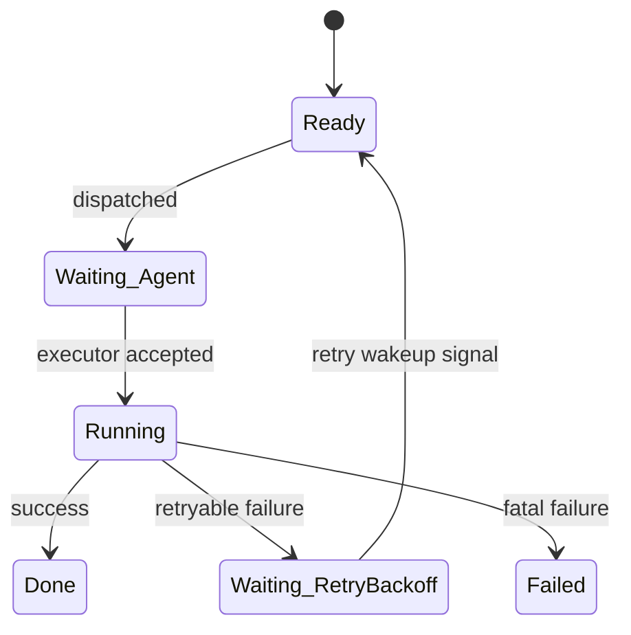
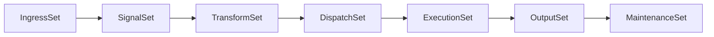
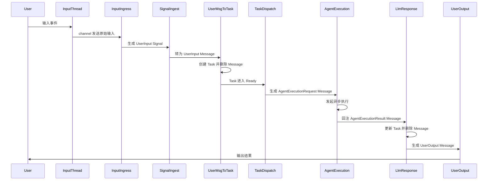
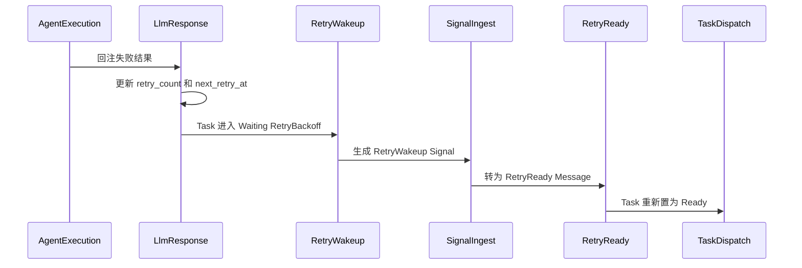
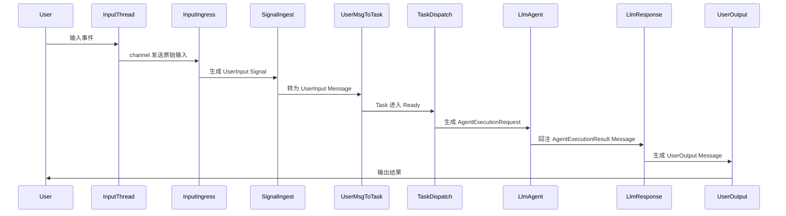

# Harness Core 流程深化设计

本文档是对当前 Harness Core 设计草案的补充和细化，重点解决以下关键缺口：

- 明确 `Signal` 只承担事件触发语义
- 补齐 `SystemSet` 编排，确保 Bevy 调度顺序可控
- 补齐异步执行与重试闭环
- 收敛 `TaskStatus`，避免重复状态字段
- 将 `TaskDispatchSystem` 与具体 LLM SDK 解耦
- 将“伪代码示意”和“Bevy 落地约束”分开描述

***

## 技术选型

| 依赖                | 版本/选择        | 说明                          |
| ----------------- | ------------ | --------------------------- |
| Bevy              | 最新稳定版（>0.18） | ECS 框架                      |
| Tokio             | 最新稳定版        | 异步运行时，执行 Agent 与 LLM SDK 依赖 |
| async-openai      | 最新版          | OpenAI API 兼容的 LLM 调用       |
| crossbeam-channel | 最新版          | 输入输出线程通信                    |
| tokio::sync::mpsc | Tokio 内置     | 异步执行结果回传                    |
| uuid              | 最新稳定版        | Task 和 Agent 标识             |
| tracing           | 最新稳定版        | 日志                          |
| thiserror         | 最新稳定版        | 库错误定义                       |
| anyhow            | 最新稳定版        | 应用错误处理                      |

***

## 一、核心原则

### 1. Signal 只表示触发事件

`Signal` 是瞬时事件，不承担长期业务状态，不作为上下文容器。

推荐语义：

- `Signal` 表示“某件事需要被系统注意到”
- `Signal` 可以携带轻量 `payload`
- `Signal` 只驱动下一阶段 system
- `Signal` 被消费后应尽快删除

典型例子：

- 用户输入到达
- 某个任务到达重试时间
- 外部信号到达
- 某个等待中的任务被外部事件唤醒

### 2. Message 是阶段之间的一次性载体

`Message` 用来在相邻 system 之间传输一次性数据，消费后删除，不作为长期历史。

### 3. Task 是稳定业务状态

`Task` 是唯一持续演化的核心业务对象，所有需要跨 system 保留的状态都应沉淀到 `Task`。

### 4. TaskDispatch 只负责分发，不直接执行

`TaskDispatchSystem` 负责把可执行任务转换为 `AgentExecutionRequest`，不直接依赖具体 LLM 客户端。执行动作由专门的 Agent 执行 system 负责。

### 5. System 只做单向转换

每个 system 最好只完成一个阶段性转换：

- `Signal -> Message`
- `Message -> Task`
- `Task -> AgentExecutionRequest`
- `ExecutionResult -> Message`
- `Message -> Output`

***

## 二、入口与出口机制

### 架构

输入和输出继续采用对称的 channel 设计，但在 ECS 内部统一经过 `Signal`：

```text
┌─────────────────┐    channel    ┌────────────────────┐
│ 输入线程         │ ────────────▶ │ InputIngressSystem │
│ stdin / 网络     │               └─────────┬──────────┘
└─────────────────┘                         │
                                            ▼
                                      Signal Entity
                                            │
                                            ▼
                                   SignalIngestSystem
                                            │
                                            ▼
                                      Message Entity
                                            │
                                            ▼
                                        ECS 主流程
                                            │
                                            ▼
                                    UserOutputSystem
                                            │
                                            ▼
┌─────────────────┐    channel    ┌────────────────────┐
│ 输出线程         │ ◀──────────── │ OutputSender       │
│ stdout / 网络    │               └────────────────────┘
└─────────────────┘
```

### 输入机制

1. 独立输入线程阻塞读取 stdin 或监听网络端口
2. 输入线程只负责采集原始输入，不参与业务判断
3. `InputIngressSystem` 负责把外部输入转成 `Signal`
4. `SignalIngestSystem` 负责把 `Signal` 转成后续 `Message`

### 输出机制

1. `UserOutputSystem` 只负责将 `UserOutput Message` 发给输出 channel
2. 独立输出线程消费 channel 并写到 stdout 或网络连接
3. 输出线程不反向修改 ECS 内状态

### 伪代码示意

```rust
/// 输入资源，承接外部线程送入的原始输入。
struct InputReceiver(Receiver<ExternalInput>);

/// 输出资源，承接 ECS 发往外部线程的输出消息。
struct OutputSender(Sender<OutputMessage>);

/// 将外部输入转换为 Signal。
fn input_ingress_system(
    receiver: Res<InputReceiver>,
    mut commands: Commands,
) {
    while let Ok(input) = receiver.0.try_recv() {
        commands.spawn(Signal::user_input(input));
    }
}

/// 将 Signal 转换为后续可消费的 Message。
fn signal_ingest_system(
    mut commands: Commands,
    signals: Query<(Entity, &SignalPayload, &SignalType)>,
) {
    for (entity, payload, signal_type) in signals.iter() {
        if matches!(signal_type, SignalType::UserInput) {
            commands.spawn(Message::user_input(payload.clone()));
        }

        if matches!(signal_type, SignalType::RetryWakeup) {
            commands.spawn(Message::retry_ready(payload.task_id));
        }

        commands.entity(entity).despawn();
    }
}

/// 将用户输出转交给输出线程。
fn user_output_system(
    tx: Res<OutputSender>,
    mut commands: Commands,
    outputs: Query<(Entity, &MessageContent), With<UserOutputTag>>,
) {
    for (entity, content) in outputs.iter() {
        let _ = tx.0.send(OutputMessage::new(content.0.clone()));
        commands.entity(entity).despawn();
    }
}
```

### Bevy 落地约束

- `InputIngressSystem` 与 `SignalIngestSystem` 是两个不同阶段，不要混成一个 system
- `Signal` 只表达事件，不直接写复杂任务逻辑
- Bevy 查询中不要写 `With<MessageKind::UserOutput>` 这类按枚举变体直接过滤的伪代码，实际实现应使用独立 tag 组件或专门组件字段
- 外部线程与 ECS 只通过 channel 通信，避免线程直接操作 `World`
- 输入线程、输出线程和 runtime 需要纳入应用生命周期管理，预留优雅退出机制

***

## 三、异步 Agent 执行集成

### 设计目标

本阶段的目标不是把 `TaskDispatchSystem` 直接绑定到某个 LLM SDK，而是引入中间执行请求：

`Task -> AgentExecutionRequest -> AgentExecutor -> ExecutionResult -> Message`

这样做的收益：

- `TaskDispatchSystem` 只负责调度，不关心执行细节
- MVP 可以由默认 LLM Agent 执行
- Phase 2 后可以平滑接入 Brain 和多 Agent
- 不同 Agent 可以复用统一的结果回注机制

### 核心结构

```rust
struct AsyncRuntime(Runtime);

struct AgentExecutionRequest {
    task_id: TaskId,
    agent_id: AgentId,
    request_kind: AgentRequestKind,
    prompt: String,
}

enum AgentRequestKind {
    LlmCompletion,
}

struct AgentExecutionResult {
    task_id: TaskId,
    agent_id: AgentId,
    result: Result<String, ExecutionError>,
}
```

### 执行链路

1. `TaskDispatchSystem` 选择可用 Agent
2. 生成 `AgentExecutionRequest Message`
3. `AgentExecutionSystem` 消费请求并在 Tokio runtime 中执行
4. 异步结果通过 `tokio::mpsc` 回注
5. `LlmResponseSystem` 把结果写回 `Task`

### 伪代码示意

```rust
/// 将 Ready Task 转换为 Agent 执行请求，而不是直接调用 LLM SDK。
fn task_dispatch_system(
    mut commands: Commands,
    mut tasks: Query<(Entity, &TaskId, &TaskContent, &mut TaskStatus), With<ReadyTag>>,
    agents: Query<&AgentProfile, With<IdleAgentTag>>,
) {
    for (_entity, task_id, content, mut status) in tasks.iter_mut() {
        let Some(agent) = select_agent(&agents, content) else {
            continue;
        };

        commands.spawn(Message::agent_execution_request(
            *task_id,
            agent.id,
            content.0.clone(),
        ));

        *status = TaskStatus::Waiting(WaitingReason::Agent);
    }
}

/// 由专门的执行 system 负责调用异步 Agent。
fn agent_execution_system(
    runtime: Res<AsyncRuntime>,
    client: Res<LlmClient>,
    mut commands: Commands,
    requests: Query<(Entity, &AgentExecutionRequestComponent)>,
) {
    for (entity, request) in requests.iter() {
        let request = request.0.clone();
        let client = client.clone();

        runtime.0.spawn(async move {
            let _ = execute_agent_request(client, request).await;
        });

        commands.entity(entity).despawn();
    }
}

/// 异步结果重新注入 ECS。
fn llm_response_system(
    mut commands: Commands,
    mut rx: ResMut<AgentExecutionResultReceiver>,
) {
    while let Ok(result) = rx.try_recv() {
        commands.spawn(Message::agent_execution_result(result));
    }
}
```

### Bevy 落地约束

- `TaskDispatchSystem` 只产出执行请求，不直接依赖 `async-openai`
- `AgentExecutionSystem` 可以有多个实现，但它们都应消费同一类执行请求
- 回注 ECS 时优先回到 `Message` 层，而不是让异步任务直接修改 `Task`
- 如果未来接入 Tool Agent、Browser Agent、Code Agent，应继续复用 `AgentExecutionRequest`

***

## 四、错误处理与重试机制

### 错误处理原则

| 错误类型       | 处理方式                    |
| ---------- | ----------------------- |
| 网络超时       | 自动重试，指数退避               |
| 临时网络故障     | 自动重试，指数退避               |
| Rate limit | 按 `Retry-After` 或退避策略重试 |
| 认证错误       | 立即失败                    |
| 配额耗尽       | 立即失败                    |
| 用户取消       | 立即失败                    |
| 未知错误       | 达到重试上限前可重试，否则失败         |

### 重试字段

```rust
struct Task {
    id: TaskId,
    content: String,
    creator: AgentId,
    delegate: Option<AgentId>,
    status: TaskStatus,
    input_summary: String,
    result_summary: String,
    priority: u32,
    created_at: DateTime,
    updated_at: DateTime,
    retry_count: u32,
    max_retries: u32,
    next_retry_at: Option<DateTime>,
    last_error: Option<String>,
}
```

### 重试闭环

重试不是在异步任务内部直接递归重试，而是重新回到 ECS 主流程中调度：

1. `AgentExecutionSystem` 返回失败结果
2. `LlmResponseSystem` 判断错误类型
3. 如果可重试，则更新 `Task.retry_count`、`Task.next_retry_at`
4. `Task.status` 置为 `TaskStatus::Waiting(WaitingReason::RetryBackoff)`
5. `RetryWakeupSystem` 检测到达时间后生成 `Signal::RetryWakeup`
6. `SignalIngestSystem` 将该 `Signal` 转成 `RetryReady Message`
7. `RetryReadySystem` 把任务重新置为 `Ready`

### 重试状态图



### 重试伪代码示意

```rust
enum WaitingReason {
    Agent,
    Brain,
    User,
    RetryBackoff,
}

/// 根据失败结果决定是否进入重试。
fn llm_response_system(
    now: Res<Clock>,
    mut commands: Commands,
    mut tasks: Query<&mut Task>,
    results: Query<(Entity, &AgentExecutionResultComponent)>,
) {
    for (entity, result) in results.iter() {
        let mut task = tasks.get_mut(result.0.task_entity).unwrap();

        match &result.0.result {
            Ok(content) => {
                task.result_summary = content.clone();
                task.status = TaskStatus::Done;
                task.next_retry_at = None;
                task.last_error = None;
            }
            Err(error) if error.is_retryable() && task.retry_count < task.max_retries => {
                task.retry_count += 1;
                task.next_retry_at = Some(now.0 + error.retry_delay(task.retry_count));
                task.last_error = Some(error.to_string());
                task.status = TaskStatus::Waiting(WaitingReason::RetryBackoff);
            }
            Err(error) => {
                task.last_error = Some(error.to_string());
                task.status = TaskStatus::Failed(error.to_failure_reason());
            }
        }

        commands.entity(entity).despawn();
    }
}

/// 到达回退时间后生成重试唤醒 Signal。
fn retry_wakeup_system(
    now: Res<Clock>,
    mut commands: Commands,
    tasks: Query<(&TaskId, &TaskStatus, &TaskRetryAt)>,
) {
    for (task_id, status, retry_at) in tasks.iter() {
        if matches!(status, TaskStatus::Waiting(WaitingReason::RetryBackoff))
            && retry_at.0.is_some()
            && retry_at.0.unwrap() <= now.0
        {
            commands.spawn(Signal::retry_wakeup(*task_id));
        }
    }
}
```

### Bevy 落地约束

- 重试调度必须重新回到 ECS 主流程，不要在异步 future 中直接无限重试
- `RetryWakeupSystem` 应基于时钟资源或统一时间源，避免直接调用系统时间导致测试不稳定
- `last_error` 保存错误详情文本，`TaskStatus::Failed` 保存结构化失败原因
- 成功后必须清空 `next_retry_at`，避免重复唤醒

***

## 五、Agent 架构

### Agent 分类

| 类型        | 创建时机                      | 销毁时机    |
| --------- | ------------------------- | ------- |
| 持久性 Agent | 系统启动时从配置文件加载              | 系统关闭    |
| 任务型 Agent | `AgentFactorySystem` 按需创建 | 任务完成后销毁 |

### Brain Agent

- 角色：全局调度者，负责决策任务应该交给哪个 Agent
- 输出：`BrainDecision Message`
- 当前阶段：保留接口，MVP 中可先使用默认调度规则代替

### Agent 能力声明

```rust
struct AgentCapabilities {
    tags: Vec<String>,
    description: String,
}
```

### Agent 生命周期

```text
BrainDecision
    |
    v
AgentFactorySystem
    |
    v
Agent Entity
    |
    v
TaskDispatchSystem
```

***

## 六、实体定义

### ID 类型

| 实体      | ID 类型        | 理由             |
| ------- | ------------ | -------------- |
| Signal  | `Entity`     | Bevy 内部短生命周期实体 |
| Message | `Entity`     | Bevy 内部短生命周期实体 |
| Task    | `uuid::Uuid` | 跨 system 稳定引用  |
| Agent   | `uuid::Uuid` | 跨 system 稳定引用  |

### TaskStatus

```rust
enum TaskStatus {
    Pending,
    Ready,
    Running,
    Waiting(WaitingReason),
    Done,
    Failed(FailureReason),
}

enum WaitingReason {
    Agent,
    Brain,
    User,
    RetryBackoff,
}

enum FailureReason {
    Timeout,
    RateLimited,
    Authentication,
    QuotaExhausted,
    AgentError,
    UserCancelled,
    Unknown,
}
```

### SignalType

```rust
enum SignalType {
    UserInput,
    RetryWakeup,
    SystemWakeup,
}
```

### MessageKind

```rust
enum MessageKind {
    UserInput,
    AgentExecutionRequest,
    AgentExecutionResult,
    BrainDecision,
    RetryReady,
    UserOutput,
    UserOutputError,
    ToolOutput,
}
```

### 完整 Task 结构

```rust
struct Task {
    id: TaskId,
    content: String,
    creator: AgentId,
    delegate: Option<AgentId>,
    status: TaskStatus,
    input_summary: String,
    result_summary: String,
    priority: u32,
    created_at: DateTime,
    updated_at: DateTime,
    retry_count: u32,
    max_retries: u32,
    next_retry_at: Option<DateTime>,
    last_error: Option<String>,
}
```

### Agent 结构

```rust
struct Agent {
    id: AgentId,
    profile: AgentProfile,
    status: AgentStatus,
    capabilities: AgentCapabilities,
    memory_ref: Option<MemoryId>,
}

enum AgentStatus {
    Idle,
    Busy,
    Offline,
}
```

***

## 七、System 与 SystemSet 设计

### System 列表

| System                    | 职责                                          |
| ------------------------- | ------------------------------------------- |
| `InputIngressSystem`      | 外部输入 channel -> `Signal`                    |
| `SignalIngestSystem`      | `Signal` -> `Message`                       |
| `UserMessageToTaskSystem` | `UserInput Message` -> `Task`               |
| `BrainDispatchSystem`     | `Ready Task` -> `BrainDecision Message`     |
| `BrainDecisionSystem`     | `BrainDecision Message` -> 任务分派信息           |
| `TaskDispatchSystem`      | `Task` -> `AgentExecutionRequest Message`   |
| `AgentExecutionSystem`    | 执行请求 -> 异步 Agent 执行                         |
| `LlmResponseSystem`       | `AgentExecutionResult Message` -> `Task` 更新 |
| `RetryWakeupSystem`       | 到时任务 -> `RetryWakeup Signal`                |
| `RetryReadySystem`        | `RetryReady Message` -> `TaskStatus::Ready` |
| `UserOutputSystem`        | `UserOutput Message` -> 外部输出                |
| `AgentFactorySystem`      | Agent 创建与销毁                                 |

### SystemSet 设计

建议按固定顺序组织 Bevy 调度：

| SystemSet        | 作用                        | 包含 System                                                                                 |
| ---------------- | ------------------------- | ----------------------------------------------------------------------------------------- |
| `IngressSet`     | 引入外部事件                    | `InputIngressSystem`                                                                      |
| `SignalSet`      | 消费 Signal                 | `SignalIngestSystem`, `RetryWakeupSystem`                                                 |
| `TransformSet`   | 在 `Message` 和 `Task` 间做转换 | `UserMessageToTaskSystem`, `BrainDecisionSystem`, `RetryReadySystem`, `LlmResponseSystem` |
| `DispatchSet`    | 基于任务状态产出执行请求              | `BrainDispatchSystem`, `TaskDispatchSystem`                                               |
| `ExecutionSet`   | 执行 Agent 请求并回注异步结果        | `AgentExecutionSystem`                                                                    |
| `OutputSet`      | 将输出发送到外部                  | `UserOutputSystem`                                                                        |
| `MaintenanceSet` | 生命周期与清理                   | `AgentFactorySystem`                                                                      |

### 调度顺序



### 调度约束

- `IngressSet` 必须早于 `SignalSet`
- `SignalSet` 必须早于 `TransformSet`
- `TransformSet` 必须早于 `DispatchSet`
- `DispatchSet` 必须早于 `ExecutionSet`
- `LlmResponseSystem` 放在 `TransformSet`，确保异步结果先落 `Task`，再由后续 system 决定是否输出
- `RetryWakeupSystem` 放在 `SignalSet`，确保唤醒逻辑也走标准 `Signal -> Message -> Task` 路径

### Bevy 落地约束

- 使用 `configure_sets` 或等价机制明确声明顺序，不依赖注册顺序碰运气
- 同一阶段内如果存在读写冲突，继续使用更细粒度的 `before` / `after`
- 明确约定“同帧最多推进一到两跳”，避免一个输入在单帧中无上限连锁推进

***

## 八、主流程时序图

### 完整流程



### 重试流程



***

## 九、MVP 范围定义

### 极简 MVP 目标

验证单轮对话闭环，并确保以下能力已经可运行：

- 输入线程接入
- `Signal -> Message -> Task` 流转
- `TaskDispatchSystem` 产出执行请求
- 默认 LLM Agent 执行请求
- 失败后回到统一重试机制

### 包含功能

| 功能         | 说明                                        |
| ---------- | ----------------------------------------- |
| 用户输入       | stdin 读取，转为 `UserInput Signal`            |
| Task 创建    | `UserInput Message -> Task`               |
| 单 Agent 执行 | 默认 `LlmAgent` 消费 `AgentExecutionRequest`  |
| 异步结果回注     | `AgentExecutionResult -> Message -> Task` |
| 错误处理       | 网络错误重试，失败通知用户                             |
| 输出         | `UserOutput Message -> stdout`            |

### 不包含

| 功能             | 原因           |
| -------------- | ------------ |
| Brain Agent 决策 | MVP 先用默认调度规则 |
| 多 Agent 并发协作   | 先验证主链路       |
| 任务型 Agent 动态创建 | 先用静态默认 Agent |
| Memory         | 后续扩展         |
| Tool           | 后续扩展         |

### 极简 MVP 流程

```text
用户输入 -> Signal -> Message -> Task -> AgentExecutionRequest -> LLM Agent -> Message -> Task -> 输出
```



***

## 十、后续扩展待办

### Phase 2: Brain Agent 调度

| 待办项                                 | 改动类型 | 难度 |
| ----------------------------------- | ---- | -- |
| 启用 `BrainDispatchSystem`            | 新建   | 低  |
| 启用 `BrainDecisionSystem`            | 新建   | 低  |
| 定义 Brain Prompt 模板                  | 新建   | 中  |
| 定义 Brain 决策结果解析                     | 新建   | 中  |
| 扩展 `TaskDispatchSystem` 接收 Brain 输出 | 改造   | 中  |

改造说明：

- `TaskDispatchSystem` 保持“只产出执行请求”的职责不变
- Brain 只改变“分发给谁”，不改变“如何执行”的标准链路

### Phase 3: 多 Agent 支持

| 待办项                            | 改动类型 | 难度 |
| ------------------------------ | ---- | -- |
| 新增更多 `AgentExecutionSystem` 实现 | 新建   | 低  |
| Agent 配置文件加载                   | 新建   | 低  |
| 任务型 Agent 创建和销毁                | 新建   | 低  |
| Agent 能力匹配逻辑                   | 扩展   | 中  |

改造说明：

- 继续复用 `AgentExecutionRequest`
- 不需要重写 `Signal`、`Message`、`Task` 主链路

### Phase 4: 高级功能

| 待办项                | 依赖                  |
| ------------------ | ------------------- |
| Memory 实体设计        | Phase 2 完成          |
| Tool 和 ToolCall 设计 | Phase 2 完成          |
| Session 设计         | Phase 3 完成          |
| Planner 模块设计       | Phase 3 完成          |
| 多轮上下文管理            | Memory 和 Session 完成 |

***

## 十一、待后续设计

以下内容在当前阶段暂不细化，但接口需保持兼容：

- `Memory` 实体设计
- `Tool` 和 `ToolCall` 设计
- `Session` 概念
- `Planner` 模块
- 多轮对话上下文管理

