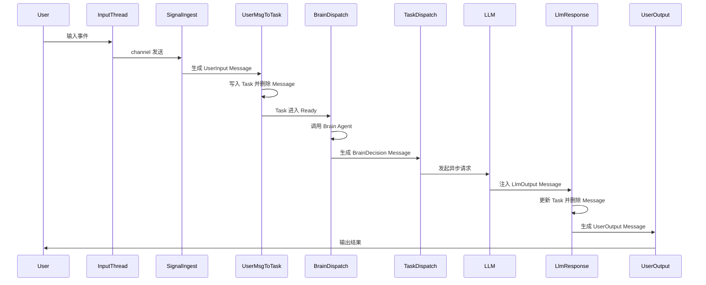

# Harness Core 流程深化设计

本文档是对 `docs/harness.md` 的补充和细化，重点解决流程打通的关键缺口。

---

## 一、入口机制

### 架构

```
┌─────────────────┐     channel      ┌──────────────────────┐
│  输入线程        │ ──────────────▶ │  ECS 主循环           │
│  (stdin/网络)   │                  │  Signal Ingest System │
└─────────────────┘                  └──────────────────────┘
```

### 实现要点

1. **独立输入线程** — 阻塞式读取 stdin 或监听网络端口
2. **线程安全通道** — 使用 `crossbeam_channel::unbounded`
3. **ECS 资源包装** — 将 `Receiver` 包装为 Bevy Resource
4. **System 消费** — 每帧轮询 Receiver，有数据则生成 Signal

### 代码结构

```rust
// 资源定义
struct InputReceiver(Receiver<UserInput>);

// 启动时 spawn 输入线程
fn setup_input_thread(mut commands: Commands) {
    let (tx, rx) = crossbeam_channel::unbounded();
    std::thread::spawn(move || {
        // 阻塞读取 stdin，发送到 channel
    });
    commands.insert_resource(InputReceiver(rx));
}

// System 消费
fn signal_ingest_system(
    receiver: Res<InputReceiver>,
    mut commands: Commands,
) {
    while let Ok(input) = receiver.0.try_recv() {
        commands.spawn(Signal::new_user_input(input));
    }
}
```

### 设计优势

- 输入线程与 ECS 主循环完全解耦
- 不阻塞 Bevy 的帧调度
- 可扩展为多来源（stdin + gRPC + WebSocket）

---

## 二、异步 LLM 集成

### 技术选型

采用 **Tokio Runtime 集成** 方案。

理由：
- 主流 Rust LLM SDK（async-openai、anthropic）基于 tokio
- `tokio::sync::mpsc` 提供成熟的背压控制
- 丰富的异步原语（timeout、CancellationToken）

### 实现要点

```rust
use tokio::runtime::Runtime;

// 启动时嵌入 tokio runtime
struct AsyncRuntime(Runtime);

fn setup_async_runtime(mut commands: Commands) {
    let rt = Runtime::new().unwrap();
    commands.insert_resource(AsyncRuntime(rt));
}

// Task Dispatch System
fn task_dispatch_system(
    mut tasks: Query<&mut Task, With<TaskStatus::Ready>>,
    llm_client: Res<LlmClient>,
    async_rt: Res<AsyncRuntime>,
    mut tx: ResMut<LlmResultSender>,
) {
    for mut task in tasks.iter_mut() {
        let client = llm_client.clone();
        let prompt = task.content.clone();
        let tx = tx.clone();

        async_rt.0.spawn(async move {
            let result = client.complete(prompt).await;
            tx.send((task.id, result)).await.ok();
        });

        task.status = TaskStatus::Waiting { reason: WaitingReason::Llm };
    }
}

// Llm Response System
fn llm_response_system(
    mut rx: ResMut<LlmResultReceiver>,
    mut commands: Commands,
) {
    while let Ok((task_id, result)) = rx.try_recv() {
        commands.spawn(Message::llm_output(task_id, result));
    }
}
```

---

## 三、错误处理策略

### 分层处理

| 错误类型 | 处理方式 |
|---------|---------|
| 网络超时/临时故障 | 自动重试（最多 3 次，指数退避） |
| Rate limit | 自动重试（读取 `Retry-After` 头） |
| 认证错误/配额耗尽 | 立即失败，通知用户 |
| 用户取消 | 立即失败，不通知 |
| 其他未知错误 | 标记失败，生成错误消息给用户 |

### Task 重试字段

```rust
struct Task {
    // ... 其他字段
    retry_count: u32,
    max_retries: u32,
    last_error: Option<String>,
}
```

---

## 四、Agent 架构

### Agent 分类

| 类型 | 创建时机 | 销毁时机 |
|------|---------|---------|
| 持久性 Agent | 系统启动时从配置文件加载 | 系统关闭 |
| 任务型 Agent | Agent Factory 创建 | 任务完成后销毁 |

### Brain Agent

- 角色：全局调度者，统一分配任务
- 决策方式：LLM 驱动，预留规则扩展接口
- 输出：`BrainDecision Message`，包含任务分配指令

### Agent 能力声明

```rust
struct AgentCapabilities {
    /// 结构化标签，用于快速过滤
    tags: Vec<String>,  // e.g., ["code", "rust", "web-search"]
    /// 自然语言描述，用于 Brain LLM 理解
    description: String,
}
```

### Agent 生命周期

```
┌──────────────────┐     创建请求      ┌─────────────────┐
│  Brain Agent     │ ───────────────▶ │  Agent Factory  │
│  (调度决策)       │                  │  (创建/销毁)     │
└──────────────────┘                  └─────────────────┘
```

---

## 五、实体定义

### ID 类型

| 实体 | ID 类型 | 理由 |
|------|--------|------|
| Signal | `Entity` (Bevy 内置) | Bevy 内部实体，无需外部引用 |
| Message | `Entity` (Bevy 内置) | Bevy 内部实体，短生命周期 |
| Task | `uuid::Uuid` | 需要跨系统持久引用 |
| Agent | `uuid::Uuid` | 需要跨系统引用 |

### TaskStatus

```rust
enum TaskStatus {
    Pending,
    Ready,
    Running,
    Waiting { reason: WaitingReason },
    Done,
    Failed { reason: FailureReason },
}

enum WaitingReason {
    Llm,
    Agent,
    Brain,
    User,
}

enum FailureReason {
    LlmError,
    AgentError,
    UserCancelled,
    Timeout,
    Unknown,
}
```

### MessageKind

```rust
enum MessageKind {
    // 输入来源
    UserInput,
    SystemInput,

    // LLM 相关
    LlmOutput,
    BrainDecision,

    // 输出
    UserOutput,
    UserOutputError,

    // 工具（预留）
    ToolOutput,
}
```

### 完整 Task 结构

```rust
struct Task {
    id: TaskId,
    content: String,
    creator: AgentId,
    delegate: Option<AgentId>,
    status: TaskStatus,
    input_summary: String,
    result_summary: String,
    waiting_reason: Option<WaitingReason>,
    priority: u32,
    created_at: DateTime,
    updated_at: DateTime,
    retry_count: u32,
    max_retries: u32,
    last_error: Option<String>,
}
```

### Agent 结构

```rust
struct Agent {
    id: AgentId,
    profile: AgentProfile,
    status: AgentStatus,
    capabilities: AgentCapabilities,
    memory_ref: Option<MemoryId>,  // 预留
}

struct AgentCapabilities {
    tags: Vec<String>,
    description: String,
}

enum AgentStatus {
    Idle,
    Busy,
    Offline,
}
```

---

## 六、System 划分

基于新增设计，System 列表更新为：

| System | 职责 |
|--------|------|
| `SignalIngestSystem` | Signal → Message |
| `UserMessageToTaskSystem` | UserInput Message → Task |
| `BrainDispatchSystem` | Ready Task → Brain Agent 决策 |
| `TaskDispatchSystem` | Brain 决策 → Agent 分配 / LLM 调用 |
| `LlmResponseSystem` | LlmOutput Message → Task 更新 |
| `BrainDecisionSystem` | BrainDecision Message → Task 分配 |
| `UserOutputSystem` | UserOutput Message → 外部输出 |
| `AgentFactorySystem` | 处理 Agent 创建/销毁请求 |

---

## 七、主流程时序图



---

## 八、待后续设计

以下内容在当前阶段暂不细化，预留接口：

- `Memory` 实体设计
- `Tool` 和 `ToolCall` 设计
- `Session` 概念
- `Planner` 模块
- 多轮对话上下文管理
