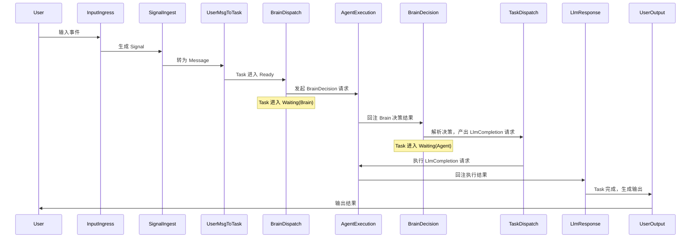
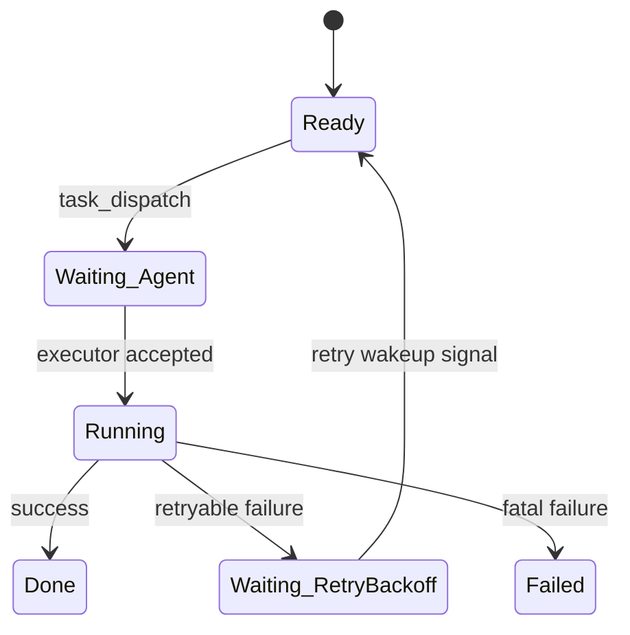
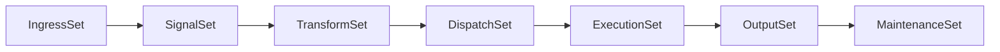
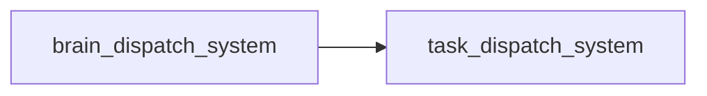
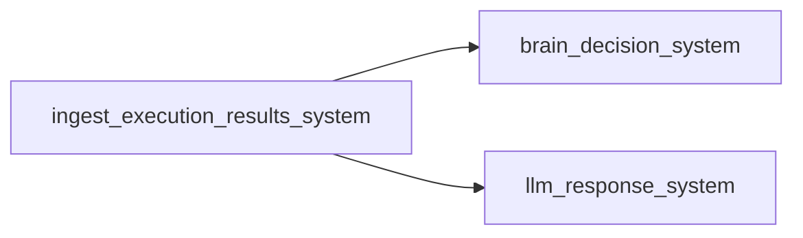

# Brain Agent 调度设计

> __状态说明（2026-06-09）__
> 分类：历史背景。
> 作用：用于理解 Brain 调度能力的设计来源。
> 说明：本文保留旧阶段语境，阅读时应以当前能力状态为准。
> 当前优先参考：`docs/current-state.md`。

本文档描述 Phase 2 Brain Agent 调度的详细设计，包括数据流、状态转换、接口定义和实施步骤。

---

## 一、设计目标

- Brain 作为全局调度者，通过 LLM 决策任务应该交给哪个 Agent
- 复用现有 `AgentExecutor` + `agent_execution_system` 异步链路
- Brain 不启用时行为与 MVP 完全一致
- Brain 决策失败时具备容错能力

---

## 二、核心数据流

### 完整流程（Brain 启用）



### MVP 兼容流程（Brain 不启用）

与当前 MVP 流程完全一致，`brain_dispatch_system` 跳过，`task_dispatch_system` 直接处理 Ready Task。

---

## 三、状态转换

> __注意__：Brain 决策发生在 Task 创建前，不进入 Task 状态机。Task 状态只描述执行过程。

### Task 状态（无 Brain 相关状态）



### Brain 决策流程

Brain 决策在 Task 创建时同步完成：

```text
用户输入 -> Brain 决策 -> 创建 Task（指定 delegate）
```

Brain 不引入额外的 Task 状态，`WaitingReason::Brain` 已被移除。

---

## 四、接口变更

### AgentRequestKind 扩展

```rust
enum AgentRequestKind {
    LlmCompletion,
    BrainDecision,  // 新增
}
```

### AgentExecutionRequest 扩展

```rust
struct AgentExecutionRequest {
    task_id: TaskId,
    agent_id: AgentId,
    request_kind: AgentRequestKind,
    prompt: String,
    system_prompt: Option<String>,  // 新增，Brain 请求使用
}
```

### AgentExecutionResult 扩展

```rust
struct AgentExecutionResult {
    task_id: TaskId,
    agent_id: AgentId,
    request_kind: AgentRequestKind,  // 新增，用于结果分流
    result: Result<String, ExecutionError>,
}
```

### Task 方法

Brain 决策在 Task 创建时完成，无需额外的 Task 状态方法。Task 创建时 `delegate` 字段已确定。

### 新增类型

```rust
struct BrainDecisionOutput {
    selected_agent_name: String,
    delegate_prompt: String,
    reasoning: String,
}

enum BrainDecisionError {
    ParseFailed(String),
    UnknownAgent(String),
    EmptyResponse,
}
```

---

## 五、System 设计

### brain_dispatch_system

- __阶段__：DispatchSet（在 `task_dispatch_system` 之前）
- __输入__：`Ready` 状态的 Task
- __输出__：`AgentExecutionRequestMessage(BrainDecision)`
- __副作用__：Task 进入 `Waiting(Agent)`（与普通任务一致）
- __跳过条件__：Brain 未启用、Brain Agent 不存在

### brain_decision_system

- __阶段__：TransformSet（在 `ingest_execution_results_system` 之后）
- __输入__：`AgentExecutionResultMessage` 中 `request_kind == BrainDecision` 的结果
- __输出__：`AgentExecutionRequestMessage(LlmCompletion)`
- __副作用__：Task 更新 `delegate` 为选定 Agent，继续等待执行
- __容错__：解析失败时 Task 标记为 Failed；选定 Agent 不存在时回退到默认 Agent

### llm_response_system 改造

- 增加过滤：跳过 `request_kind == BrainDecision` 的结果（由 `brain_decision_system` 处理）

### agent_execution_system 改造

- 回注结果携带 `request_kind`
- Brain 请求不调用 `task.mark_running()`

---

## 六、Brain Prompt 设计

### System Prompt

要求 LLM 输出 JSON 格式的结构化决策，包含 `selected_agent_name`、`delegate_prompt`、`reasoning` 三个字段。

### User Prompt

包含 Task 内容和所有可用 Agent（排除 Brain 自身）的能力描述，供 LLM 做调度判断。

### 结果解析

- 支持直接 JSON 文本
- 支持被 markdown code block 包裹的 JSON
- 解析失败时返回 `BrainDecisionError::ParseFailed`

---

## 七、Brain 配置

| 环境变量                  | 必填 | 默认值        | 说明                 |
|-------------------------|------|---------------|----------------------|
| `HARNESS_BRAIN_ENABLED` | 否   | `false`       | 是否启用 Brain 调度  |
| `HARNESS_BRAIN_MODEL`   | 否   | 与主模型相同   | Brain 使用的 LLM 模型 |
| `HARNESS_BRAIN_AGENT_NAME` | 否 | `brain`      | Brain Agent 名称    |

---

## 八、SystemSet 编排变化



DispatchSet 内部顺序：



TransformSet 内部顺序（新增 brain_decision_system）：



---

## 九、容错策略

| 场景                     | 处理方式                                         |
|-------------------------|-------------------------------------------------|
| Brain LLM 调用网络错误  | 走标准重试流程（与 Task 重试机制一致）         |
| Brain 返回非 JSON 格式  | Task 标记 Failed(AgentError)，记录 last_error  |
| Brain 选定不存在的 Agent | 回退到默认 Agent                                |
| Brain 选中自身          | 在 prompt 中排除 Brain，解析后校验              |
| Brain Agent 不存在      | brain_dispatch_system 跳过，task_dispatch_system 接管 |

---

## 十、同帧推进分析

| 帧   | 推进                                         | 跳数 |
|------|---------------------------------------------|------|
| N    | Ready -> Waiting(Agent) + BrainDecision 请求 | 1    |
| N+1  | agent_execution_system spawn 异步任务        | 1    |
| N+K  | ingest + brain_decision -> Waiting(Agent) + LlmCompletion 请求 | 2 |
| N+K+1| agent_execution_system spawn 异步任务        | 1    |
| N+K+M| ingest + llm_response -> Done + UserOutput  | 2    |

每帧最多推进 2 跳，符合约束。

> __注意__：Brain 决策和普通 Agent 执行都使用 `Waiting(Agent)` 状态，Task 状态机不区分两者。
