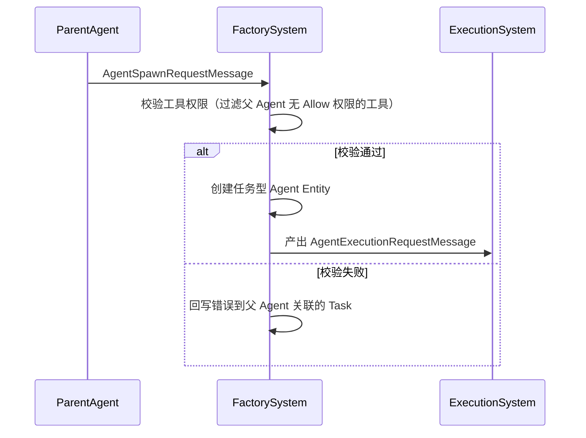
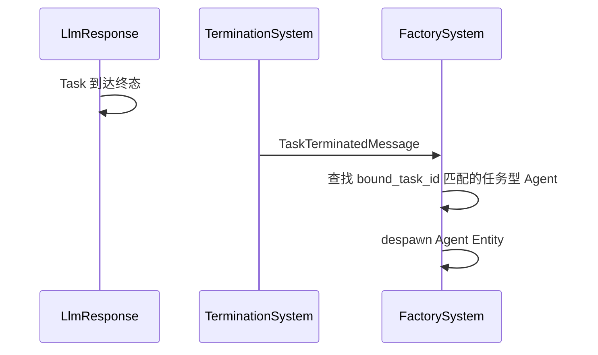
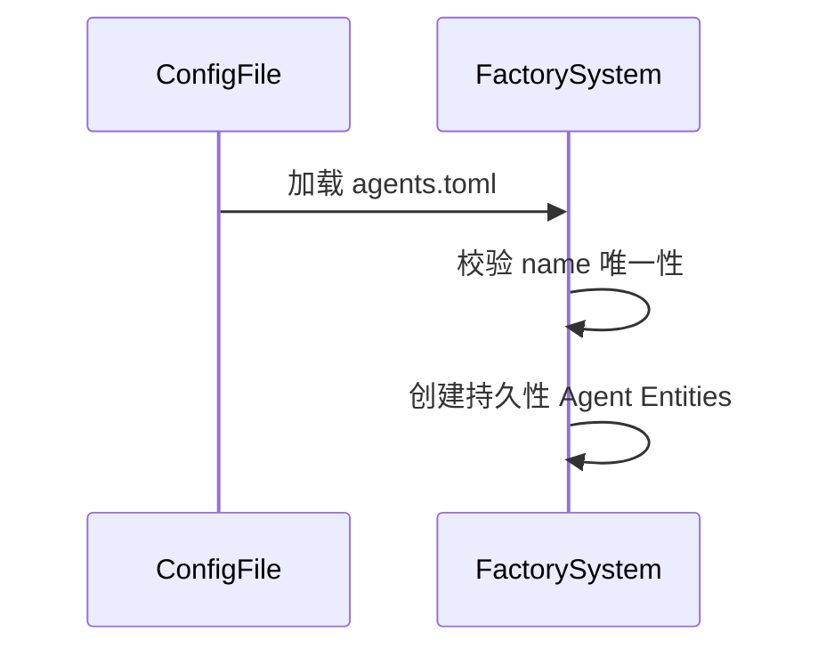

# Phase 3: 多 Agent 支持设计

> __状态说明（2026-06-09）__
> 分类：历史背景。
> 作用：用于理解多 Agent、Agent 演化与权限继承设计的演进过程。
> 说明：本文部分前提已由 ADR 和后续实现修订，不直接代表当前实现。
> 当前优先参考：`docs/current-state.md`、`docs/adr/ADR-002-agent-controlled-evolution.md`。

本文档描述 Phase 3 多 Agent 支持的详细设计，包括 Agent 分类、配置加载、动态创建/销毁、权限继承和核心数据流。

> 注：本文档关于 Agent 定位的前提已被 [ADR-002](/Users/diater/workspace/Harness/docs/adr/ADR-002-agent-controlled-evolution.md) 修订。
> 本文中的"Agent 无运行状态"仍然成立，但"Agent 不可变配置实体"已更新为"Agent 是可演化的执行配置实体"。
>
> __Phase 5 更新__：标签（tags）子集校验已替换为基于工具（tools）的权限继承模型。
> 子 Agent 创建时指定所需工具列表，`handle_spawn_request` 过滤为父 Agent 拥有 Allow 权限的工具。
> 详见 `AgentSpawnRequestMessage.tools` 和 `handle_spawn_request`。

---

## 一、设计目标

- Agent 是可演化的执行配置实体，不承载瞬时运行状态，可被多个 Task 并发复用
- 持久性 Agent 从 TOML 配置文件加载，系统运行期间始终存在
- 任务型 Agent 由任意 Agent 动态创建，一对一绑定 Task，终态后自动销毁
- 子 Agent 的 tags 必须是父 Agent tags 的子集（权限继承约束）
- 任意 Agent 均可创建子 Agent，不限于 Brain

---

## 二、核心原则

### Agent 是执行配置，不是执行状态

Agent 描述"怎么执行"（model、tags、description），不追踪"执行到哪了"。执行状态由 Task 承担，Agent 不需要 `Idle/Busy` 等可变状态。

与本文原始版本不同，Agent 的长期配置允许被受控修正，例如：

- Tool 权限
- 长期经验记忆
- 可继承的执行约束

但这些修正不改变本节核心边界：Agent 不承载瞬时执行态。

### 统一创建入口

所有 Agent 创建均通过 `AgentSpawnRequestMessage` 经 `AgentFactorySystem` 处理，权限校验集中在一处。持久性 Agent 是"启动时自动提交的 SpawnRequest"的特化形式。

### 单向转换链路

保持现有 `Signal → Message → System` 的单向转换模式，Agent 创建和销毁均通过 Message 驱动。

---

## 三、Agent 分类

| 类型          | 创建时机                    | 销毁时机                 | 参与通用匹配 |
|---------------|----------------------------|--------------------------|--------------|
| 持久性 Agent  | 启动时从配置文件加载      | 系统关闭                | 是           |
| 任务型 Agent  | Agent 请求创建            | 绑定 Task 终态后自动销毁 | 否           |

### 持久性 Agent

- 从 `agents.toml` 配置文件加载
- Brain Agent 也属于持久性 Agent，通过配置声明
- 可被多个 Task 并发使用

### 任务型 Agent

- 由任意 Agent（包括子 Agent）通过 `AgentSpawnRequestMessage` 请求创建
- 一对一绑定 Task
- 创建时即绑定目标 Task，不参与通用匹配
- tools 列表由父 Agent 过滤，仅保留父 Agent 有 Allow 权限的工具
- 子 Agent 也可以创建自己的子 Agent（同样受工具权限继承约束）
- 关联 Task 到达终态（Done/Failed）后自动销毁

---

## 四、配置文件设计

### 文件位置

项目根目录 `agents.toml`，启动时加载。

### 格式

```toml
[[agent]]
name = "default"
model = "deepseek-chat"
tags = ["llm", "default", "code", "general"]
description = "默认 LLM Agent，处理通用任务"

[[agent]]
name = "brain"
model = "deepseek-chat"
tags = ["brain", "dispatcher"]
description = "Brain Agent，负责调度决策"

[[agent]]
name = "coder"
model = "deepseek-coder"
tags = ["llm", "code"]
description = "代码专家 Agent，处理编程相关任务"
```

### 配置结构

```rust
#[derive(Deserialize)]
struct AgentConfig {
    agents: Vec<AgentEntry>,
}

#[derive(Deserialize)]
struct AgentEntry {
    name: String,
    model: String,
    tags: Vec<String>,
    description: String,
}
```

### 约束

- 每个 `name` 必须唯一，重复则启动时 panic
- Brain Agent 通过 tags 中包含 `"brain"` 标识，不再硬编码
- 配置文件不存在时不报错，启动时不创建任何持久性 Agent

---

## 五、实体定义

### Agent（修订）

移除 `status` 字段，新增 `kind`、`parent_id`、`bound_task_id`：

```rust
#[derive(Debug, Clone, Component)]
pub struct Agent {
    pub id: AgentId,
    pub profile: AgentProfile,
    pub capabilities: AgentCapabilities,
    pub kind: AgentKind,
    pub parent_id: Option<AgentId>,
    pub bound_task_id: Option<TaskId>,
}
```

### AgentKind（新增）

```rust
#[derive(Debug, Clone, Serialize, Deserialize, PartialEq, Eq)]
pub enum AgentKind {
    Persistent,
    TaskScoped,
}
```

### AgentSpawnRequestMessage（新增）

```rust
#[derive(Debug, Clone, Component)]
pub struct AgentSpawnRequestMessage {
    pub parent_agent_id: AgentId,
    pub task_id: TaskId,
    pub name: String,
    pub model: String,
    pub tags: Vec<String>,
    pub description: String,
}
```

### TaskTerminatedMessage（新增）

```rust
#[derive(Debug, Clone, Component)]
pub struct TaskTerminatedMessage {
    pub task_id: TaskId,
}
```

### 移除内容

| 实体                        | 原因               |
|-----------------------------|--------------------|
| `AgentStatus` 枚举         | Agent 无状态化     |
| `spawn_default_agent_system` | 配置加载归入 Factory |

---

## 六、核心数据流

### Agent 创建流程



### Agent 销毁流程



### 持久性 Agent 启动流程



---

## 七、System 设计

### 新增/修改 System

| System                 | 变更类型 | 职责                                                         |
|------------------------|----------|--------------------------------------------------------------|
| `agent_factory_system` | 重写     | 加载配置创建持久性 Agent；消费 SpawnRequest 创建任务型 Agent；消费 TaskTerminated 销毁任务型 Agent |
| `task_termination_system` | 新增  | 检测 Task 终态，产出 TaskTerminatedMessage                   |
| `task_dispatch_system` | 修改     | 按 tags 匹配替代 Idle 过滤，排除任务型 Agent                 |
| `brain_dispatch_system`| 修改     | 移除 Idle 过滤                                               |

### agent_factory_system

三个职责：

1. __启动阶段__：加载 `agents.toml`，创建持久性 Agent
2. __运行阶段-创建__：消费 `AgentSpawnRequestMessage`，校验 tags 子集，创建任务型 Agent 并产出执行请求
3. __运行阶段-销毁__：消费 `TaskTerminatedMessage`，查找匹配的任务型 Agent 并 despawn

```rust
fn agent_factory_system(
    mut commands: Commands,
    settings: Res<HarnessSettings>,
    spawn_requests: Query<(Entity, &AgentSpawnRequestMessage)>,
    terminated_tasks: Query<(Entity, &TaskTerminatedMessage)>,
    agents: Query<(Entity, &Agent)>,
    // 启动标记，确保配置只加载一次
    mut loaded: Local<bool>,
) {
    // 1. 启动时加载配置
    if !*loaded {
        load_persistent_agents(&mut commands, &settings);
        *loaded = true;
    }

    // 2. 处理创建请求
    for (entity, request) in &spawn_requests {
        // 校验 tags 子集
        // 创建任务型 Agent
        // 产出 AgentExecutionRequestMessage
        commands.entity(entity).despawn();
    }

    // 3. 处理销毁
    for (entity, terminated) in &terminated_tasks {
        // 查找 bound_task_id 匹配的任务型 Agent
        // despawn
        commands.entity(entity).despawn();
    }
}
```

### task_termination_system

```rust
fn task_termination_system(
    mut commands: Commands,
    tasks: Query<(Entity, &TaskId, &TaskStatus), Added<TaskStatus>>,
) {
    for (entity, task_id, status) in &tasks {
        if status.is_terminal() {
            commands.spawn(TaskTerminatedMessage { task_id: *task_id });
        }
    }
}
```

### task_dispatch_system（修订）

移除 `Idle` 过滤，改为按 tags 匹配：

```rust
fn task_dispatch_system(
    clock: Res<Clock>,
    mut commands: Commands,
    mut tasks: Query<&mut Task>,
    agents: Query<&Agent>,
) {
    for mut task in &mut tasks {
        if task.status != TaskStatus::Ready {
            continue;
        }

        let Some(agent) = select_agent(&agents, &task.content) else {
            continue;
        };

        let request = AgentExecutionRequest {
            task_id: task.id,
            agent_id: agent.id,
            request_kind: AgentRequestKind::LlmCompletion,
            prompt: task.content.clone(),
            system_prompt: None,
        };

        task.mark_waiting_for_agent(agent.id, clock.0);
        commands.spawn(AgentExecutionRequestMessage { request });
    }
}
```

### Agent 匹配逻辑

```rust
fn select_agent<'a>(agents: impl Iterator<Item = &'a Agent>, task_content: &str) -> Option<&'a Agent> {
    agents
        .filter(|a| a.kind == AgentKind::Persistent)
        .filter(|a| !a.capabilities.tags.contains(&"brain".to_string()))
        .max_by_key(|a| match_score(a, task_content))
}

fn match_score(agent: &Agent, task_content: &str) -> usize {
    // MVP: 基于 tags 与任务内容的关键词重叠度
    agent.capabilities.tags.iter()
        .filter(|tag| task_content.to_lowercase().contains(&tag.to_lowercase()))
        .count()
}
```

### brain_dispatch_system（修订）

移除 `Idle` 过滤，Brain Agent 选择改为按名称查找：

```rust
fn brain_dispatch_system(
    // ...
    agents: Query<&Agent>,
) {
    // Brain Agent 选择：按 name 匹配，无需 Idle 过滤
    let brain_agent = agents.iter()
        .find(|a| a.capabilities.tags.contains(&"brain".to_string())
            && a.kind == AgentKind::Persistent);
    // ...
}
```

### SystemSet 归属

| System                 | Set           | 顺序说明                             |
|------------------------|---------------|--------------------------------------|
| `task_termination_system` | TransformSet | 紧接 `llm_response_system` 之后     |
| `agent_factory_system` | MaintenanceSet | 现有位置不变                       |

---

## 八、权限继承

### 规则

子 Agent 的 tags 必须是父 Agent tags 的子集。

### 校验逻辑

```rust
fn validate_tags_subset(parent_tags: &[String], child_tags: &[String]) -> bool {
    child_tags.iter().all(|tag| parent_tags.contains(tag))
}
```

### 校验时机

`agent_factory_system` 消费 `AgentSpawnRequestMessage` 时校验。

### 校验失败处理

拒绝创建，将错误信息回写到父 Agent 关联的 Task：

```rust
// 回写错误到 Task
task.last_error = Some(format!(
    "Agent spawn rejected: child tags {:?} exceed parent tags {:?}",
    child_tags, parent_tags
));
task.status = TaskStatus::Failed(FailureReason::AgentError);
```

### 嵌套约束

子 Agent 可继续创建子 Agent，每层都受直接父级 tags 子集约束。例如：

- Agent A tags: `["llm", "code", "general"]`
- Agent B（A 的子 Agent）tags: `["llm", "code"]` — 通过
- Agent C（B 的子 Agent）tags: `["llm", "code", "web"]` — 拒绝，`"web"` 不在 B 的 tags 中

---

## 九、错误处理

| 场景                           | 处理                                         |
|--------------------------------|----------------------------------------------|
| SpawnRequest tags 超出父 Agent | 拒绝创建，回写错误到父 Agent 关联的 Task    |
| 配置文件 name 重复             | 启动时 panic（配置错误应尽早暴露）          |
| 配置文件不存在                 | 不报错，无持久性 Agent                       |
| 销毁时 Agent 已不存在          | 忽略（幂等）                                 |
| TaskTerminatedMessage 重复消费 | 幂等处理，第二次查询无匹配 Agent 时跳过     |

---

## 十、不在本次范围

- Agent 能力匹配算法优化（MVP 用 tags 重叠度，后续可接入语义匹配）
- tags 语义拆分（能力 vs 权限）
- Agent 执行超时/取消
- 子 Agent 嵌套深度限制
- Task 清理机制（Task 终态后的 despawn 策略）
- Agent 热重载（运行时修改配置文件并重新加载）

---

## 十一、与现有设计的兼容性

### 移除项

- `AgentStatus` 枚举：Agent 无状态化后不再需要
- `spawn_default_agent_system`：配置加载归入 `agent_factory_system`
- `task_dispatch_system` 中的 `Idle` 过滤逻辑
- `brain_dispatch_system` 中的 `Idle` 过滤逻辑
- `mark_waiting_for_agent` 中对 Agent status 的修改

### 保留项

- `AgentExecutionRequest` / `AgentExecutionResult`：不变
- `AgentExecutor` trait：不变
- `agent_execution_system`：不变
- `llm_response_system`：不变
- 重试机制：不变
- Brain 决策链路：核心逻辑不变，仅移除 Idle 过滤

### Task 结构

无需变更。`delegate: Option<AgentId>` 已足够表达 Task 与 Agent 的关联。
