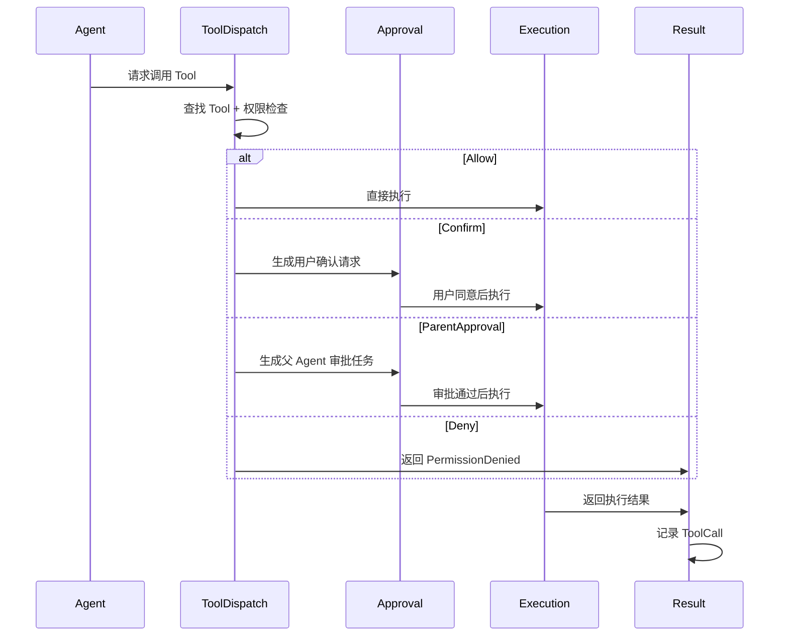
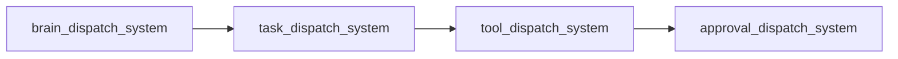
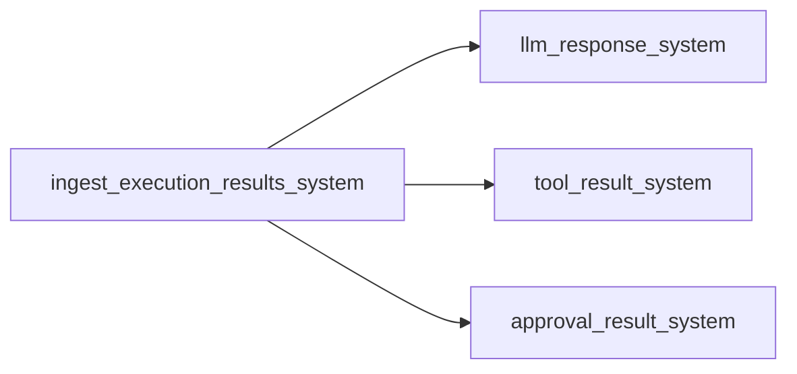

# Phase 4.2 Tool 与 Space 设计

> __状态说明（2026-06-09）__
> 分类：历史背景。
> 作用：用于理解 Tool、Space、权限与审批能力的设计来源。
> 说明：当前 shell 工具面、审批限制与部分实现细节已在后续文档中更新。
> 当前优先参考：`docs/current-state.md`、`docs/TODO.md`、
> `docs/superpowers/specs/2026-06-08-shell-tool-simplification-design.md`。
> 本文档描述 Tool 系统、Space 概念及相关权限控制设计。
>
> 本文档在 Phase 3/4.1 基础上继续扩展，并修正一个核心前提：
> 可以在运行期间通过受控机制被修正、继承和演化。

---

## 一、设计目标

- 引入 Space，承载全局共享但非任务级的运行时语义资源
- 定义 Tool 注册、执行、记录与权限控制机制
- 支持 Agent 级别的精细化 Tool 权限配置
- 支持父 Agent 审核与用户确认
- 支持 Agent 经验积累与受控自我进化

---

## 二、与现有架构的对齐原则

### 2.1 保持不变的边界

- `Signal -> Message -> System -> Task` 的主链路保持不变
- `Task` 仍然承载执行中的瞬时业务状态
- `AgentExecutionRequest` / `AgentExecutionResult` 仍然是统一异步执行入口
- `HarnessConfig` 继续通过环境变量加载启动配置，不被 Space 替代

### 2.2 本阶段修订的原则

此前 Phase 3 文档中，Agent 被描述为"不可变配置实体"。本阶段修订为：

- Agent 的职责仍然是描述"如何执行"
- Agent 不承载 `Idle/Busy/Running` 一类瞬时运行状态
- Agent 的配置允许被受控修正
- 可修正的内容仅限长期有效的执行配置，例如：
  - Tool 权限
  - 经验记忆
  - 偏好化策略
  - 可继承的执行约束
- 所有修正必须通过明确 system 或 message 完成，不能由异步执行 future 直接改写 `World`

### 2.3 设计意图

这样处理后，Agent 具备"自我进化"能力，但不会重新退化成状态机实体。

- 执行态放在 `Task`
- 长期配置与经验放在 `Agent`
- 全局共享上下文放在 `Space`

---

## 三、Space 设计

### 3.1 概念定义

Space 是全局共享的运行时语义容器，用来承载以下信息：

| 内容 | 说明 |
|------|------|
| `SpaceKnowledge` | 用户相关长期知识、偏好、共享上下文 |
| `SpacePreferences` | 用户级默认偏好，不等同于启动配置 |
| `SpaceToolRegistry` | 全局 Tool 注册表 |
| `SpaceAgentRegistry` | 启动加载后的持久性 Agent 配置镜像 |
| `SpaceRuntimeContext` | 当前时间、只读环境摘要、系统状态 |

### 3.2 不属于 Space 的内容

以下内容继续保持现有边界，不纳入 Space 主职责：

- `HarnessConfig`：启动配置，来自环境变量
- `LlmProviderConfig`：Provider、模型、鉴权配置
- `Task`：任务级短期业务状态
- `ShortTermMemory`：任务级上下文

### 3.3 实现方式

Space 采用多个独立 `Resource` 实现，而不是单一 Entity：

```rust
/// Space 级别的长期知识（用户相关）
#[derive(Resource, Default)]
pub struct SpaceKnowledge {
    pub entries: Vec<MemoryEntry>,
}

/// Space 级别的默认偏好
#[derive(Resource)]
pub struct SpacePreferences {
    pub default_language: String,
    pub default_behavior: String,
    pub preferred_model: Option<String>,
}

/// 全局工具注册表
#[derive(Resource, Default)]
pub struct SpaceToolRegistry {
    pub tools: HashMap<String, ToolDefinition>,
}

/// 持久性 Agent 配置镜像
#[derive(Resource, Default)]
pub struct SpaceAgentRegistry {
    pub agents: HashMap<String, PersistentAgentConfig>,
}

/// 全局运行时上下文
#[derive(Resource)]
pub struct SpaceRuntimeContext {
    pub current_time: DateTime<Utc>,
    pub environment_summary: HashMap<String, String>,
    pub system_status: SystemStatus,
}
```

### 3.4 命名约定

Space 相关 Resource 统一使用 `Space` 前缀，避免与普通业务 Resource 混淆。

---

## 四、Agent 演化模型

### 4.1 Agent 的新定位

Agent 是"可演化的执行配置实体"。

它包含三类信息：

- 基础执行配置：`name`、`model`、`tags`、`description`
- 长期约束配置：Tool 权限、可继承约束
- 长期经验：执行后的经验沉淀、优化策略、偏好化修正

### 4.2 保持不进入 Agent 的内容

以下内容仍不进入 Agent：

- 当前是否正在执行
- 某次调用的中间结果
- 某个审批流是否卡住
- 某次重试的指数退避状态

这些仍然属于 `Task` 或一次性 `Message`。

### 4.3 数据结构修订

```rust
#[derive(Debug, Clone, Component)]
pub struct Agent {
    pub id: AgentId,
    pub profile: AgentProfile,
    pub capabilities: AgentCapabilities,
    pub kind: AgentKind,
    pub parent_id: Option<AgentId>,
    pub bound_task_id: Option<TaskId>,
    /// Tool 权限配置：启动加载、父 Agent 授权或后续修正
    pub tool_permissions: AgentToolPermissions,
    /// Agent 长期经验
    pub experience: AgentExperience,
}

/// Agent 的 Tool 权限配置
#[derive(Debug, Clone, Serialize, Deserialize, PartialEq, Eq)]
pub struct AgentToolPermissions {
    /// 未显式配置的 Tool 默认权限
    pub default_permission: ToolPermission,
    /// 针对特定 Tool 的覆盖项
    pub overrides: HashMap<String, ToolPermission>,
}

impl AgentToolPermissions {
    pub fn get_permission(&self, tool_name: &str) -> ToolPermission {
        self.overrides
            .get(tool_name)
            .copied()
            .unwrap_or(self.default_permission)
    }
}

/// Agent 长期经验
#[derive(Debug, Clone, Component, Default, Serialize, Deserialize, PartialEq, Eq)]
pub struct AgentExperience {
    pub entries: Vec<MemoryEntry>,
}
```

### 4.4 自我进化约束

- Agent 只能修正长期配置，不能直接改动任务执行状态
- Agent 的权限扩张必须经过审批链或用户确认
- Agent 的经验写入必须通过 maintenance / transform system 完成
- 若后续需要持久化 Agent 演化结果，应由专门持久化流程写回配置文件或快照

---

## 五、Tool 定义

### 5.1 Tool 结构

```rust
#[derive(Debug, Clone)]
pub struct ToolDefinition {
    /// 工具名称（唯一标识）
    pub name: String,
    /// 工具描述（供 LLM 理解用途）
    pub description: String,
    /// JSON Schema 参数定义
    pub parameters: ToolSchema,
    /// 默认权限级别
    pub default_permission: ToolPermission,
    /// 执行器类型
    pub executor: ToolExecutorKind,
}

#[derive(Debug, Clone)]
pub struct ToolSchema {
    pub schema: serde_json::Value,
}

#[derive(Debug, Clone)]
pub enum ToolExecutorKind {
    /// 内置执行器，由系统内注册函数实现
    Builtin(String),
    /// 外部进程执行
    External { command: String, args: Vec<String> },
    /// HTTP 调用
    Http { endpoint: String },
}

#[derive(Debug, Clone, Copy, PartialEq, Eq, Serialize, Deserialize)]
pub enum ToolPermission {
    Allow,
    Confirm,
    Deny,
}
```

### 5.2 Tool 注册表

```rust
impl SpaceToolRegistry {
    pub fn register(&mut self, tool: ToolDefinition) {
        self.tools.insert(tool.name.clone(), tool);
    }

    pub fn get(&self, name: &str) -> Option<&ToolDefinition> {
        self.tools.get(name)
    }

    pub fn exists(&self, name: &str) -> bool {
        self.tools.contains_key(name)
    }
}
```

### 5.3 MVP 范围约束

MVP 仅实现 `Builtin` 执行器。

- `External` 和 `Http` 只保留接口
- 不在本阶段直接引入进程沙箱或域名白名单实现

---

## 六、Agent 配置与继承

### 6.1 `agents.toml` 扩展

在现有 `name`、`model`、`tags`、`description` 基础上增加 `tools` 配置节：

```toml
[[agent]]
name = "default"
model = "gpt-4.1-mini"
tags = ["llm", "default", "general"]
description = "默认 LLM Agent，处理通用任务"

[agent.tools]
default_permission = "confirm"
read_file = "allow"
write_file = "confirm"
search_web = "allow"
execute_code = "deny"

[[agent]]
name = "brain"
model = "gpt-4.1-mini"
tags = ["brain", "dispatcher"]
description = "Brain Agent，负责调度决策"

[agent.tools]
default_permission = "deny"
read_file = "allow"
```

### 6.2 持久性 Agent 配置结构

```rust
#[derive(Debug, Clone, Deserialize)]
pub struct AgentConfig {
    pub agent: Vec<AgentEntry>,
}

#[derive(Debug, Clone, Deserialize)]
pub struct AgentEntry {
    pub name: String,
    pub model: String,
    pub tags: Vec<String>,
    pub description: String,
    pub tools: Option<AgentToolsConfig>,
}

#[derive(Debug, Clone, Deserialize)]
pub struct AgentToolsConfig {
    pub default_permission: Option<ToolPermission>,
    #[serde(flatten)]
    pub overrides: HashMap<String, ToolPermission>,
}
```

### 6.3 与现有 tags 继承规则的关系

本阶段保留 Phase 3 已有规则：

- 子 Agent 的 `tags` 必须是父 Agent `tags` 的子集

在此基础上新增 Tool 权限继承规则：

- 子 Agent 的 Tool 权限不能超过父 Agent
- 父 Agent 只能授予自己已有的 Tool 权限
- `tags` 用于能力和匹配范围
- `tool_permissions` 用于具体可执行操作的权限边界

两者不是替代关系，而是两个维度：

| 维度 | 用途 |
|------|------|
| `tags` | 表达能力领域、参与路由匹配 |
| `tool_permissions` | 表达允许执行哪些 Tool |

### 6.4 创建子 Agent 时的权限授予

扩展 `AgentSpawnRequestMessage`：

```rust
#[derive(Debug, Clone, Component)]
pub struct AgentSpawnRequestMessage {
    pub parent_agent_id: AgentId,
    pub task_id: TaskId,
    pub name: String,
    pub model: String,
    pub tags: Vec<String>,
    pub description: String,
    /// 父 Agent 请求授予的 Tool 权限
    pub requested_permissions: Vec<String>,
}
```

处理规则：

1. 先校验 `tags` 是否为父 Agent 子集
2. 再过滤 `requested_permissions`，仅保留父 Agent 已拥有且允许下放的权限
3. 生成子 Agent 的 `tool_permissions`

---

## 七、Tool 执行主链路

### 7.1 `AgentRequestKind` 扩展

```rust
#[derive(Debug, Clone, Serialize, Deserialize, PartialEq, Eq)]
pub enum AgentRequestKind {
    LlmCompletion,
    BrainDecision,
    ToolExecution { tool_name: String },
}
```

### 7.2 执行消息

```rust
#[derive(Debug, Clone, Component)]
pub struct ToolExecutionRequestMessage {
    pub request: AgentExecutionRequest,
    pub tool_input: serde_json::Value,
}

#[derive(Debug, Clone, Component)]
pub struct ToolExecutionResultMessage {
    pub result: AgentExecutionResult,
    pub tool_output: Result<serde_json::Value, ToolError>,
}

#[derive(Debug, Clone, Error, Serialize, Deserialize, PartialEq, Eq)]
pub enum ToolError {
    #[error("tool not found: {0}")]
    NotFound(String),
    #[error("permission denied: {0}")]
    PermissionDenied(String),
    #[error("execution failed: {0}")]
    ExecutionFailed(String),
    #[error("invalid input: {0}")]
    InvalidInput(String),
    #[error("timeout: {0}")]
    Timeout(String),
}
```

### 7.3 执行流程



---

## 八、确认与审批模型

### 8.1 确认模式

```rust
#[derive(Debug, Clone, Copy, PartialEq, Eq)]
pub enum ConfirmMode {
    /// 单次确认，仅对本次请求生效
    Once,
    /// 永久确认，修正 Agent 的长期权限配置
    Permanent,
    /// 父 Agent 审批
    ParentApproval,
}
```

### 8.2 `Permanent` 的含义

`Permanent` 不表示直接修改原始 `agents.toml` 文件，而是：

- 先更新运行中的 `Agent.tool_permissions`
- 再由后续持久化策略决定是否写回配置文件或快照

这样可以兼容当前仓库仍以环境变量和 `agents.toml` 启动加载的事实。

__持久化策略（后续扩展）__：

MVP 阶段不实现 Agent 演化结果的持久化，权限修正仅在内存中生效。后续扩展方向：

| 方案 | 优点 | 缺点 |
|------|------|------|
| 运行时快照文件 | 不污染源配置，支持版本回滚 | 需额外加载逻辑 |
| 写回 `agents.toml` | 改动最小，配置集中 | 可能与版本控制冲突 |
| 独立 `agent_state.json` | 职责分离，易于审计 | 多文件管理复杂度 |

MVP 阶段选择：__不持久化__，重启后恢复配置文件初始状态。

### 8.3 审批流必须补齐的关联信息

为避免"审批通过后无法恢复原任务"的问题，审批消息必须携带原始请求上下文：

```rust
#[derive(Debug, Clone, Component)]
pub struct ApprovalRequestMessage {
    pub request_id: Uuid,
    pub source_task_id: TaskId,
    pub approval_task_id: TaskId,
    pub parent_agent_id: AgentId,
    pub child_agent_id: AgentId,
    pub tool_name: String,
    pub tool_input: serde_json::Value,
    pub context: String,
}

#[derive(Debug, Clone, Component)]
pub struct ApprovalResultMessage {
    pub request_id: Uuid,
    pub source_task_id: TaskId,
    pub approval_task_id: TaskId,
    pub decision: ApprovalDecision,
    pub reasoning: String,
}

#[derive(Debug, Clone, Copy, PartialEq, Eq)]
pub enum ApprovalDecision {
    Approved,
    Rejected,
}
```

### 8.4 `WaitingReason` 扩展

```rust
#[derive(Debug, Clone, Serialize, Deserialize, PartialEq, Eq)]
pub enum WaitingReason {
    Agent,
    User,
    Evaluator,
    RetryBackoff,
    Approval,
}
```

### 8.5 审批流

```text
子 Agent 发起 ToolExecutionRequest
    ↓
tool_dispatch_system 检查权限
    ↓
若需要 ParentApproval：
    1. 创建 approval task
    2. 原 task -> Waiting(Approval)
    3. 生成 ApprovalRequestMessage
    4. 父 Agent 执行审批任务
    5. approval_result_system 根据 request_id + source_task_id 恢复原请求
    6. 审批通过则继续执行 Tool，否则回写 PermissionDenied
```

---

## 九、System 设计

### 9.1 新增 System

| System | Set | 职责 |
|--------|-----|------|
| `tool_dispatch_system` | `HarnessSet::Dispatch` | 检查 Tool 权限并决定直接执行、用户确认或父 Agent 审批 |
| `approval_dispatch_system` | `HarnessSet::Dispatch` | 为需要父 Agent 决策的请求创建审批任务 |
| `tool_execution_system` | `HarnessSet::Execution` | 执行 Builtin Tool |
| `tool_result_system` | `HarnessSet::Transform` | 处理 Tool 执行结果，记录 ToolCall，恢复原 Task |
| `approval_result_system` | `HarnessSet::Transform` | 处理审批结果并恢复待执行 Tool 请求 |
| `agent_evolution_system` | `HarnessSet::Maintenance` | 将批准后的长期权限修正或经验写回 Agent |

### 9.2 与现有 `HarnessSet` 的关系

当前项目已存在以下 `HarnessSet`：

- `Ingress`
- `Signal`
- `Transform`
- `Dispatch`
- `Execution`
- `Output`
- `Maintenance`

本阶段不新增新的 `SystemSet`，仅在现有集合内扩展顺序。

### 9.3 推荐编排

以下流程图表示__同一 `HarnessSet` 内__的 System 执行顺序：



> 注：以上四个 System 均属于 `HarnessSet::Dispatch`，需通过 `.before()` / `.after()` 约束顺序。



> 注：以上 System 均属于 `HarnessSet::Transform`。

### 9.4 单向约束

- Tool 执行仍然通过 Message 驱动，不让 Tool 直接修改 `Task`
- 审批通过后恢复原请求，也通过 Message 回注
- Agent 演化写回放在 `HarnessSet::Transform` 或 `HarnessSet::Maintenance`，不在异步 future 中直接修改 ECS

---

## 十、Tool 调用记录

### 10.1 复用现有 `ToolCall`

```rust
#[derive(Debug, Clone, Serialize, Deserialize, PartialEq, Eq)]
pub struct ToolCall {
    pub tool_name: String,
    pub input: String,
    pub output: String,
    pub timestamp: DateTime<Utc>,
}
```

### 10.2 记录策略

- `tool_result_system` 在 Tool 成功执行后写入 `EntryMetadata.tool_calls`
- 若 Tool 执行失败，可记录失败输出或错误摘要
- 若 Tool 调用影响 Agent 的长期经验，可同步追加到 `AgentExperience`

---

## 十一、与当前仓库的兼容性结论

### 11.1 已对齐项

| 项目 | 对齐方式 |
|------|----------|
| 异步执行架构 | 继续复用 `AgentExecutionRequest` / `AgentExecutionResult` |
| Task 状态机 | 仅扩展 `WaitingReason::Approval` |
| 多 Agent 结构 | 保留 `parent_id` / `bound_task_id` |
| 多轮记忆 | 继续复用 `ToolCall` 写入 `EntryMetadata` |
| 配置来源 | 不替代 `HarnessConfig::from_env()` 和 `agents.toml` |

### 11.2 本阶段需要新增的结构

| 项目 | 改动 |
|------|------|
| `AgentRequestKind` | 新增 `ToolExecution` |
| `WaitingReason` | 新增 `Approval` |
| `Agent` | 新增 `tool_permissions`、`experience` |
| `AgentEntry` | 新增可选 `tools` 配置节 |
| Message | 新增 Tool 执行与审批相关消息 |
| Resource | 新增 `SpaceToolRegistry`、`SpaceAgentRegistry` 等 |

### 11.3 本阶段不声称已实现

以下内容在当前仓库中尚未实现，本设计仅定义目标：

- Tool 注册与执行主链路
- 审批任务恢复机制
- Agent 长期权限修正
- Agent 经验持久化
- External / HTTP Tool 执行器

---

## 十二、实施范围

### 12.1 MVP 范围

MVP 阶段建议实现，按优先级分组：

__P0 - 基础设施（必须先完成）__：

- [ ] Space Resource 骨架
- [ ] `ToolDefinition` 与 `SpaceToolRegistry`
- [ ] `AgentRequestKind::ToolExecution`
- [ ] `WaitingReason::Approval`

__P1 - 核心功能__：

- [ ] `Agent.tool_permissions`
- [ ] Builtin Tool 执行器
- [ ] ToolCall 记录

__P2 - 审批与演化__：

- [ ] 用户确认 `Once / Permanent`
- [ ] 父 Agent 审批链
- [ ] `Agent.experience`

### 12.2 后续扩展

- [ ] External Tool 执行器
- [ ] HTTP Tool 执行器
- [ ] Tool Schema 校验
- [ ] Agent 演化结果持久化
- [ ] Tool 沙箱与白名单策略

### 12.3 相关 ADR

本设计明确修订了"Agent 不可变配置实体"这一前提，相关决策见 [ADR-002](/Users/diater/workspace/Harness/docs/adr/ADR-002-agent-controlled-evolution.md)。

ADR 需要覆盖的内容包括：

- 为什么允许 Agent 受控演化
- 哪些字段允许被修正
- 哪些字段仍然禁止运行期修改
- 持久化策略如何落地
