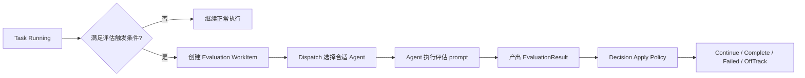

# Plan / Evaluation 模块重评估设计

## 文档信息

| 属性 | 值 |
|------|-----|
| 状态 | 草稿 |
| 创建日期 | 2026-06-06 |
| 适用阶段 | MVP 主链路重评估 |
| 相关文档 | `docs/design/modular-refactor-implementation.md`、`docs/design/2026-06-06-workitem-boundary-design.md` |

---

## 1. 背景

当前框架在 P3 阶段提出了 `Brain / Plan / Summary` 重构目标，并引入 `WorkItem` 作为统一工作单元。实际演进后，三个模块的落地程度并不一致：

- `Summary` 已经形成相对稳定的记忆治理职责
- `Plan` 仅完成契约层定义，尚未形成 `Task -> PlanArtifact -> WorkItem` 的执行闭环
- `Evaluation` 已接入主链路的触发与结果写回，但默认关闭，偏航处理策略尚未闭环

与此同时，任务分解、多子任务调度与等待能力已经在现有主链路中形成可运行实现，包括：

- `create_tasks` tool 负责创建子任务批次
- 子任务 DAG 依赖由调度系统负责检查
- `wait_tasks` tool 负责父任务等待子任务结果
- 兄弟任务结果可注入后续子任务 prompt

这导致一个新的架构问题：`Plan` 与 `Evaluation` 是否还需要继续作为独立模块存在，还是应当收敛为更轻量的能力组合。

---

## 2. 问题陈述

### 2.1 当前问题

- `Plan` 的主要价值与现有任务分解链路高度重叠，存在重复建模风险
- `Evaluation` 具备独立语义，但当前实现是半专用链路，未完全复用统一 `WorkItem` 架构
- `Brain / Dispatch / TaskRuntime / WorkItem` 的职责边界仍有交叉，后续若继续同时推进独立 `Plan` 和独立 `Evaluation`，会放大系统复杂度

### 2.2 本次重评估要回答的问题

1. `Plan` 是否还应作为独立模块存在
2. `Evaluation` 是否需要保留为独立模块
3. 如果不保留独立模块，现有能力应迁移到哪些模块
4. 如何在不破坏 MVP 主链路的前提下完成职责收敛

---

## 3. 设计目标

- 明确 `Plan` 与 `Evaluation` 的真实职责边界
- 减少重复抽象，优先复用现有可运行链路
- 保留对未来演进有价值的稳定语义，不因做减法而丢失控制能力
- 让 `WorkItem` 成为统一执行载体，避免长期维护多条平行执行通道
- 为后续实施提供清晰迁移路径和验收标准

---

## 4. 设计原则

### 4.1 能力优先于模块

如果某项能力已经能通过现有模块组合稳定实现，则不再为其保留独立模块。

### 4.2 语义优先于实现细节

即使不保留独立模块，只要某类职责具有稳定业务语义，仍应在领域模型中保留其概念。

### 4.3 执行链统一

新的设计优先复用 `WorkItem -> Dispatch -> Agent Execution -> Result Apply` 主链路，避免新增专用执行分支。

### 4.4 MVP 收敛优先

本次重评估以收敛架构复杂度为目标，不追求一次性引入更强的 planner/evaluator 能力。

### 4.5 以 WorkItem 边界为前提

本设计中提到的“统一执行链”以 `WorkItem` 边界清晰为前提。

需要明确：

- `WorkItem` 只负责统一内部执行单元
- `WorkItem` 不负责统一工具循环、等待、批次状态等控制流对象
- `Evaluation` 收敛到 `WorkItem` 不等于所有内部动作都应被提升为 `WorkItem`

---

## 5. 现状评估

### 5.1 Plan 现状

`Plan` 目前已定义如下契约：

- `PlanPolicy`
- `PlanArtifactBuilder`
- `ReplanPolicy`
- `WorkItemDeriver`

但从执行链路看，以下闭环尚未建立：

```text
Task -> Planning WorkItem -> PlanArtifact -> Worker WorkItem
```

与之相对，当前真正可运行的任务分解主链路是：

```text
Task
  -> Brain / Agent 产生 create_tasks tool 调用
  -> create_tasks 生成子任务批次
  -> 调度系统按 depends_on 驱动子任务执行
  -> wait_tasks / 完成回传恢复父任务
```

因此，`Plan` 当前更像“尚未闭环的规划抽象”，而不是不可替代的运行时模块。

### 5.2 Evaluation 现状

`Evaluation` 当前已具备以下要素：

- 触发条件：`AgentRequested`、`TurnLimitReached`、`UserRequested`
- 结果模型：`Continue`、`Complete`、`Failed`、`OffTrack`
- 策略配置：`TaskEvaluationConfig`、`OffTrackPolicy`
- 系统接线：触发 system 与结果写回 system 已注册到插件

但当前实现仍有明显局限：

- 默认关闭，未成为稳定主链路
- 通过固定名称 `evaluator` 查找 Agent，耦合实现细节
- `OffTrack` 尚未形成完整处理闭环
- 仍采用专用消息流而非统一 `WorkItem` 流程

因此，`Evaluation` 已存在稳定语义，但其承载方式仍偏重。

---

## 6. 核心结论

### 6.1 Plan 结论

__不再将 `Plan` 作为独立模块推进。__

保留“规划”这一能力概念，但将其重新定义为：

- 任务分解能力
- 子任务依赖表达能力
- 失败后重新拆分或重试的策略能力

这些能力通过已有模块组合实现，不再要求存在独立的 `PlanningPlugin` 或独立 `Planning WorkItem` 闭环。

### 6.2 Evaluation 结论

__不将 `Evaluation` 保留为大而全的独立模块，但保留其独立语义层。__

`Evaluation` 的核心价值不是生成子任务，而是对任务执行状态进行监督、裁决和纠偏。这类职责具有稳定边界，不应完全散入其他模块；但它也不需要维持一套独立执行体系。

新的定位是：

- `Evaluation` 作为领域语义与策略集合存在
- 具体执行通过统一主链路复用 `WorkItem`、Dispatch、TaskRuntime 和 Agent Execution

---

## 7. 目标架构

### 7.1 新的能力划分

```text
Planning capability
  = create_tasks + DAG dispatch + wait_tasks + subtask result passing

Evaluation capability
  = evaluation trigger policy
  + evaluation work item
  + evaluation decision apply policy
```

### 7.2 模块职责调整

| 模块 | 调整前定位 | 调整后定位 |
|------|------------|------------|
| `Plan` | 独立规划模块 | 取消独立模块，收敛为任务分解能力 |
| `Evaluation` | 独立评估模块 | 保留语义层，执行走统一链路 |
| `TaskRuntime` | 生命周期管理 | 同时承担评估触发时机判定 |
| `WorkItem` | 统一工作单元 | 成为评估执行的统一承载体 |
| `Dispatch` | 任务派发 | 统一负责评估工作项的 Agent 选择 |
| `Transform / Result` | 各类结果处理 | 增加评估决策写回与后续动作应用 |

### 7.3 目标数据流



---

## 8. 详细设计

### 8.1 Plan 能力重定义

`Plan` 不再承担“先规划、再执行”的独立阶段，而是被拆解为以下现有能力：

1. __任务分解__：由 Brain 或普通 Agent 通过 `create_tasks` tool 触发
2. __依赖表达__：由子任务 `depends_on` 与批次状态建模承载
3. __执行编排__：由 Dispatch / SubTask 相关 systems 负责
4. __等待与聚合__：由 `wait_tasks` 与子任务完成回传负责
5. __重分解__：未来由失败策略或显式工具调用触发，而非独立 replan 模块

`PlanPolicy`、`PlanArtifactBuilder`、`WorkItemDeriver` 等抽象不再继续扩展为运行时中心能力。若后续确有需要，可仅保留极小的策略接口，例如：

- 是否建议分解
- 分解失败后的回退策略

但这些策略接口不再要求独立插件和专用工作流。

### 8.2 Evaluation 语义保留

`Evaluation` 在领域层继续保留以下概念：

- `EvaluationTrigger`
- `EvaluationDecision`
- `EvaluationResult`
- `OffTrackPolicy`
- `TaskEvaluationConfig`

这些类型表达的是稳定运行时语义，应继续存在于 `domain` 层，避免散落到各个 system 内部。

### 8.3 Evaluation 执行收敛

`Evaluation` 不再长期维护专用消息链路，目标是并入统一 `WorkItem` 体系。

推荐执行方式：

1. `TaskRuntime` 根据 turn limit、Agent 请求或用户请求判断是否触发评估
2. 触发后创建 `WorkItemType::Evaluation`
3. `Dispatch` 按 tag/capability 选择适合评估的 Agent
4. Agent 产出结构化评估结果
5. `Decision Apply Policy` 将结果应用到 `TaskStatus` 和后续动作

这样可以使评估流程与摘要、普通执行、后续治理能力保持同构。

### 8.4 Evaluation 与 Brain 的关系

`Brain` 不负责成为评估模块。

`Brain` 的职责仍应收敛为：

- 分发决策
- Agent 选择
- 在必要时决定是否调用任务分解能力

而 `Evaluation` 的职责是：

- 监督当前执行是否继续
- 决定是否完成、失败或偏航
- 在偏航时选择纠偏策略

两者都可能调用 LLM，但它们的职责性质不同，不应混合。

### 8.5 OffTrack 策略定位

`OffTrack` 不应只被视为一个普通失败分支，它代表“任务仍可继续，但当前路径偏离目标”。

建议将 `OffTrackPolicy` 明确为以下三类动作：

- `AutoCorrect`：自动生成修正后的后续动作并恢复任务
- `AskUser`：暂停当前任务并请求用户确认
- `Fail`：将任务标记为失败并记录原因

其中 `AutoCorrect` 不要求立即实现复杂自动重规划，可先退化为：

- 补充一段纠偏说明写回任务上下文
- 将任务恢复到 `Ready`
- 由下一轮 Brain / Worker 基于纠偏上下文继续执行

### 8.6 Agent 选择约束

新的评估流程不再依赖固定 Agent 名称 `evaluator`。

建议改为以下约束之一：

- 基于 tag 选择，例如 `evaluation`
- 基于 capability 选择，例如支持评估型输出格式
- 若无专门评估 Agent，则允许回退到通用 Agent

这样可以减少实现细节泄漏到运行时策略中。

---

## 9. 模块边界变更

### 9.1 删除或降级的内容

- 不再推进独立 `Plan` 模块闭环
- 不再以独立模块为目标扩展 `Planning WorkItem` 流程
- 不再长期维护以固定 `evaluator` 名称为中心的评估执行路径

### 9.2 保留的内容

- `Plan` 相关已有任务分解能力
- `Evaluation` 相关领域类型与配置语义
- `WorkItemType::Evaluation`

### 9.3 新增或强化的内容

- `EvaluationTriggerPolicy`
- `EvaluationDecisionApplyPolicy`
- 评估结果到任务状态的统一写回逻辑
- 偏航场景的明确处理规范

---

## 10. 迁移路径

### 10.1 第一阶段：文档与目标收敛

- 明确 `WorkItem` 作为内部执行单元的边界，详见 `docs/design/2026-06-06-workitem-boundary-design.md`
- 将 `Plan` 的目标从“独立模块”调整为“任务分解能力”
- 将 `Evaluation` 的目标从“独立评估模块”调整为“评估语义层 + 统一执行链”
- 更新相关设计文档中的阶段目标和验收标准

### 10.2 第二阶段：Evaluation 执行链统一

- 保留现有 `EvaluationResult` 领域模型
- 将评估触发逻辑逐步迁移为创建 `Evaluation WorkItem`
- 将结果处理逻辑改造成可复用的 decision apply 层

### 10.3 第三阶段：清理过时抽象

- 清理不再使用的 `Plan` 闭环设计描述
- 收敛仅为过渡而存在的专用消息流
- 补充针对 `OffTrack` 与评估回写的测试

---

## 11. 风险与缓解

| 风险 | 说明 | 缓解措施 |
|------|------|----------|
| 语义丢失 | 去模块化后把评估逻辑散入各 system | 保留 `Evaluation` 领域类型与策略接口 |
| 迁移半完成 | 新旧评估链路长期并存 | 明确统一到 `WorkItem` 是目标态 |
| 过度设计 | 为未来能力预留过多接口 | 仅保留当前主链路需要的最小策略抽象 |
| 偏航处理不清 | `OffTrack` 行为在不同 system 中含义不一致 | 由 `DecisionApplyPolicy` 统一解释 |

---

## 12. 非目标

- 本文档不定义新的复杂 planner 算法
- 本文档不要求立即实现自动 replan
- 本文档不要求立即替换所有现有评估代码
- 本文档不扩展新的 Agent 权限模型

---

## 13. 验收标准

- `Plan` 的设计定位明确收敛为能力而非独立模块
- `Evaluation` 的设计定位明确收敛为语义层而非独立执行体系
- `WorkItem` 被确认为评估执行的目标承载体
- `TaskRuntime`、`Dispatch`、`Result Apply` 的职责分工清晰
- `OffTrack` 的处理策略在文档中明确可执行
- 后续实施可直接基于本文档进入实现计划阶段

---

## 14. 最终决策

本次重评估后的正式决策如下：

1. __取消 `Plan` 独立模块路线__，保留任务分解能力并复用现有子任务链路
2. __保留 `Evaluation` 的领域语义__，但取消其独立执行模块路线
3. __统一执行链路以 `WorkItem` 为核心__，逐步消除专用评估分支
4. __后续实施重点放在 Evaluation 收敛，而非继续补完独立 Plan 模块__

该方案优先服务于 MVP 阶段的架构收敛、可维护性和最小必要复杂度。


---

## 实施备注

**实施日期：** 2026-06-06

**状态：** 已完成第一轮 WorkItem 迁移

**实施内容：**
- Evaluation WorkItem 完整闭环已实现
- Summarization WorkItem 完整闭环已实现
- 详细实施情况参见 `docs/design/2026-06-06-workitem-boundary-design.md` 第 16 节

