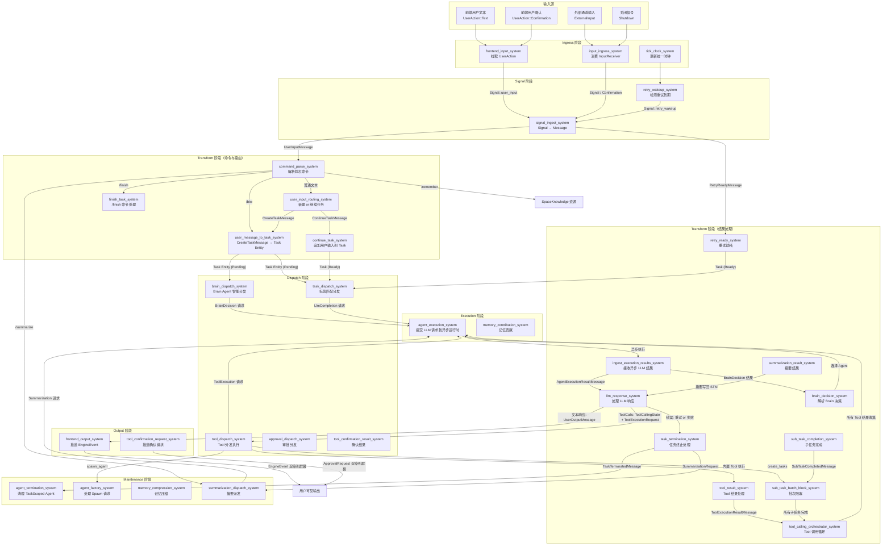
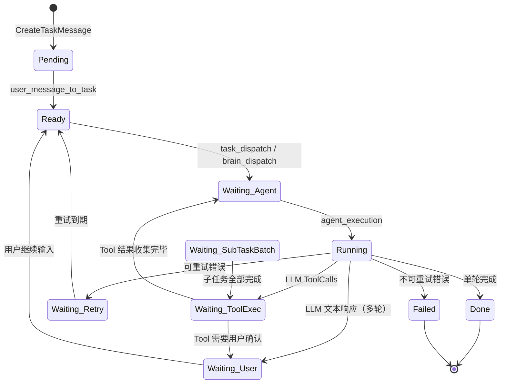
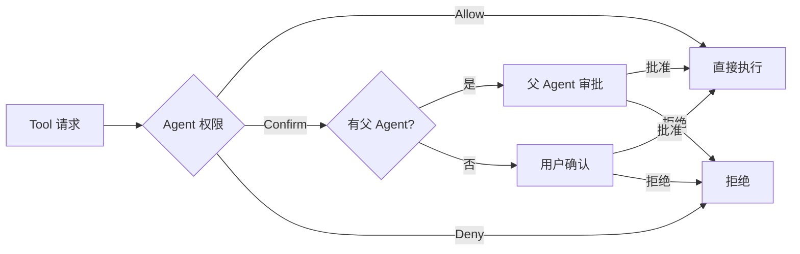

# AI Harness 框架架构分析

## 1. 项目层级总览

```text
harness/
├── main.rs                    # 程序入口：TUI 主循环 + ECS 驱动
├── lib.rs                     # 模块导出入口
├── app/                       # 应用层：配置、Resource 定义、ECS App 构建
│   └── mod.rs                 #   HarnessConfig、build_harness_app()
├── domain/                    # 领域层：核心实体与消息类型定义
│   ├── agent.rs               #   Agent 实体、权限、经验
│   ├── brain.rs               #   Brain 决策输出类型
│   ├── command.rs             #   用户命令解析（/btw, /finish 等）
│   ├── confirmation.rs        #   审批/确认类型
│   ├── contribution.rs        #   记忆贡献消息
│   ├── error.rs               #   执行错误与失败原因
│   ├── evaluation.rs          #   任务评估类型
│   ├── execution.rs           #   LLM 执行请求/响应
│   ├── frontend.rs            #   前端 trait、EngineEvent、UserAction
│   ├── memory.rs              #   短期/长期记忆、MemoryEntry
│   ├── message.rs             #   所有 ECS 消息组件（30+ 种）
│   ├── space.rs               #   全局共享 Resource（知识、工具注册表等）
│   ├── summarization.rs       #   摘要触发类型
│   ├── task.rs                #   Task 实体与状态机
│   ├── tool_runtime.rs        #   Tool 调用循环状态
│   ├── work_item.rs           #   工作项类型
│   └── workflow.rs            #   子任务批次、DAG 执行状态
├── contracts/                 # 契约层：模块间稳定接口
│   ├── dispatch.rs            #   DispatchPolicy、AgentSelector、TagMatcher
│   ├── execution.rs           #   ExecutionBackend、ExecutionPolicy
│   ├── memory.rs              #   MemoryStore、MemoryCompactor
│   ├── planning.rs            #   PlanPolicy、ReplanPolicy、WorkItemDeriver
│   └── tools.rs               #   ToolCatalog、ToolApprovalPolicy
├── llm/                       # LLM 集成层
│   ├── provider.rs            #   LLM Provider 配置（OpenAI/Anthropic/DeepSeek）
│   ├── factory.rs             #   Executor 工厂函数
│   ├── genai.rs               #   genai crate 适配实现
│   ├── brain_prompt.rs        #   Brain 调度 prompt 模板
│   └── summarization_prompt.rs #  摘要 prompt 模板
├── plugins/                   # 插件层：Bevy Plugin 装配
│   ├── default_runtime.rs     #   DefaultRuntimePluginGroup
│   ├── frontend.rs            #   FrontendPlugin
│   ├── task_runtime.rs        #   TaskRuntimePlugin
│   ├── dispatch.rs            #   DispatchPlugin
│   ├── execution.rs           #   ExecutionPlugin
│   ├── tools.rs               #   ToolRuntimePlugin
│   └── memory.rs              #   MemoryPlugin
├── systems/                   # 系统层：ECS System 实现
│   ├── ingress.rs             #   输入入口（Ingress 阶段）
│   ├── frontend_input.rs      #   前端输入拉取
│   ├── frontend_output.rs     #   前端输出推送
│   ├── command.rs             #   命令解析
│   ├── routing.rs             #   用户输入路由
│   ├── dispatch/              #   任务分发
│   │   ├── task_dispatch.rs   #     标签匹配分发
│   │   ├── brain_dispatch.rs  #     Brain Agent 智能分发
│   │   └── agent_selection.rs #     Agent 选择算法
│   ├── execution.rs           #   异步 LLM 执行提交
│   ├── transform/             #   数据转换与状态迁移
│   │   ├── signal_ingest.rs   #     Signal → Message
│   │   ├── task_creation.rs   #     CreateTaskMessage → Task Entity
│   │   ├── llm_response.rs    #     LLM 结果处理 + Tool 调用循环
│   │   ├── brain_decision.rs  #     Brain 决策解析
│   │   ├── task_lifecycle.rs  #     重试/终止/完成
│   │   └── subtask.rs         #     子任务批次管理
│   ├── tools/                 #   工具执行子系统
│   │   ├── dispatch.rs        #     Tool 分发
│   │   ├── result.rs          #     Tool 结果处理
│   │   ├── builtin/           #     内置 Tool 实现
│   │   ├── approval.rs        #     审批分发/结果
│   │   ├── confirmation.rs    #     用户确认
│   │   ├── waiting.rs         #     wait_tasks 检查
│   │   └── orchestrator.rs    #     Tool 调用编排
│   ├── memory.rs              #   记忆压缩/初始化
│   ├── contribution.rs        #   记忆贡献/吸收
│   ├── summarization.rs       #   摘要派发/结果
│   ├── evaluation.rs          #   任务评估
│   └── maintenance.rs         #   Agent 加载/创建/销毁
└── tui/                       # TUI 前端层
    ├── app.rs                 #   TUI 应用状态
    ├── chat.rs                #   聊天面板渲染
    ├── input.rs               #   输入面板渲染
    └── status.rs              #   状态栏渲染
```

## 2. 各模块作用与完成情况

### 2.1 app — 应用装配层

**作用**：定义全局配置 `HarnessConfig`（LLM provider、重试策略、Brain 开关等），声明 Bevy ECS 的 Resource 类型（`InputReceiver`、`FrontendRegistry`、`ExecutorHandle` 等），并提供 `build_harness_app()` 函数完成 ECS App 的完整装配——插入 Resource、配置 SystemSet 执行顺序、注册 Plugin Group 和 Startup/Maintenance 系统。

**完成情况**：**已完成**。配置从环境变量加载，SystemSet 流水线 7 阶段已定义并串联，`app_is_idle()` 实现了空闲检测。

### 2.2 domain — 领域类型层

**作用**：定义所有核心领域类型，是整个框架的"语言"。包括：

| 子模块 | 核心类型 | 作用 |
|--------|---------|------|
| `task.rs` | `Task`, `TaskStatus` | 任务实体，6 态状态机（Pending→Ready→Running→Waiting→Done/Failed） |
| `agent.rs` | `Agent`, `AgentKind` | Agent 实体，区分 Persistent（持久）和 TaskScoped（任务绑定） |
| `message.rs` | 30+ 种 Message Component | ECS 消息驱动组件，覆盖输入/输出/执行/工具/审批/子任务等 |
| `execution.rs` | `AgentExecutionRequest`, `AgentExecutionResult` | LLM 请求/响应的结构化封装 |
| `memory.rs` | `ShortTermMemory`, `LongTermMemory`, `MemoryEntry` | 双层记忆模型（Task 级短期 + Agent 级长期） |
| `space.rs` | `SpaceKnowledge`, `SpaceToolRegistry`, `BuiltinTool` | 全局共享资源（知识库、工具注册表、运行时上下文） |
| `frontend.rs` | `Frontend` trait, `EngineEvent`, `UserAction` | 前端抽象接口，引擎事件和用户动作的定义 |
| `workflow.rs` | `SubTaskDefinition`, `SubTaskBatchState` | 子任务 DAG 编排状态 |
| `command.rs` | `UserCommand` | 用户斜杠命令解析（/btw、/finish、/summarize、/remember） |
| `work_item.rs` | `WorkItem`, `WorkItemType` | 统一工作单元抽象（Planning/Execution/Summarization/Evaluation），已定义但未接入 System |
| `error.rs` | `ExecutionError`, `ToolError` | 统一错误类型，支持可重试判断和指数退避 |

**完成情况**：**已完成**。类型定义完备，`AgentExecutor` trait 作为 LLM 执行的抽象接口已稳定。

### 2.3 contracts — 契约接口层

**作用**：定义模块间的稳定接口（trait），支撑模块替换和独立测试。5 个契约域：

| 契约域 | 核心 Trait | 默认实现 |
|--------|-----------|---------|
| Dispatch | `DispatchPolicy`, `AgentSelector`, `TagMatcher`, `BrainSelectionPolicy`, `SummarizerSelectionPolicy` | `DefaultDispatchPolicy`（标签匹配评分）, `FirstBrainPolicy`, `FirstByTagPolicy` |
| Execution | `ExecutionBackend`, `ExecutionPolicy` | `DefaultExecutionPolicy`（指数退避重试） |
| Memory | `MemoryStore`, `MemoryCompactor`, `ContributionPolicy` | `DefaultCompactionPolicy`（token 阈值触发） |
| Planning | `PlanPolicy`, `ReplanPolicy`, `WorkItemDeriver` | `DefaultPlanPolicy`（长度阈值判断） |
| Tools | `ToolCatalog`, `ToolApprovalPolicy` | `DefaultToolApprovalPolicy`（基于 Agent 权限） |

**完成情况**：**接口已定义，但与实际 System 层存在断层**。所有 trait 均有默认实现，但实际 System 直接操作 ECS 组件而非通过 contract trait 调用——契约层当前更像是一份"规范文档"而非运行时的抽象边界。其中 Planning 契约（`PlanPolicy`、`ReplanPolicy`、`WorkItemDeriver`）已定义但无对应 System 实现。此外，`domain/work_item.rs` 中的 `WorkItem` 组件、`WorkItemCreatedMessage`/`WorkItemCompletedMessage` 事件也已定义但未接入任何 System，与 Planning 契约同属"预留接口"状态。

### 2.4 llm — LLM 集成层

**作用**：封装 LLM Provider 的配置解析和 API 调用。支持 OpenAI、Anthropic、DeepSeek、OpenAI-Compatible 四种 Provider。通过 `genai` crate 统一适配，提供 `create_executor_from_config()` 工厂函数创建 `AgentExecutor` 实现。还包含 Brain 调度和摘要调度的 prompt 模板。

**完成情况**：**已完成**。genai 适配层实现了完整的请求构建、响应解析、错误分类（认证/限流/配额/传输/超时等）。

### 2.5 plugins — Bevy 插件装配层

**作用**：将 System 按职责分组为 Bevy Plugin，通过 `DefaultRuntimePluginGroup` 一次性注册。6 个 Plugin：

| Plugin | 注册的 Systems |
|--------|--------------|
| `FrontendPlugin` | tick_clock, frontend_input, input_ingress, retry_wakeup, signal_ingest, command_parse, finish_task, user_input_routing, user_message_to_task, continue_task, frontend_output, tool_confirmation_request |
| `TaskRuntimePlugin` | retry_ready, task_termination, sub_task_completion, sub_task_batch_block |
| `DispatchPlugin` | brain_decision, brain_dispatch, task_dispatch, evaluation_trigger/result, approval_dispatch/result, tool_confirmation_result |
| `ExecutionPlugin` | ingest_execution_results, llm_response, tool_calling_orchestrator, agent_execution, memory_contribution |
| `ToolRuntimePlugin` | tool_dispatch, tool_result, check_waiting_tasks, on_subtask_completed_check_waiting |
| `MemoryPlugin` | memory_compression, init_agent_memory, memory_absorption, summarization_dispatch/result |

**完成情况**：**已完成**。所有 System 均已注册到对应 Plugin，执行顺序通过 `in_set()` + `after()` 约束。

### 2.6 systems — ECS 系统实现层

**作用**：框架的核心逻辑实现，所有 System 均在此定义。按流水线阶段组织（详见第 3 节数据流图）。

**完成情况**：**主体已完成**。Ingress→Signal→Transform→Dispatch→Execution→Output→Maintenance 全链路已实现。Evaluation（任务评估）System 已注册但实现较简。

### 2.7 tui — TUI 前端层

**作用**：基于 `ratatui` + `crossterm` 实现的终端用户界面。`TuiFrontend` 实现 `Frontend` trait，通过 `crossbeam-channel` 与 ECS 主循环双向通信。提供聊天面板、输入框、状态栏等 UI 组件。

**完成情况**：**已完成**。支持键盘/鼠标/粘贴事件，支持 EngineEvent 到 UI 状态的映射和渲染。

## 3. 输入类型与数据流转

### 3.1 框架输入类型

初始化完毕后，框架有 **4 种输入来源**，通过 **双通道** 进入 ECS：

- **前端通道**（`Frontend` trait）：TUI 或其他前端实现，通过 `poll_actions()` 拉取
- **外部通道**（`InputReceiver`）：基于 `crossbeam-channel` 的外部输入，支持非 TUI 场景

| 输入来源 | 入口通道 | 输入类型 | 说明 |
|---------|---------|---------|------|
| **前端用户文本** | 前端通道 | `UserAction::Text` | 用户在 TUI 中输入普通文本 |
| **前端用户确认** | 前端通道 | `UserAction::Confirmation` | 用户响应工具审批/确认请求 |
| **外部通道输入** | 外部通道 | `ExternalInput::TextWithChannel` | 带通道标识的文本 |
| **外部关闭信号** | 外部通道 | `ExternalInput::Shutdown` | 请求优雅关闭 |

### 3.2 用户命令

用户文本输入经解析后识别为以下命令或普通文本：

| 命令 | 行为 |
|------|------|
| `/btw [topic]` | 创建子任务承接新话题 |
| `/finish` | 结束当前任务 |
| `/summarize` | 触发对话摘要 |
| `/remember <content>` | 写入全局知识库 |
| 其他文本 | 作为普通用户输入处理 |

### 3.3 数据流转全景图



### 3.4 核心数据流转路径

#### 路径 A：普通用户输入（最常见）

```text
UserAction::Text
  → frontend_input_system: 创建 Signal::user_input
  → signal_ingest_system: 转为 UserInputMessage
  → command_parse_system: 判定非命令，放行
  → user_input_routing_system: 无 Waiting(User) 任务 → 创建 CreateTaskMessage
  → user_message_to_task_system: 创建 Task Entity (Pending) + ShortTermMemory
  → [Brain 启用时] brain_dispatch_system: Brain Agent 选择执行 Agent → AgentExecutionRequestMessage
  → [Brain 未启用时] task_dispatch_system: 标签匹配选择 Agent → AgentExecutionRequestMessage
  → agent_execution_system: 提交到 tokio 异步运行时
  → ingest_execution_results_system: 从 channel 接收结果
  → llm_response_system: 处理 LLM 响应
    → 文本响应: 写入 STM，输出 UserOutputMessage，Task → Waiting(User)
    → ToolCalls: 创建 ToolCallingState + ToolExecutionRequestMessage，Task → Waiting(ToolExecution)
  → frontend_output_system: 推送 EngineEvent 到前端
```

#### 路径 B：Tool 调用循环

```text
ToolExecutionRequestMessage
  → tool_dispatch_system: 权限检查 + 执行内置 Tool
    → 需要确认: 创建 ToolConfirmationRequestMessage
    → 直接执行: 创建 ToolExecutionResultMessage
  → tool_result_system: 记录 Tool 调用到 STM
  → tool_calling_orchestrator_system: 等待所有 Tool 结果 → 构建对话历史 → 发起后续 LLM 请求
  → agent_execution_system: 后续 LLM 调用
  → llm_response_system: 处理后续响应（文本 or 再次 ToolCalls）
```

#### 路径 C：多轮对话继续

```text
UserAction::Text (存在 Waiting(User) 的 Task)
  → frontend_input_system → signal_ingest_system → UserInputMessage
  → user_input_routing_system: 发现 Waiting(User) 任务 → ContinueTaskMessage
  → continue_task_system: 追加用户输入到 STM，Task → Ready
  → task_dispatch_system: 重新分发（带完整对话历史）
  → 后续同路径 A
```

#### 路径 D：子任务创建与等待

```text
LLM 调用 create_tasks Tool
  → tool_dispatch_system → CreateTasksTool: 返回 ToolAction::CreateBatch
  → sub_task_batch_block_system: 创建子 Task Entity + SubTaskConfig，父 Task → Waiting(SubTaskBatch)
  → brain_dispatch_system: 为子任务分发 Agent（检查 DAG 依赖）
  → agent_factory_system: 处理 AgentSpawnRequestMessage → 创建 TaskScoped Agent
  → 子任务执行（独立的路径 A）
  → task_termination_system: 子任务完成 → SubTaskCompletedMessage
  → sub_task_completion_system: 更新 BatchState
  → on_subtask_completed_check_waiting: 所有子任务完成 → 唤醒父 Task
```

### 3.5 关键状态变迁

#### Task 状态机



#### Tool 审批路由



## 4. 内置工具一览

| 工具名 | 功能 | 所需 Tag | 权限默认值 |
|--------|------|----------|----------|
| `knowledge_search` | 搜索全局知识库 | 无 | Allow |
| `spawn_agent` | 创建子 Agent | brain | Allow |
| `create_tasks` | 创建子任务批次（支持 DAG 依赖） | 无 | Allow |
| `wait_tasks` | 等待子任务完成并收集结果 | 无 | Allow |

### Tool 执行后的动作分支

每个内置 Tool 执行后返回一个 `ToolAction`，决定后续走向：

| ToolAction | 后续路径 |
|------------|--------|
| `Direct(value)` | 直接生成 `ToolExecutionResultMessage`，回到 Tool 调用循环 |
| `SpawnAgent{..}` | 生成 `AgentSpawnRequestMessage` → `agent_factory_system` 创建 TaskScoped Agent |
| `CreateBatch(defs)` | 生成 `SubTaskBatchCreatedMessage` → `sub_task_batch_block_system` 创建子任务 + 批次状态 |
| `WaitForTasks{..}` | 生成 `WaitingForTasksInfo` 组件附加到父 Task，父 Task 进入 `Waiting(SubTaskBatch)` |

## 5. Agent 配置文件（agents.toml）

`agents.toml` 是持久性 Agent 的定义源，在 Startup 阶段由 `load_agents_system` 加载。其内容直接决定调度行为：

| 字段 | 作用 |
|------|------|
| `name` | Agent 唯一名称（禁止重复） |
| `model` | LLM 模型名称 |
| `tags` | 能力标签，决定调度匹配（如 `brain`、`default`、`summarization`） |
| `description` | 能力描述，Brain Agent 用于调度决策 |
| `tools` | Tool 权限配置（`default_permission` + 各 Tool 的 `Allow`/`Confirm`/`Deny`） |

当前默认配置包含 3 个 Agent：`default-llm-agent`（通用）、`brain`（调度）、`summarizer`（摘要）。

## 6. ECS 流水线执行顺序

每个 `app.update()` 调用按以下严格顺序执行 7 个 SystemSet：

```text
Ingress → Signal → Transform → Dispatch → Execution → Output → Maintenance
```

| 阶段 | 职责 | 关键 System |
|------|------|------------|
| Ingress | 接收外部输入 | tick_clock, frontend_input, input_ingress |
| Signal | 信号生成 | retry_wakeup, signal_ingest |
| Transform | 数据转换与状态迁移 | command_parse, user_input_routing, llm_response, tool_calling_orchestrator, task_termination, sub_task_completion 等 |
| Dispatch | 任务/工具/审批分发 | brain_dispatch, task_dispatch, tool_dispatch |
| Execution | 异步执行提交 | agent_execution, memory_contribution |
| Output | 前端输出推送 | frontend_output, tool_confirmation_request |
| Maintenance | 清理与维护 | agent_termination, agent_factory, memory_compression, summarization_dispatch |

## 7. 补充机制说明

### 7.1 父子 Agent 记忆贡献

子 Agent（TaskScoped）任务完成后，可通过 `MemoryContributionRequestMessage` 将自身经验贡献给父 Agent。流程：

```text
子 Agent 任务完成
  → memory_contribution_system: 生成 MemoryContributionRequestMessage
  → 父 Agent 评估贡献内容（可选 LLM 调用）
  → memory_absorption_system: 将 AbsorbedMemory 写入父 Agent 的 LongTermMemory
```

### 7.2 评估系统（Evaluation）

`evaluation_trigger_system` 和 `evaluation_result_system` 已注册到 DispatchPlugin，但 `TaskEvaluationConfig` 默认为 `enabled: false`。这是一个预留的“任务健康检查”框架钩子，设计用于在任务执行过程中由 Evaluator Agent 判断任务是否偏离轨道。

### 7.3 推理内容透传（reasoning_content）

DeepSeek 等推理模型会返回 `reasoning_content`（思考过程），该字段必须在后续对话请求中原样回传。框架在以下位置透传此字段：

- `AgentExecutionOutput.reasoning_content` → `AgentExecutionResult.reasoning_content`
- `ToolCallingState.conversation` 中的 `ConversationMessage::Assistant.reasoning_content`
- `genai.rs` 中通过 `with_reasoning_content()` 回传给 API
