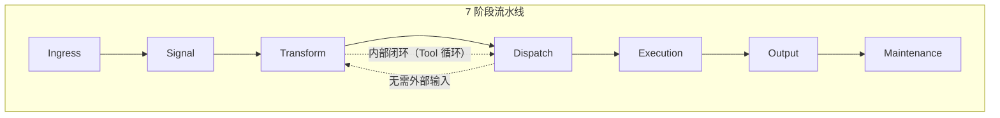
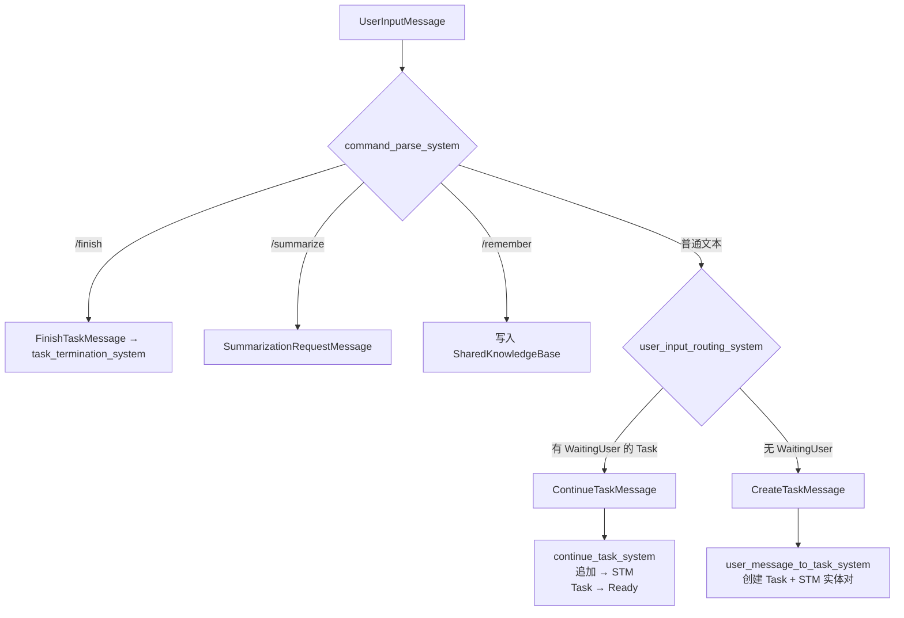
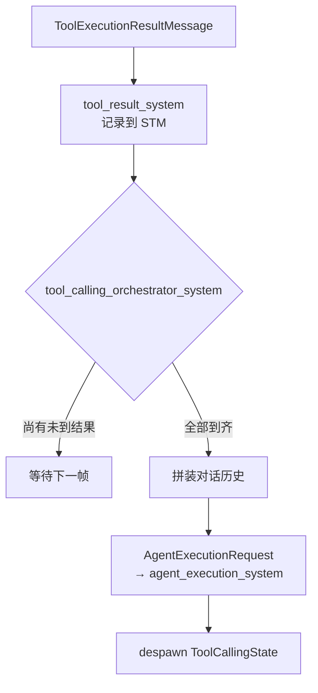
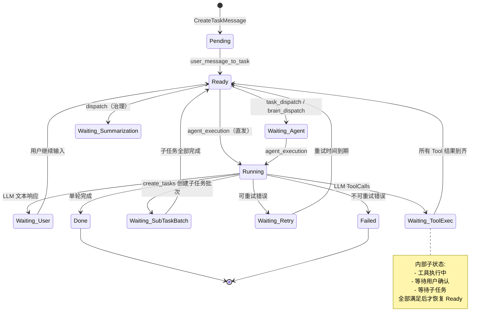
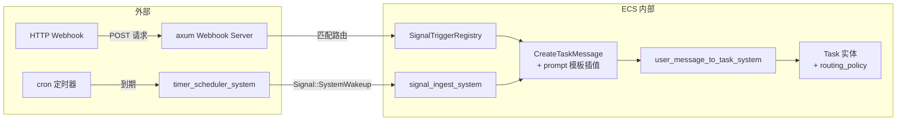

# AI Harness 数据流转指南 — 设计规格

> **状态：当前有效** — 设计已确认，准备进入实施

## 1. 背景与目标

为第一次接触 AI Harness 的项目评估者、架构审查者提供一个以**数据流转**为主线的框架理解指南。

### 目标读者

项目评估者与架构审查者，具备软件工程基础但首次接触 AI Harness。

### 文档定位

- 聚焦"数据在管线中如何变化"，而非"如何配置"或"如何扩展"
- 中等粒度：列出每个阶段的 System + 关键数据变化说明
- 使用 Mermaid 图表辅助可视化数据流向

### 内容原则

- 不涉及具体配置字段、环境变量或扩展机制
- 同一数据结构的生命周期不跨章节重复展开
- 以文档首节定义的 7 阶段流水线为组织主线

## 2. 框架全景

### 2.1 核心架构：ECS 流水线

AI Harness 构建在 Bevy ECS 之上，通过 **SystemSet** 严格组织执行顺序。每帧 `app.update()` 按 7 个阶段顺序执行：



- 外部输入（用户键盘、IM 消息、Webhook）每次从 Ingress 进入，完整经过所有阶段
- Task 内部工作流（Tool 调用循环、子任务调度）在 Transform ↔ Dispatch ↔ Execution 之间自动推进，依赖内部消息驱动

### 2.2 阶段职责速览

| 阶段 | 一句话职责 | 数据形态变化典型 |
|------|-----------|----------------|
| **Ingress** | 从外部世界采集输入 | 键盘事件 → `Signal` |
| **Signal** | 瞬时信号转为标准化消息 | `Signal` → `UserInputMessage`/`RetryReadyMessage` |
| **Transform** | 数据变换 + 状态迁移 + 响应处理 | `Message` → `Task` 实体；`LLM 结果` → `ToolCalls`/`文本输出` |
| **Dispatch** | 决策分发 | `Ready Task` → `AgentExecutionRequest`；工具请求 → 工具执行 |
| **Execution** | 提交异步 LLM 执行 | `AgentExecutionRequest` → tokio 通道 → 异步回注结果 |
| **Output** | 推送给前端 | `UserOutputMessage` → `EngineEvent` → TUI/IM |
| **Maintenance** | Agent 生命周期与记忆管理 | 创建/清理 Agent；压缩 STM；治理经验候选 |

### 2.3 数据分类

在管线中流转的数据分为两类：

- **实体（Entity）**：跨帧存活，承载状态。附加 Component 标记状态，多帧内被不同 System 查询和修改
- **消息（Message）**：ECS Message Component，通常单帧内消费。由一个 System 生产，下一个 Consumer System 消费后 despawn

## 3. 关键数据结构速览

### 3.1 实体类

| 数据结构 | 创建位置 | 一句话职责 | 核心字段 | 生命周期 |
|---------|---------|-----------|---------|---------|
| **Task** | `user_message_to_task_system` | 用户意图的载体，贯穿全流程的主实体 | `id`, `content`, `status`, `delegate`, `origin_channel` | 创建 → 状态流转 → Done/Failed |
| **ShortTermMemory** | 随 Task 同时创建 | 记录 Task 的对话历史 | `entries[]`, `summary_prefix`, `estimated_tokens` | 随 Task 同生同灭 |
| **Agent** | `load_agents_system` / `agent_factory_system` | LLM 执行能力的载体 | `id`, `kind`, `tags`, `model`, `tools` | Persistent 永久；TaskScoped 随 Task 销毁 |
| **LongTermMemory** | `init_agent_memory_system` | Agent 的跨任务知识沉淀 | `entries[]`（含衰退评分 + 重要性） | 随 Agent 持久化，含衰退淘汰 |
| **ToolCallingState** | `llm_response_system` | 跟踪一次 LLM 返回的多条 Tool 调用 | `pending_tool_call_ids`, `iteration`, `conversation` | 跨帧存活，结果到齐后 despawn |
| **WorkItem** | Evaluation/Summarization 等治理系统 | 内部治理工作的统一执行单元 | `id`, `work_type`, `status`, `writeback_target` | 创建 → 分发 → 执行 → 写回 |
| **SubTaskBatchState** | `sub_task_batch_block_system` | 跟踪一批子任务的完成进度 | `pending_ids[]`, `batch_id` | 全部完成或超时后 despawn |

### 3.2 消息类

| 数据结构 | 生产者 | 消费者 | 传递内容 |
|---------|-------|-------|---------|
| **Signal** | Ingress System / 重试检查 | `signal_ingest_system` | 外部事件的瞬时信号 |
| **UserInputMessage** | `signal_ingest_system` | `command_parse_system` / `routing_system` | 标准化用户文本 |
| **CreateTaskMessage** | `routing_system` | `user_message_to_task_system` | "创建新任务"指令 |
| **ContinueTaskMessage** | `routing_system` | `continue_task_system` | "继续已有对话"指令 |
| **AgentExecutionRequest** | Dispatch / Transform | `agent_execution_system` | 含 prompt + 工具定义 + 对话历史的 LLM 请求 |
| **AgentExecutionResult** | 异步执行通道回注 | `ingest_execution_results_system` | LLM 返回的文本 / ToolCalls / 错误 |
| **ToolExecutionRequestMessage** | `llm_response_system` | `tool_dispatch_system` | LLM 要求调用的工具名称与参数 |
| **ToolExecutionResultMessage** | `tool_dispatch_system` | `tool_result_system` / `orchestrator_system` | 工具执行结果或错误 |
| **UserOutputMessage** | `llm_response_system` | `frontend_output_system` | 展示给用户的 LLM 文本回复 |
| **SystemOutputMessage** | 各 System | `frontend_output_system` | 系统通知（不进入 STM） |
| **ToolConfirmationRequestMessage** | `tool_dispatch_system` | `frontend_output_system` | 工具使用审批请求 |
| **ToolConfirmationResponseMessage** | 前端/IM | `tool_confirmation_result_system` | 用户对审批的确认/拒绝 |
| **SubTaskBatchCreatedMessage** | `create_tasks` 工具 | `sub_task_batch_block_system` | 子任务批次创建指令 |
| **SubTaskCompletedMessage** | `task_termination_system` | `sub_task_completion_system` | 子任务完成通知 |
| **AgentSpawnRequestMessage** | `create_tasks` 工具 | `agent_factory_system` | TaskScoped Agent 创建请求 |
| **WorkItemCreatedMessage** | 治理触发 System | `workitem_dispatch_system` | WorkItem 创建事件 |

### 3.3 主线关系

```
Task  →  为什么做，做到哪了
  ├── ShortTermMemory →  已经说了什么
  ├── delegate Agent  →  谁来执行
  └── WorkItem        →  还需要做的内部工作
```

## 4. 逐阶段展开

### 4.1 Ingress 阶段

**负责从外部世界采集输入，转为 ECS 内部信号。**

**System 清单：**

| System | 源文件 | 行为 |
|--------|-------|------|
| `tick_clock_system` | `ingress.rs` | 更新全局时钟 `Clock`，确保同帧内各 System 读取一致时间 |
| `frontend_input_system` | `frontend_input.rs` | 轮询 TUI 前端：文本 → `Signal::user_input`；确认 → `ToolConfirmationResponseMessage` |
| `input_ingress_system` | `ingress.rs` | 从 `InputReceiver` 通道读取外部输入（IM 消息 / Shutdown） |

**数据变化：**

```text
用户键盘文本     → Signal { kind: UserInput, payload: "帮我写个脚本" }
TUI 确认按钮     → ToolConfirmationResponseMessage
IM 通道消息      → ExternalInput::TextWithChannel → Signal::user_input
Shutdown 信号    → ShutdownState.requested = true
外部前端轮询     → UserAction::Text / UserAction::Confirmation
```

### 4.2 Signal 阶段

**将瞬时信号转换为标准化消息供下游消费。**

**System 清单：**

| System | 源文件 | 行为 |
|--------|-------|------|
| `retry_wakeup_system` | `ingress.rs` | 轮询 Waiting(RetryBackoff) 的 Task，到达重试时间时 spawn `Signal::RetryWakeup` |
| `signal_ingest_system` | `signal_ingest.rs` | 消费所有 Signal 实体，转换为对应 Message 后 despawn Signal |

**数据变化：**

```text
Signal::UserInput      → UserInputMessage { content: "帮我写个脚本" }
Signal::RetryWakeup    → RetryReadyMessage { task_id: xxx }
Signal::SystemWakeup   → 无操作（保留扩展）
```

### 4.3 Transform 阶段

**数据转换与状态迁移的核心层。System 最多、分支最密集。**

**System 清单：**

| System | 源文件 | 行为 |
|--------|-------|------|
| `command_parse_system` | `command.rs` | 解析用户输入中的斜杠命令 |
| `finish_task_system` | `task_lifecycle.rs` | 消费 `FinishTaskMessage`，标记 Task 为 Done |
| `user_input_routing_system` | `routing.rs` | 路由决策：有 Waiting(User) 的 Task → 继续；无 → 创建新任务 |
| `user_message_to_task_system` | `task_creation.rs` | 创建 `(Task, ShortTermMemory)` 实体对 |
| `continue_task_system` | `routing.rs` | 追加用户输入到 STM，恢复 Task 为 Ready |
| `retry_ready_system` | `task_lifecycle.rs` | 将 Task 从 Waiting(RetryBackoff) 恢复为 Ready |
| `ingest_execution_results_system` | `transform/mod.rs` | 从异步 channel 读取 LLM 结果 |
| `llm_response_system` | `llm_response.rs` | **核心 System**：处理 LLM 结果文本 / ToolCalls / 错误 |
| `tool_calling_orchestrator_system` | `llm_response.rs` | 收集 Tool 结果，到齐后拼装对话并发起 follow-up LLM |
| `tool_result_system` | `tools/result.rs` | 将 Tool 执行结果写入 STM |
| `task_termination_system` | `task_lifecycle.rs` | Task 到达终态：清理状态、停止 shell、通知子任务完成 |
| `sub_task_completion_system` | `subtask.rs` | 更新 SubTaskBatchState，全部完成时唤醒父 Task |
| `sub_task_batch_block_system` | `subtask.rs` | 将父 Task 阻塞为 Waiting(SubTaskBatch) |

**数据变化**：

#### 4.3.1 用户输入 → 任务创建



**Task 实体创建后的初始状态：**

```text
Task {
    id: Uuid::new_v4(),
    content: "帮我写个脚本",
    status: Pending,
    delegate: None,
    multi_turn: true,
    origin_channel: Some("tui:{user}"),
    routing_policy: { output_channel: Some(tui), approval_channel: Some(tui) },
}
ShortTermMemory {
    entries: [{ role: User, content: "帮我写个脚本" }],
    estimated_tokens: ~10,
}
```

#### 4.3.2 LLM 结果处理

```mermaid
graph TD
    AER[AgentExecutionResultMessage] --> LRS{llm_response_system}

    LRS -->|文本| UOM[UserOutputMessage<br/>→ STM 追加 + 前端输出]
    LRS -->|ToolCalls| TCS[创建 ToolCallingState]
    LRS -->|可重试错误| RET[Task.schedule_retry → WaitingBackoff]
    LRS -->|不可重试| FAI[Task.mark_failed]

    TCS --> TER[ToolExecutionRequestMessage<br/>→ tool_dispatch_system]
    TCS -.->|跨帧| TCST[ToolCallingState<br/>pending: ["call_1", "call_2"]<br/>iteration: 1<br/>conversation: [...]]
```

#### 4.3.3 Tool 调用循环



#### 4.3.4 Task 终态处理

```text
Task → Done/Failed
    → task_termination_system:
        ├─ 清理 ToolCallingState
        ├─ 停止 shell session
        ├─ 子任务 → SubTaskCompletedMessage
        │   → sub_task_completion_system → 更新 BatchState
        │   → on_subtask_completed_check_waiting → 全部完成唤醒父 Task
        └─ 触发 Summarization WorkItem
```

### 4.4 Dispatch 阶段

**负责任务到 Agent 的分配决策和工具权限检查。**

| System | 源文件 | 行为 |
|--------|-------|------|
| `brain_dispatch_system` | `brain_dispatch.rs` | Brain 模式：Ready Task 交给 Brain Agent 做决策 |
| `task_dispatch_system` | `task_dispatch.rs` | **核心 System**：tag 匹配 Agent + 构建含 STM/LTM 的 prompt |
| `workitem_dispatch_system` | `workitem_dispatch.rs` | 为治理型 WorkItem 匹配 Agent |
| `tool_dispatch_system` | `tools/dispatch.rs` | 工具权限检查 + 审批路由 |
| `evaluation_trigger_system` | `evaluation.rs` | 检测对话轮数阈值，创建 Evaluation WorkItem |
| `summarization_dispatch_system` | `summarization.rs` | 摘要请求 → Summarization WorkItem |
| `approval_dispatch_system` | `approval.rs` | 父 Agent 审批处理（当前 MVP 自动通过） |
| `tool_confirmation_result_system` | `confirmation.rs` | 处理用户确认响应 |

**数据变化：**

```mermaid
graph TD
    T[Task { status: Ready }] --> BD{brain_dispatch_system}
    BD -->|Brain 启用| BRAIN[Brain 决策 → agent_execution_system]
    BD -->|子任务/无 Brain| TD[tag 匹配 Agent]

    TD --> BUILD[构建 prompt:<br/>Task.content + STM 历史 + LTM.Relevant]
    BUILD --> AER[AgentExecutionRequest<br/>→ agent_execution_system]

    TER[ToolExecutionRequestMessage] --> TDISP{tool_dispatch_system}
    TDISP -->|Allow| EXEC[直接执行 → ToolExecutionResultMessage]
    TDISP -->|Confirm + 无父 Agent| USR[用户确认请求]
    TDISP -->|Confirm + 有父 Agent| PAR[父 Agent 审批]
    TDISP -->|Deny| ERR[错误结果]
```

**AgentExecutionRequest 的分发结构：**

```text
首次请求：
AgentExecutionRequest {
    agent_id: "default-llm-agent",    ← tag 匹配选择的 Agent
    request_kind: LlmCompletion,
    prompt: "帮我写个脚本",
    system_prompt: "..." + LTM.Core + LTM.Relevant,
    tools: [create_tasks, shell_exec, ...],
    conversation: None,               ← 首次请求无历史
}

Tool 循环后续请求：
AgentExecutionRequest {
    agent_id: "default-llm-agent",
    request_kind: LlmCompletion,
    prompt: "帮我写个脚本",
    system_prompt: "...",
    tools: [create_tasks, shell_exec, ...],
    conversation: Some([User, Assistant, Tool, Tool, ...]),  ← 完整结构历史
}
```

### 4.5 Execution 阶段

**将 Agent 执行请求提交给异步运行时，不阻塞 ECS 主循环。**

| System | 源文件 | 行为 |
|--------|-------|------|
| `agent_execution_system` | `execution.rs` | 消费 AgentExecutionRequest，通过 genai → tokio 执行 LLM |
| `agent_termination_system` | `contribution.rs` | Agent 终止时触发经验收集 |
| `experience_collection_dispatch_system` | `contribution.rs` | 派发经验收集的 follow-up 请求 |

**数据变化：**

```text
AgentExecutionRequest → agent_execution_system:
    1. 通过 genai 构造 LLM API 请求
    2. 提交 tokio 异步执行
    3. LlmCompletion: Task.status → Running
    4. 结果回注通道

    异步完成后:
    通道 → AgentExecutionResult
    → ingest_execution_results_system
    → llm_response_system（回到 Transform 阶段 4.3.2 入口）
```

### 4.6 Output 阶段

**将 ECS 内部状态变化推送给前端。**

| System | 源文件 | 行为 |
|--------|-------|------|
| `frontend_output_system` | `frontend_output.rs` | 推送给所有已注册前端 |
| `tool_confirmation_request_system` | `confirmation.rs` | 转为前端审批事件 |

**数据变化：**

```text
UserOutputMessage → frontend_output_system:
    → 追加到 STM（Assistant 条目）
    → EngineEvent::UserOutput → TUI 渲染
    → 有 origin_channel → 推送到对应 IM 通道

ToolConfirmationRequestMessage:
    → EngineEvent::ApprovalRequest → TUI 弹窗
    → IM 通道用户收到文本选项 "1. 允许 2. 拒绝"
    → 用户回复 "1" → 回注 ConfirmationResponse

SystemOutputMessage:
    → EngineEvent::SystemNotification（不进入 STM）
```

### 4.7 Maintenance 阶段

**Agent 生命周期管理、记忆压缩与经验治理。**

| System | 源文件 | 行为 |
|--------|-------|------|
| `load_agents_system` | `maintenance.rs` | Startup：加载 agents.toml，创建 Persistent Agent 实体 |
| `agent_factory_system` | `maintenance.rs` | 处理 AgentSpawnRequestMessage，创建 TaskScoped Agent |
| `memory_compression_system` | `memory.rs` | STM 超阈值 → Summarization WorkItem |
| `summarization_dispatch_system` | `summarization.rs` | 摘要请求 → WorkItem |
| `experience_governance_system` | `contribution.rs` | 治理经验候选：Knowledge → LTM；Skill → SKILL.md |
| `experience_collection_cleanup_system` | `contribution.rs` | 经验收集后清理 TaskScoped Agent |

**数据变化：**

```text
STM.estimated_tokens > THRESHOLD
    → memory_compression_system → Summarization WorkItem
    → summarization_dispatch_system → workitem_dispatch_system
    → 后续 LLM 摘要执行 → 结果写回 STM.summary_prefix

Agent 终止
    → ExperienceCollection WorkItem
    → 执行 → experience_governance_system:
        ├─ Knowledge → 父 Agent LongTermMemory 追加
        ├─ Skill → 用户确认 → SKILL.md 目录
        └─ default Agent → IncubationProposal
```

## 5. Task 状态机全景

### 5.1 状态定义

| 状态 | 含义 |
|------|------|
| `Pending` | 刚创建，尚未设置 Ready |
| `Ready` | 就绪待分发 |
| `Running` | LLM 正在执行中 |
| `Waiting(reason)` | 等待某条件满足后继续 |
| `Done` | 成功完成 |
| `Failed(reason)` | 失败终止 |

### 5.2 完整状态流转



### 5.3 状态变更位置一览

| 迁移 | 阶段 | System |
|------|------|--------|
| Pending → Ready | Transform | `user_message_to_task_system` |
| Ready → Waiting(Agent) | Dispatch | `task_dispatch_system` |
| Waiting(Agent) → Running | Execution | `agent_execution_system` |
| Running → Waiting(User) | Transform | `llm_response_system` |
| Running → Waiting(ToolExec) | Transform | `llm_response_system` |
| Running → Waiting(SubTaskBatch) | Transform | `sub_task_batch_block_system` |
| Running → Waiting(RetryBackoff) | Transform | `llm_response_system` |
| Running → Done | Transform | `task_termination_system` |
| Running → Failed | Transform | `task_termination_system` |
| Waiting(User) → Ready | Transform | `continue_task_system` |
| Waiting(ToolExec) → Waiting(Agent)* | Transform | `tool_calling_orchestrator_system` |
| Waiting(ToolExec) → Waiting(User)* | Dispatch | `tool_dispatch_system` |
| Waiting(SubTaskBatch) → Waiting(ToolExec)* | Transform | `on_subtask_completed_check_waiting` |
| Waiting(RetryBackoff) → Ready | Signal → Transform | `retry_wakeup_system` → `retry_ready_system` |

*注：Waiting(ToolExec) 是一个"复合等待"状态，实际可能等待多个条件。Task 恢复到 Ready 只发生在**所有**等待条件满足后。

## 6. 补充路径

### 6.1 信号触发路径（Webhook / Timer）

与用户交互不同，无需等待人工输入，由外部事件或定时器驱动：



**与用户输入任务的关键差异：**

- `Task.origin_channel = None`（没有用户来源）
- `Task.routing_policy` 指定了 `output_channel` 和 `approval_channel`（输出和审批去向）
- 执行期间的工具确认请求路由到 `approval_channel` 对应的 IM 用户
- `schedule_task` 工具支持 Agent 动态创建未来定时任务

### 6.2 IM 通道透传路径

框架通过统一的 `Channel` 抽象接入 IM 平台（Telegram、QQ 等）：

```text
用户 IM 消息
  → Channel Adapter（轮询 / WebSocket）
  → ExternalInput::TextWithChannel { content, channel_id }
  → input_ingress_system → Signal::user_input
  → 正常流程 → Task.origin_channel = Some(channel_id)

LLM 文本回复
  → UserOutputMessage
  → frontend_output_system
  → 检查 Task.routing_policy.output_channel
  → 通过 ChannelManager.send() 推送到对应 IM 会话
  → 附加任务短 ID 前缀如 "[a1b2c3d4]"

审批请求（无 TUI 场景）
  → ToolConfirmationRequestMessage
  → IM 用户收到文本："是否允许执行 shell_exec？\n1. 允许\n2. 拒绝"
  → 用户回复 "1" → 作为 ConfirmationResponse 回注 ECS
```

IM 通道的隔离规则：
- 文本输入仅路由到同一通道中 `Waiting(User)` 的 Task
- 斜杠命令（`/finish`、`/summarize`、`/btw`）限定在发出通道内生效
- 子任务继承父任务的 `origin_channel`

## 7. 附录：System 与阶段对照总表

| 阶段 | System | 主要消费数据 | 主要产出数据 |
|------|--------|------------|------------|
| Ingress | `tick_clock_system` | 系统时间 | `Clock` 资源 |
| Ingress | `frontend_input_system` | 前端轮询结果 | `Signal`, `ToolConfirmationResponseMessage` |
| Ingress | `input_ingress_system` | `ExternalInput` 通道 | `Signal`, `ToolConfirmationResponseMessage` |
| Signal | `retry_wakeup_system` | Task.status | `Signal::RetryWakeup` |
| Signal | `signal_ingest_system` | `Signal` | `UserInputMessage`, `RetryReadyMessage` |
| Transform | `command_parse_system` | `UserInputMessage` | 命令处理或放行 |
| Transform | `finish_task_system` | `FinishTaskMessage` | Task → Done |
| Transform | `user_input_routing_system` | `UserInputMessage` | `CreateTaskMessage` / `ContinueTaskMessage` |
| Transform | `user_message_to_task_system` | `CreateTaskMessage` | Task + STM 实体 |
| Transform | `continue_task_system` | `ContinueTaskMessage` | STM 追加 + Task → Ready |
| Transform | `retry_ready_system` | `RetryReadyMessage` | Task → Ready |
| Transform | `ingest_execution_results_system` | 异步通道 | `AgentExecutionResultMessage` |
| Transform | `llm_response_system` | `AgentExecutionResultMessage` | `UserOutputMessage` / ToolCallingState + 工具请求 |
| Transform | `tool_calling_orchestrator_system` | `ToolExecutionResultMessage` | follow-up `AgentExecutionRequest` |
| Transform | `tool_result_system` | `ToolExecutionResultMessage` | STM 记录 |
| Transform | `task_termination_system` | Task 终态 | `TaskTerminatedMessage`, `SubTaskCompletedMessage` |
| Transform | `sub_task_completion_system` | `SubTaskCompletedMessage` | `SubTaskBatchState` 更新 |
| Transform | `sub_task_batch_block_system` | `SubTaskBatchCreatedMessage` | 父 Task → Waiting(SubTaskBatch) |
| Transform | `check_waiting_tasks_system` | `WaitingForTasksInfo` | 等待结果消息 |
| Dispatch | `brain_dispatch_system` | Task → Ready | BrainDecision 请求或直发 Agent |
| Dispatch | `task_dispatch_system` | Task → Ready | `AgentExecutionRequest`（含 prompt） |
| Dispatch | `workitem_dispatch_system` | WorkItem → Pending | `AgentExecutionRequest` |
| Dispatch | `tool_dispatch_system` | `ToolExecutionRequestMessage` | `ToolExecutionResultMessage` / 审批请求 |
| Dispatch | `evaluation_trigger_system` | 对话轮数 | Evaluation WorkItem |
| Dispatch | `summarization_dispatch_system` | `SummarizationRequestMessage` | Summarization WorkItem |
| Dispatch | `approval_dispatch_system` | `ApprovalRequestMessage` | 审批结果 |
| Dispatch | `tool_confirmation_result_system` | `ToolConfirmationResponseMessage` | 工具恢复执行或取消 |
| Execution | `agent_execution_system` | `AgentExecutionRequest` | tokio 异步执行 |
| Execution | `agent_termination_system` | Agent 终止事件 | 经验收集触发 |
| Execution | `experience_collection_dispatch_system` | 经验收集触发 | ExperienceCollection WorkItem |
| Output | `frontend_output_system` | `UserOutputMessage` / `SystemOutputMessage` | `EngineEvent` → 前端 |
| Output | `tool_confirmation_request_system` | `ToolConfirmationRequestMessage` | 前端审批事件 |
| Maintenance | `load_agents_system` | `agents.toml` | Persistent Agent 实体 |
| Maintenance | `agent_factory_system` | `AgentSpawnRequestMessage` | TaskScoped Agent 实体 |
| Maintenance | `memory_compression_system` | STM 超阈值 | Summarization WorkItem |
| Maintenance | `summarization_dispatch_system` | `SummarizationRequestMessage` | Summarization WorkItem |
| Maintenance | `experience_governance_system` | 经验候选 | LTM 写入 / SKILL.md 生成 |
| Maintenance | `experience_collection_cleanup_system` | TaskScoped Agent | Agent 清理 |