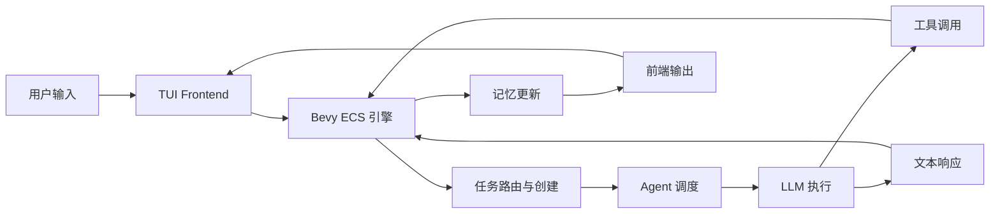
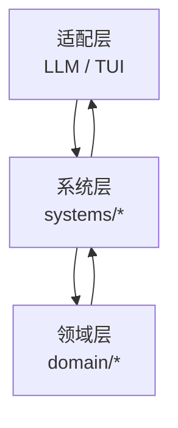

# 项目概述

## 项目定位

`AI Harness` 是一个基于 Rust 与 Bevy ECS 的 AI Harness 框架，目标是把用户输入、任务拆解、Agent 调度、LLM 执行、工具调用、记忆沉淀与前端交互组织为一条可扩展的运行链路。

当前代码已经具备 MVP 主链路：

- 支持从终端输入自然语言任务。
- 支持任务创建、继续执行、完成与失败状态流转。
- 支持通过 LLM 执行文本回复与工具调用。
- 支持内置工具、审批流、子任务批处理与等待机制。
- 支持短期记忆压缩与长期记忆吸收。
- 支持 TUI 前端与引擎解耦通信。

## 技术栈

| 类别 | 选型 | 说明 |
| --- | --- | --- |
| 语言 | Rust 2024 | 强类型、并发安全、适合构建长期演进的基础框架 |
| ECS | Bevy `0.18.1` | 用于资源、组件、系统调度与数据驱动状态流转 |
| 异步运行时 | Tokio | 承担 LLM 执行与异步结果回流 |
| LLM 接入 | `genai` | 统一封装不同 Provider 的聊天调用 |
| 前端 | Ratatui + Crossterm | 提供本地终端交互界面 |
| 日志 | tracing | 输出结构化日志，便于调试与诊断 |
| 配置 | dotenvy + 环境变量 | 管理模型、Provider 与运行配置 |

## 设计目标

- 使用 ECS 把流程拆解为可维护的系统阶段。
- 使用领域模型隔离业务语义与外部适配实现。
- 使用抽象接口隔离 LLM 与前端，避免核心流程直接依赖具体实现。
- 使用 Message / Resource 驱动系统间通信，降低模块耦合。
- 支持多 Agent、子任务编排、工具审批、记忆压缩等扩展能力。

## 核心能力概览

## 代码结构

| 目录 | 职责 |
| --- | --- |
| `src/main.rs` | 进程入口、日志初始化、Tokio 运行时、TUI 主循环 |
| `src/lib.rs` | 库入口与模块导出 |
| `src/app` | 应用配置、资源注入、系统装配、空闲态判断 |
| `src/domain` | 领域模型与系统间协议 |
| `src/systems` | ECS 系统实现，承载主链路 |
| `src/llm` | Provider 配置、执行器工厂、Prompt 与具体适配实现 |
| `src/tui` | 终端 UI 状态管理、渲染与输入处理 |

## 运行视角

项目运行时可以理解为三层：

1. 领域层定义 Task、Agent、Memory、Tool、Frontend Event 等稳定语义。
2. 系统层围绕这些语义组织输入、转换、调度、执行与输出。
3. 适配层把 LLM Provider、终端 UI 等外部能力接入到统一协议中。

## 当前特征

- 架构风格偏“工作流引擎 + 代理系统”。
- 主链路已经成形，模块边界基本清晰。
- 代码中已预留多前端、多 Provider、外部工具等扩展点。
- 当前更适合继续完善真实联调、可观测性与配置治理，而不是再扩张新能力面。

## 推荐阅读

- 先读 [架构设计](./02-architecture.md)，理解整体依赖与消息流。
- 再读 [应用装配与系统流转](./03-app-and-systems.md)，理解主执行链。
- 随后查看 [领域模型](./04-domain-model.md) 与 [LLM 与前端适配](./05-llm-and-frontend.md)。
