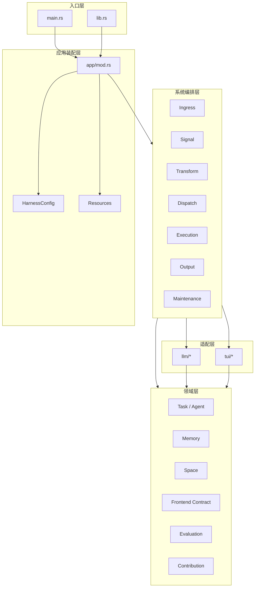
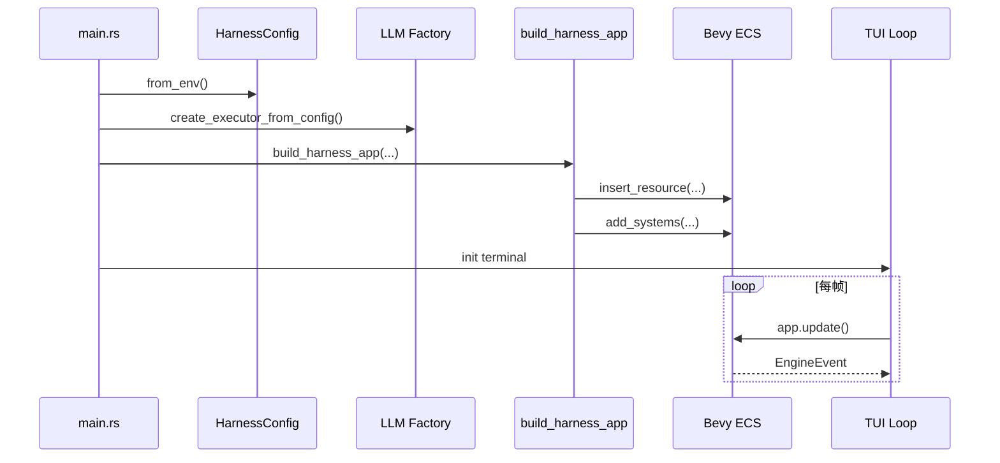
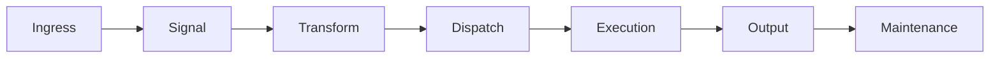
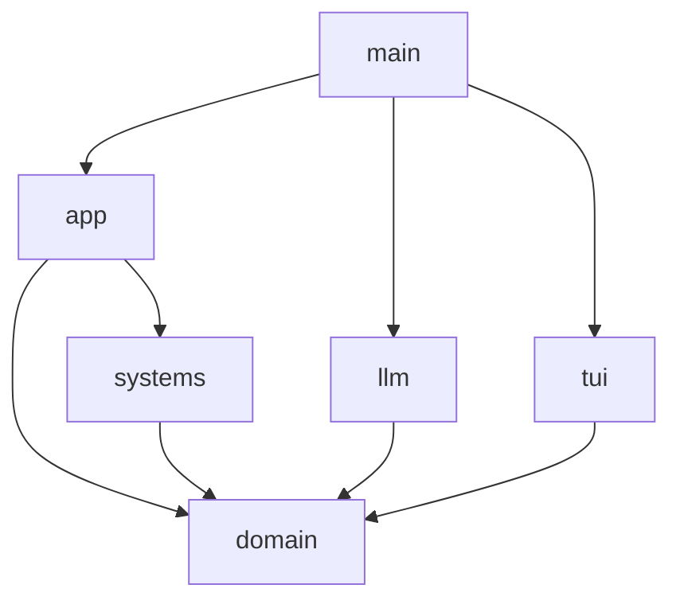

# 架构设计

## 架构总览

`Harness` 采用“领域模型 + ECS 调度 + 外部适配”的结构：

- `domain` 负责定义核心业务语义与协议。
- `systems` 负责围绕 ECS 世界推进状态机。
- `app` 负责资源装配与系统执行顺序。
- `llm` 与 `tui` 作为边界适配层接入系统。

## 分层架构

## 启动装配

应用启动主要发生在 `main.rs` 与 `app/mod.rs`：

1. 初始化日志与 panic hook。
2. 读取环境变量生成 `HarnessConfig`。
3. 创建 Tokio runtime 与 LLM executor。
4. 创建 TUI Frontend 的事件通道。
5. 调用 `build_harness_app()` 注入 Resource 并配置系统阶段。
6. 进入 TUI 主循环，持续驱动 `app.update()`。

## 资源设计

`app/mod.rs` 在启动阶段注入了多类资源，它们共同构成运行时上下文：

| 资源 | 作用 |
| --- | --- |
| `FrontendRegistry` | 统一管理所有前端实现 |
| `AsyncRuntime` | 承载异步执行逻辑 |
| `ExecutorHandle` | 持有 `AgentExecutor` 抽象 |
| `ExecutionResultSender/Receiver` | 异步执行结果回流通道 |
| `HarnessSettings` | 全局配置 |
| `Clock` | 当前时间资源 |
| `ShutdownState` | 优雅退出标记 |
| `MemoryConfig` | 短期记忆压缩参数 |
| `TaskEvaluationConfig` | 任务评估策略 |
| `SpaceKnowledge` | 全局共享知识 |
| `SpacePreferences` | 默认偏好 |
| `SpaceAgentRegistry` | 持久 Agent 配置 |
| `SpaceRuntimeContext` | 全局运行态信息 |
| `SpaceToolRegistry` | 工具定义注册表 |
| `BuiltinToolExecutors` | 内置工具执行器注册表 |

## 系统阶段设计

`systems/mod.rs` 中定义了 7 个阶段，这些阶段通过 `chain()` 串接，保证主链路按顺序推进。

| 阶段 | 目标 |
| --- | --- |
| `Ingress` | 接收外部输入并更新时间 |
| `Signal` | 将输入规范化为内部消息 |
| `Transform` | 做消息转换、状态流转与结果归并 |
| `Dispatch` | 选择 Agent、触发工具或评估 |
| `Execution` | 发起异步 LLM 执行 |
| `Output` | 向前端输出用户可见事件 |
| `Maintenance` | 做记忆、摘要、Agent 生命周期维护 |

## 依赖关系原则

从当前代码实现看，整体依赖关系遵循以下方向：

- `main` 依赖 `app`、`llm`、`tui` 的公开能力。
- `app` 依赖 `domain` 与 `systems`，但不内嵌具体业务细节。
- `systems` 大量依赖 `domain`，是业务编排的核心。
- `llm` 与 `tui` 实现 `domain` 中定义的 trait，不反向依赖系统细节。

## 架构特点

- 优点
  - 领域模型较集中，便于抽象与复用。
  - 系统阶段清晰，适合扩展新的 Message 与流程节点。
  - LLM、前端、工具被抽象为边界接口，替换成本较低。
- 代价
  - `systems` 目录承担了大量流程编排逻辑，复杂度较高。
  - 多个消息实体与状态分散在 ECS 世界中，调试需要较好的可观测性。
  - 主链路跨越资源、消息、组件和异步通道，理解成本偏高。

## 架构结论

当前项目已经形成一套适合 AI Agent 工作流引擎的基础架构。后续演进的关键，不在于重建架构，而在于进一步：

- 收敛系统复杂度。
- 提升流程观测能力。
- 补齐真实 LLM 联调与自动化验证。
