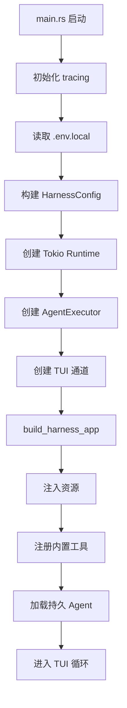
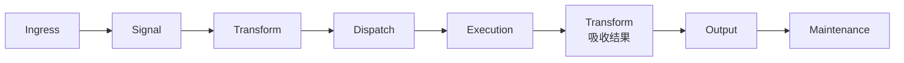
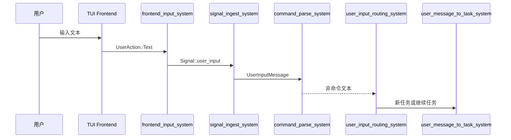
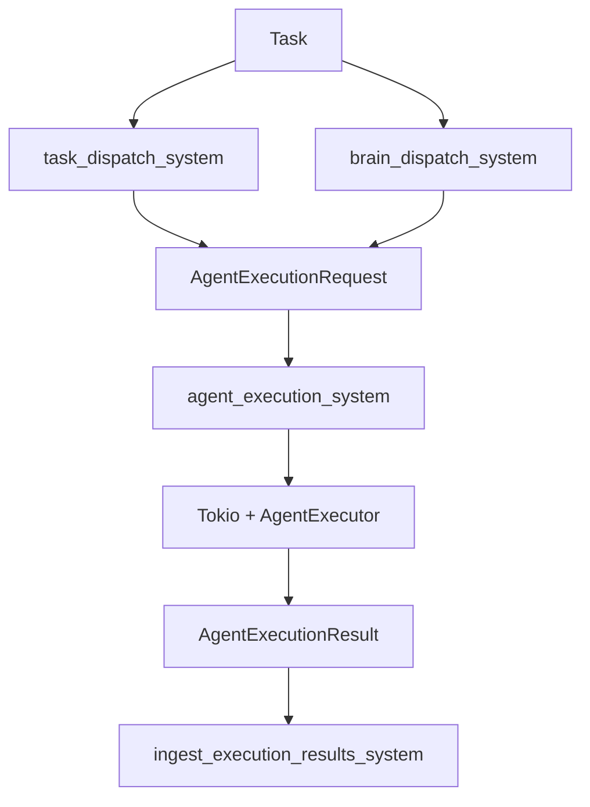
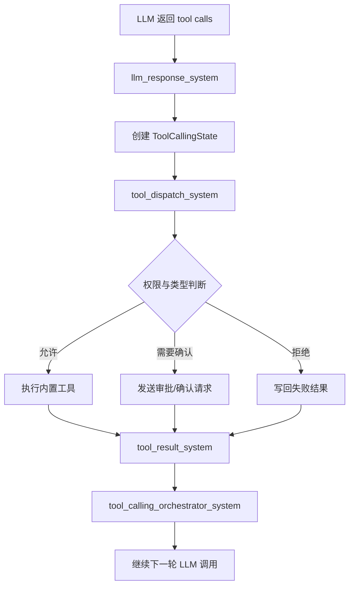
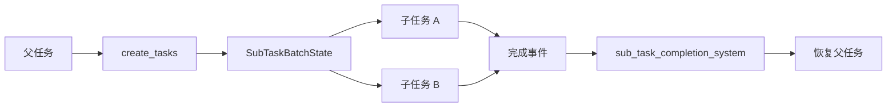

# 应用装配与系统流转

## 模块职责

本篇聚焦 `src/app`、`src/main.rs` 与 `src/systems`，说明引擎是如何被装配起来并持续推进的。

| 模块 | 作用 |
| --- | --- |
| `main.rs` | 进程入口、TUI 主循环、ECS 驱动 |
| `app/mod.rs` | Resource 注入、Startup/Update 系统装配、空闲态判断 |
| `systems/ingress.rs` | 接收输入、更新时间、唤醒重试 |
| `systems/routing.rs` | 路由用户输入，决定创建新任务还是继续旧任务 |
| `systems/transform.rs` | 结果吸收、状态转换、任务生命周期处理中枢 |
| `systems/dispatch.rs` | 选择 Agent、构造执行请求、处理 Brain 分发 |
| `systems/execution.rs` | 发起异步 LLM 执行 |
| `systems/tool.rs` | 工具注册、工具调度、审批、等待与子任务协同 |
| `systems/frontend_*.rs` | 前端输入与输出桥接 |
| `systems/memory.rs` | 记忆压缩触发 |
| `systems/summarization.rs` | 摘要请求构造与结果写回 |
| `systems/contribution.rs` | 子 Agent 经验回流父 Agent |
| `systems/maintenance.rs` | Agent 生命周期管理与持久配置加载 |

## 启动阶段

## Update 阶段主链路

`HarnessSet` 把一次 `app.update()` 分为清晰的流水线，主流程如下：

## 输入到任务的流转

用户输入在系统中的转化路径如下：

## 调度与执行链路

调度阶段的目标是“为任务选择执行者，并把它转化成一次可执行请求”。

1. `task_dispatch_system` 为普通任务选择合适 Agent。
2. 若启用 Brain，则 `brain_dispatch_system` 先做高层决策。
3. 系统结合短期记忆、长期记忆、工具权限等上下文组装请求。
4. `agent_execution_system` 把请求交给异步执行器。
5. 执行结果通过 `ExecutionResultReceiver` 回流 ECS。

## Tool Calling 闭环

工具调用是该项目最关键的复杂链路之一。

## 子任务与等待机制

内置工具中的 `create_tasks` 和 `wait_tasks` 使系统具备多任务编排能力。

- `create_tasks` 用于创建一个子任务批次，支持依赖关系。
- `sub_task_batch_block_system` 会让父任务进入等待态。
- `sub_task_completion_system` 汇总批次进度并恢复父任务。
- `wait_tasks` 允许当前任务显式等待一组任务完成。

## 输出链路

当任务状态、Agent 状态或文本输出发生变化时，系统会生成 `EngineEvent`，再由前端消费并显示。

| 事件类型 | 典型来源 |
| --- | --- |
| `Text` | Agent 回复、系统消息 |
| `ApprovalRequest` | 工具执行前的用户确认 |
| `ApprovalResult` | 审批结果回显 |
| `AgentStatusChanged` | 调度、执行、等待状态更新 |
| `TaskStatusChanged` | 任务从 Pending 到 Done/Failed 的流转 |
| `BatchProgress` | 子任务批次进度更新 |

## 模块观察

### `app/mod.rs`

- 优点是集中管理资源和系统顺序，方便快速理解“系统什么时候运行”。
- 代价是装配文件已经较长，后续可以考虑把资源注册、系统注册、默认配置拆到更细的子模块。

### `systems/transform.rs`

- 是当前最核心的转换中枢，负责吸收 LLM 结果、工具结果、摘要结果、任务结束与子任务状态变化。
- 复杂度最高，也是未来最值得继续拆分的模块。

### `systems/tool.rs`

- 承担内置工具定义、审批流、等待机制、批处理等多个职责。
- 功能强，但容易成为“万能模块”。

## 结论

`app` 与 `systems` 构成了项目的“执行引擎”。它的优势在于流水线清晰、扩展点明确；它的主要挑战在于若不继续收敛复杂度，`Transform`、`Tool`、`Dispatch` 等中枢模块会越来越难维护。
