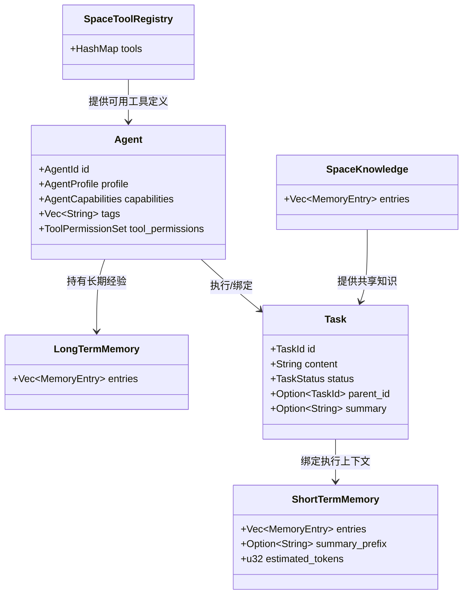
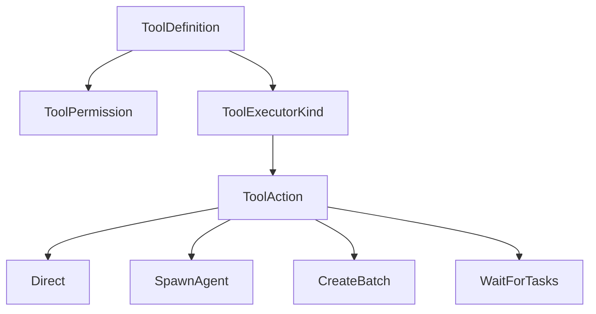
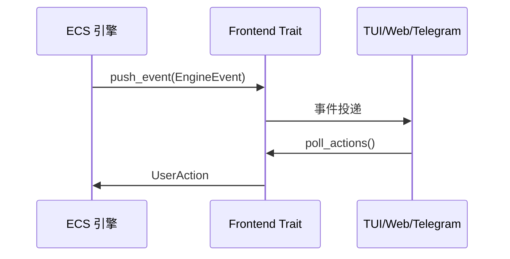

# 领域模型

## 模块定位

`src/domain` 是整个项目的语义中心。它不直接负责调度和执行，而是定义：

- 任务是什么。
- Agent 是什么。
- 记忆如何表达。
- 工具如何建模。
- 前端和系统如何通信。
- 评估与经验回流如何在领域层表达。

## 子模块划分

| 文件 | 作用 |
| --- | --- |
| `mod.rs` | 主领域模型聚合出口，定义 Task、Agent、执行协议、子任务、错误与状态 |
| `memory.rs` | 短期记忆、长期记忆、Tool 调用痕迹与 token 估算 |
| `space.rs` | 全局共享资源、工具注册表、Agent 注册表、运行时上下文 |
| `frontend.rs` | 前端协议、引擎事件与用户动作 |
| `evaluation.rs` | 任务评估请求与结果 |
| `contribution.rs` | 子 Agent 任务总结与记忆回流协议 |

## 核心实体关系



## Task 模型

`Task` 是系统中的核心业务实体，围绕任务生命周期展开：

- 保存用户输入转化后的工作内容。
- 表示任务处于 `Pending`、`Running`、`Waiting`、`Done`、`Failed` 等状态。
- 记录父子任务关系，支撑批处理与任务委派。
- 记录摘要、优先级、重试信息与来源通道。

从设计上看，Task 不只是“待办项”，而是整个工作流节点。

## Agent 模型

`Agent` 是任务执行的主体，负责把模型能力、工具权限、记忆和任务绑定起来。

- `profile` 描述 Agent 身份与画像。
- `capabilities` 描述其能力边界。
- `tags` 用于任务匹配与调度。
- `tool_permissions` 控制工具可见性与执行权限。
- 任务型 Agent 与持久 Agent 共存，支撑长期角色与短期委派。

## 记忆模型

项目中存在三类“记忆/知识”承载方式：

| 类型 | 归属 | 作用 |
| --- | --- | --- |
| `ShortTermMemory` | Task | 保存当前任务上下文与最近对话 |
| `LongTermMemory` | Agent | 保存长期经验和归档内容 |
| `SpaceKnowledge` | 全局 Resource | 保存跨任务共享知识 |

```mermaid
flowchart LR
    U[用户输入] --> STM[ShortTermMemory]
    LLM[LLM 输出] --> STM
    STM --> SUM[摘要压缩]
    SUM --> STM
    Child[子任务总结] --> LTM[LongTermMemory]
    CMD[/remember 等命令] --> SK[SpaceKnowledge]
    SK --> TOOL[knowledge_search]
```

### `ShortTermMemory`

- 保存完整对话条目。
- 保存压缩后的 `summary_prefix`。
- 估算当前 token 数，用于摘要触发。
- 记录工具调用痕迹，保留调试与上下文信息。

### `LongTermMemory`

- 挂在 Agent 上。
- 支持归档与吸收子 Agent 贡献。
- 为后续长期经验利用提供基础。

### `SpaceKnowledge`

- 面向全局共享，而非单个任务。
- 适合存放用户偏好、长期上下文或显式记忆内容。

## Tool 领域建模

`space.rs` 中定义了工具的统一模型：

- `ToolDefinition` 描述名称、用途、参数 Schema、默认权限与执行器类型。
- `ToolPermission` 把权限抽象为 `Allow`、`Confirm`、`Deny`。
- `ToolExecutorKind` 预留内置、外部进程与 HTTP 执行方式。
- `ToolAction` 把工具结果提升为领域动作，而不只是字符串返回。

这是一个很关键的设计点：工具执行结果不直接篡改流程，而是先转化为结构化动作，再由系统层继续编排。



## 前端契约

`frontend.rs` 定义了系统和前端之间的稳定接口：

- `Frontend` trait 抽象前端实现。
- `EngineEvent` 表示引擎对前端的输出。
- `UserAction` 表示前端回传的用户动作。
- `ChannelId` 与 `EventTarget` 允许未来扩展到多用户、多前端场景。



## 评估与贡献

### 评估模型

`evaluation.rs` 用于表达任务质量控制：

- 是否继续执行。
- 是否应判定完成。
- 是否失败或跑偏。

这意味着系统未来可以接入更强的自我检查机制。

### 贡献模型

`contribution.rs` 用于表达子 Agent 完成工作后，如何把经验以摘要形式回灌给父 Agent。

这让系统不只是“完成一次任务”，还能逐步沉淀能力。

## 领域层价值

`domain` 最大的价值，是把运行时复杂流程压缩为一套稳定语言：

- Task 表达工作流节点。
- Agent 表达执行主体。
- Memory 表达上下文。
- Tool 表达结构化能力。
- Frontend 表达交互边界。

系统层可以变化，适配层可以替换，但只要领域层稳定，整个项目就具备持续演进能力。
