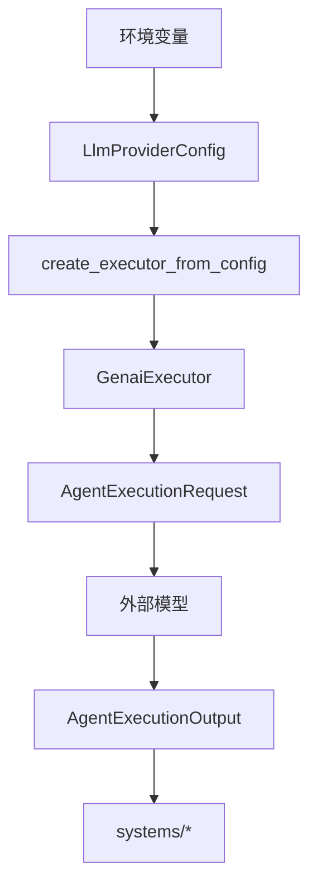
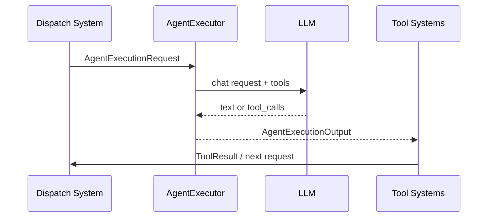
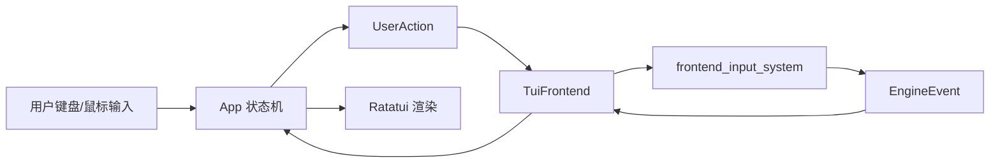
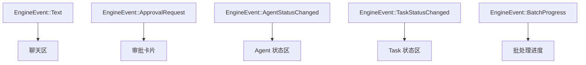

# LLM 与前端适配

## 模块定位

`src/llm` 与 `src/tui` 共同承担边界适配职责：

- `llm` 负责把外部模型能力接入到 `AgentExecutor` 抽象。
- `tui` 负责把终端交互接入到 `Frontend` 抽象。

这两个模块都不直接主导业务编排，而是为系统层提供稳定、可替换的输入输出边界。

## LLM 模块拆解

| 文件 | 作用 |
| --- | --- |
| `provider.rs` | 读取环境变量并校验 Provider 配置 |
| `factory.rs` | 根据配置创建 `AgentExecutor` |
| `genai.rs` | 基于 `genai` crate 实现聊天调用与工具调用转换 |
| `brain_prompt.rs` | Brain 决策 Prompt 与结果解析 |
| `summarization_prompt.rs` | 记忆摘要 Prompt |
| `mod.rs` | 模块导出入口 |

## LLM 适配流程

## Provider 设计

当前支持以下 Provider 类型：

- `OpenAi`
- `Anthropic`
- `DeepSeek`
- `OpenAiCompatible`

设计特点：

- 标准 Provider 尽量复用 `genai` 默认环境变量读取能力。
- OpenAI Compatible 模式要求显式提供 `api_key` 与 `api_base`。
- Provider 与模型解耦，模型名通过环境变量覆盖。

## Prompt 职责划分

### Brain Prompt

用于高层决策，例如：

- 当前任务应该由哪个 Agent 执行。
- 是否需要创建子任务。
- 是否应该使用 Brain 进行进一步规划。

### Summarization Prompt

用于记忆压缩，把旧对话摘要化，降低上下文膨胀。

### 普通执行请求

由系统层结合任务内容、短期记忆、长期记忆、工具定义等构造 `AgentExecutionRequest`，再交给执行器统一执行。

## Tool Calling 与 LLM 的配合

## TUI 模块拆解

| 文件 | 作用 |
| --- | --- |
| `mod.rs` | `TuiFrontend`，实现 `Frontend` trait |
| `app.rs` | TUI 本地状态机 |
| `chat.rs` | 聊天区渲染与消息模型 |
| `input.rs` | 输入框渲染 |
| `status.rs` | 状态区渲染 |

## TUI 适配流程

## TUI 状态管理

`App` 是终端前端内部的本地投影层，主要维护：

- 当前模式，如聊天态与审批态。
- 消息列表。
- Agent 展示状态。
- Task 展示状态。
- 待处理审批请求。

这里的关键点在于：TUI 不直接持有 ECS 实体，而是持有 ECS 状态在前端的“投影”。

## 前后端事件模型

## 边界适配设计的意义

从架构上看，`llm` 与 `tui` 之所以重要，不是因为它们逻辑最复杂，而是因为它们把系统从“具体实现”里解耦出来了：

- 如果要替换模型 Provider，核心系统不需要重写。
- 如果要增加 Web 前端或 Telegram 前端，领域与系统层可以复用。
- 如果要把终端 UI 改成服务端 API，同样可以沿用 `Frontend` 契约思路。

## 当前观察

- `llm` 的边界较清晰，职责划分明确。
- `tui` 的模块拆分也比较自然，读者容易建立心智模型。
- 未来如果支持更多前端，建议把共享的前端投影逻辑从 `tui/app.rs` 中进一步抽象。
