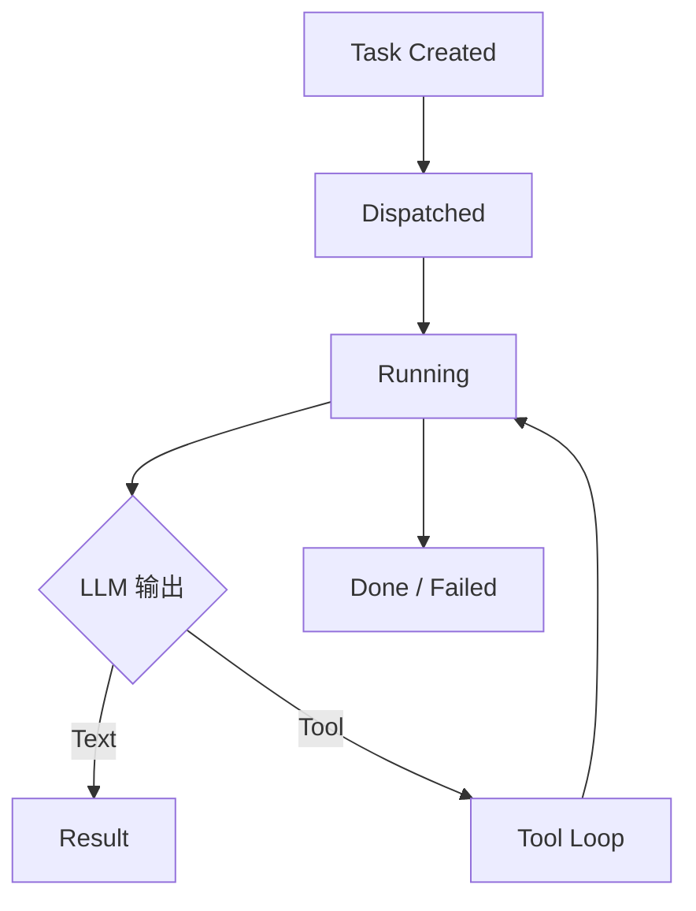

# 待优化项

## 总体判断

当前项目已经具备可运行的主链路，但从可维护性、可观测性与真实联调成熟度来看，仍有若干值得优先推进的优化方向。

## 优先级路线图

## P0: 真实联调与稳定性

### 1. 完成真实 LLM Provider 联调

当前框架已经完成 Provider 配置、执行器工厂与主链路集成，但仍需要重点验证：

- 不同 Provider 下的工具调用格式兼容性。
- 文本回复与工具回复混合场景。
- 异常响应、超时、限流、空响应等失败路径。
- OpenAI Compatible 模式在真实服务下的参数兼容性。

### 2. 补齐关键失败路径的验证

建议优先覆盖：

- 执行器创建失败。
- 执行结果回流失败。
- 工具审批超时或被拒绝。
- 子任务等待超时。
- 摘要失败后的降级策略。

## P1: 复杂模块拆分

### 3. 拆分 `systems/transform.rs`

这是当前最复杂的业务中枢之一，建议按职责拆分为多个子模块，例如：

- 输入消息转换。
- LLM 响应吸收。
- Tool Calling 状态推进。
- 任务终止与子任务完成处理。
- 摘要结果与评估结果吸收。

### 4. 拆分 `systems/tool.rs`

当前该文件同时承担：

- 内置工具定义。
- 工具调度。
- 审批流。
- 等待与批处理协同。

建议至少拆成：

- `tool_registry`
- `tool_dispatch`
- `tool_approval`
- `tool_waiting`
- `builtin_tools/*`

### 5. 收敛 `app/mod.rs` 的装配复杂度

可以把以下内容拆开：

- 默认配置。
- Resource 注册。
- System Set 注册。
- Startup 装配。

这样能降低入口文件阅读成本。

## P2: 可观测性与测试

### 6. 增强流程可观测性

当前已有 `tracing`，但仍建议补充：

- 统一的任务链路 ID / Agent 链路 ID。
- 工具调用闭环耗时统计。
- 子任务批次生命周期日志。
- 关键状态迁移图或调试快照。

### 7. 增加针对系统主链路的自动化测试

建议优先补齐的测试层级：

- `domain` 的纯数据结构测试。
- `llm/provider.rs` 这类纯配置逻辑测试。
- `systems` 中关键状态流转的单元测试。
- 至少一条“输入 -> 调度 -> 执行结果回流 -> 输出事件”的集成测试。

### 8. 为内置工具建立更明确的回归测试

重点包括：

- `knowledge_search`
- `create_tasks`
- `wait_tasks`
- `spawn_agent`

这些工具直接影响流程正确性，回归价值高。

## P3: 扩展性与配置治理

### 9. 统一配置来源与默认值策略

当前配置分散在环境变量、默认实现与局部资源中。后续可考虑：

- 引入统一配置文件。
- 为不同环境定义独立配置模板。
- 明确哪些配置允许热更新，哪些只在启动时生效。

### 10. 强化前端扩展准备

虽然 `Frontend` 已经抽象，但要支撑 Web/Telegram 等前端，还需要继续抽象：

- 前端共享投影模型。
- 事件序列化方案。
- 多用户会话隔离策略。
- 不同前端的确认/审批交互模型。

### 11. 完善 Tool 执行器扩展路径

`ToolExecutorKind` 已预留 `External` 与 `Http`，但当前主要仍以内置工具为主。后续可补齐：

- 外部命令执行沙箱。
- HTTP 工具安全策略。
- 工具超时、重试和幂等设计。
- 工具执行审计日志。

## 优化建议总结

如果只选三件事优先推进，建议顺序如下：

1. 真实 LLM 联调与失败路径验证。
2. 拆分 `transform.rs` 与 `tool.rs`。
3. 补齐关键链路自动化测试和可观测性。

## 结束语

当前项目的架构方向是正确的，优化重点应放在“让已有架构更稳、更清楚、更可验证”，而不是继续快速堆叠新功能。
