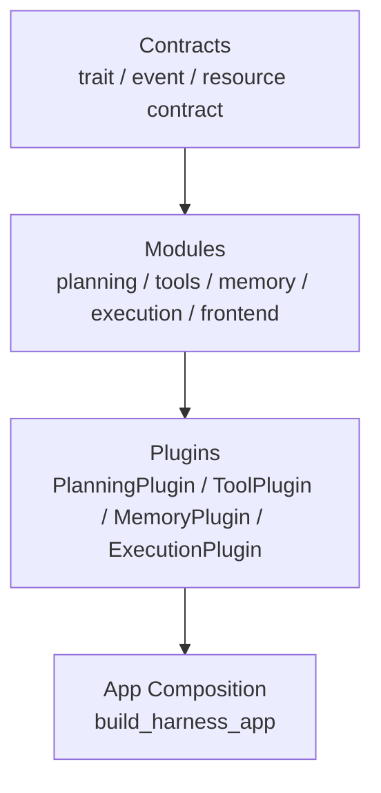
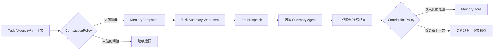
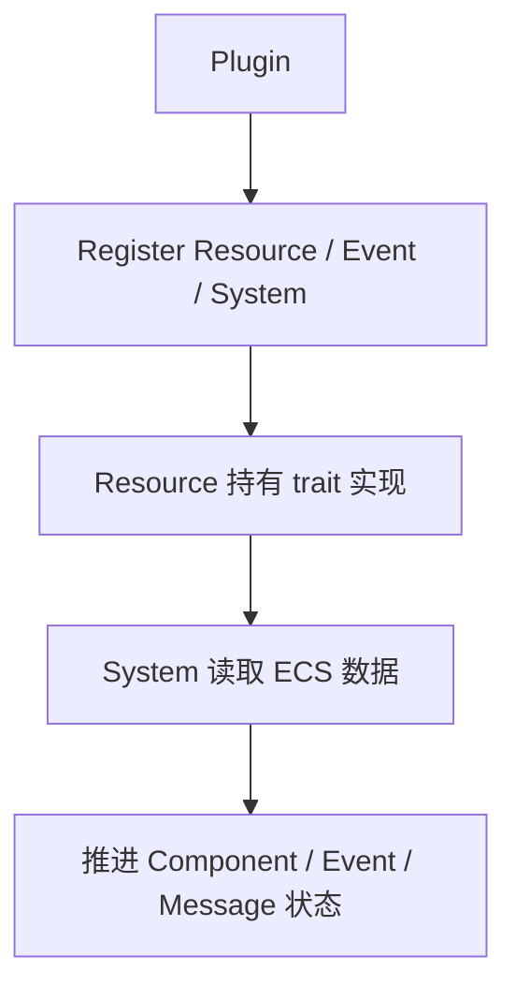
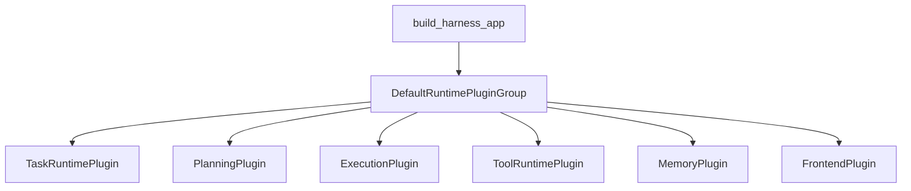
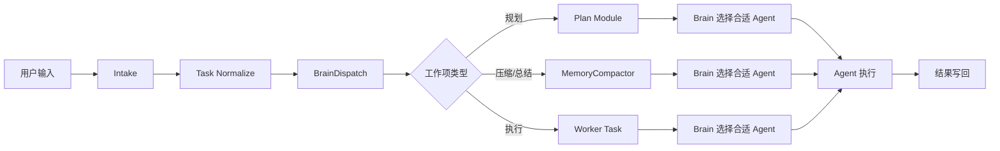
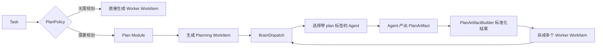
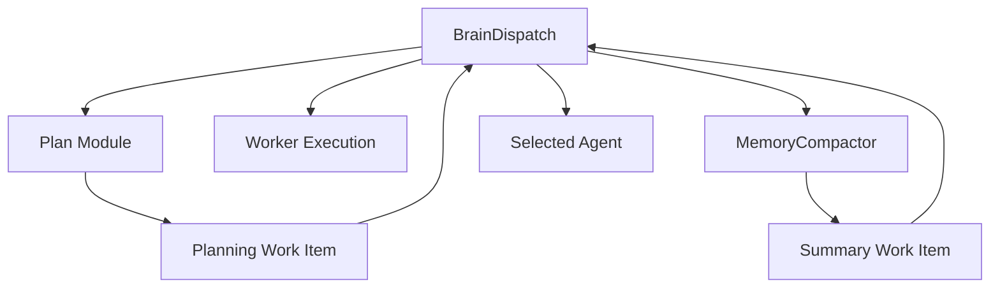
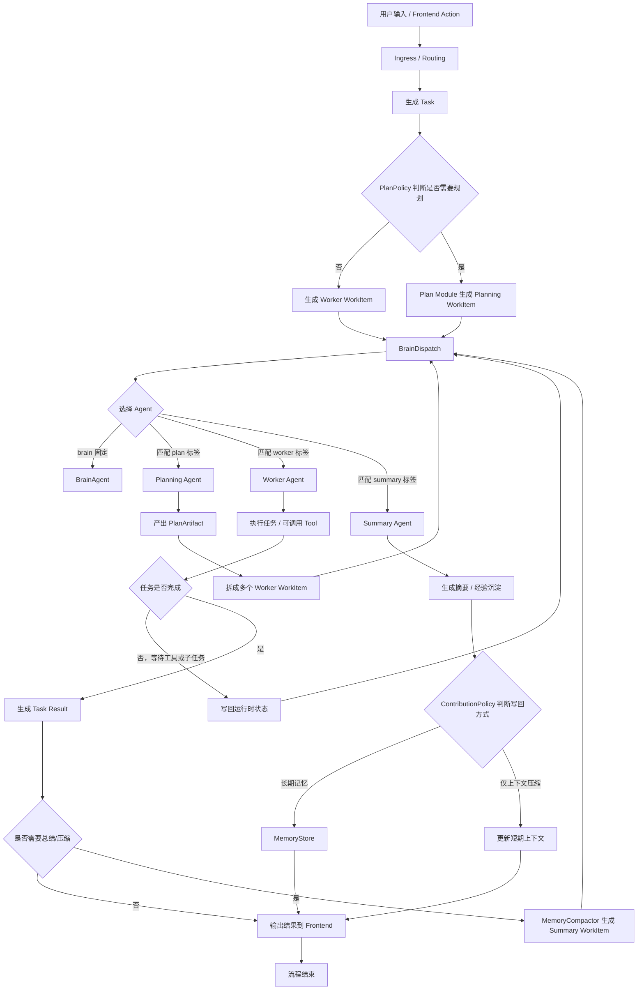
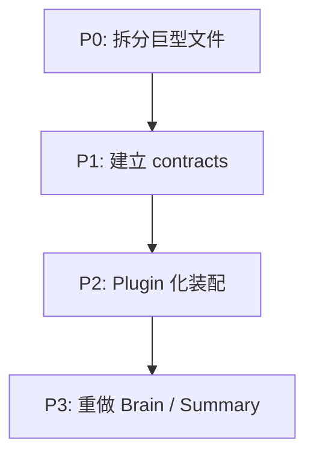

# 模块化重构优化方案

## 文档目标

本文档提出一份面向下一阶段演进的重构方案。该方案不以“最小改动”或“兼容旧实现”为目标，而以以下诉求为核心：

1. 删除废弃实现，不保留旧方案兼容层。
2. 拆分过大的单文件与杂糅职责，降低后续维护成本。
3. 将系统改造为可替换的模块化架构。
4. 重新定义 Brain / Summary 在框架中的定位与流程。

## 重构原则

### 原则一：不做旧方案兼容

本次重构应采用硬切换策略，而不是“双轨并行 + 兼容层”。

- 不保留旧版 `tool.rs`、`domain/mod.rs` 的适配胶水。
- 不为了兼容旧状态流而继续维持粗粒度聚合模块。
- 不新增“临时桥接层”把旧结构继续延长生命周期。

原因很明确：

- 当前项目仍处于 MVP 演进阶段，兼容成本会快速放大。
- 大量兼容层会让重构后的边界再次被侵蚀。
- 如果目标是长期维护，应该尽早让新结构成为唯一事实来源。

## 现状问题

### 1. 大文件承担了过多职责

从当前代码规模看，以下文件已经明显超过合理维护范围：

| 文件                         | 行数   | 主要问题                                                    |
| -------------------------- | ---- | ------------------------------------------------------- |
| `src/systems/tool.rs`      | 2026 | 同时包含 Tool 定义、注册、调度、审批、确认、等待、批处理、orchestrator            |
| `src/domain/mod.rs`        | 1226 | 聚合了 Task、Agent、执行协议、子任务状态、ToolCallingState、错误、消息等多类领域对象 |
| `src/systems/transform.rs` | 1049 | 同时处理输入转换、LLM 响应吸收、任务终止、子任务推进、Tool loop 续跑               |
| `src/systems/dispatch.rs`  | 643  | 既做普通任务分发，也做 Brain 分发与子任务 DAG 处理                         |

这不是单纯的“文件长”，而是职责边界已经开始模糊：

- 阅读成本高。
- 局部改动的影响范围难以评估。
- 测试粒度不自然。
- 后续继续加功能时，代码会继续堆叠到同一文件中。

### 2. Tool 体系的实现方式过于集中

当前 `tool.rs` 既定义内置 Tool，又定义注册逻辑，还承担大量流程控制系统。这带来两个直接问题：

- Tool 本身的业务逻辑和 Tool Runtime 的流程逻辑耦合在一起。
- 新增一个 Tool 时，需要进入一个巨大的“总文件”修改，风险高。

这与 Tool 的扩展方式是矛盾的。Tool 天然应该按能力拆分，而不是按单一文件聚合。

### 3. 领域层聚合过粗

`domain/mod.rs` 当前同时扮演：

- 领域出口
- 主数据模型定义文件
- 协议与消息定义文件
- 错误与状态机定义文件

这导致“领域层看似集中，实际过于拥挤”，问题包括：

- 不同子域之间缺少自然边界。
- 领域对象的演进容易互相污染。
- 某个状态或消息变化时，`mod.rs` 容易不断膨胀。

### 4. 模块替换能力不足

当前代码虽然已有部分抽象，如：

- `Frontend`
- `AgentExecutor`
- `BuiltinTool`

但这些抽象还不足以支撑“模块替换”。主要原因是：

- 核心流程主要通过系统直接读写 ECS 世界推进。
- 系统之间大量依赖共享消息和组件，但缺少更高层的模块契约。
- `build_harness_app()` 直接拼装全部系统，模块边界仍偏静态和硬编码。

因此，当前架构更接近“一个大引擎中的多系统协作”，而不是“多个可替换模块共同组成引擎”。

### 5. Brain / Summary 的定位不够清晰

当前 Brain 与 Summary 都被实现为“特殊 Agent”，但从职责上看，它们并不完全等同于普通工作 Agent；同时，它们又确实需要保留 Agent 形态来统一承载 LLM、Tool 和长期记忆能力。

### Brain 的问题

- 既承担全局路由，又参与子任务 DAG 分发。
- 依赖单个 JSON prompt 进行粗粒度决策。
- 决策阶段和执行阶段边界不够明确。

### Summary 的问题

- 被当作一个带 `summarization` tag 的 Agent 进行查找和调用。
- 更像一种“内务处理能力”，而不是一个面向任务的工作 Agent。
- 当前摘要结果写回逻辑过于粗糙，例如 `summarization_result_system` 使用 `memories.iter_mut().next()`，没有严格按 `task_id` 作用到目标记忆上，说明其模型边界还不稳定。

结论是：Brain 和 Summary 应升级为框架级服务模块，但模块内部的 LLM 执行仍统一通过专用 Agent 完成，而不是彻底去 Agent 化。

## 重构目标架构

### 总体思路

建议将当前架构划分为三层：

1. `contract` 层：定义稳定接口、事件、资源协议。
2. `module` 层：按功能拆分具体实现。
3. `plugin` 层：以 Bevy `Plugin` 为模块装载单位，将模块注册进 App。



## Plugin 作为模块载体是否可行

结论：可行，但要明确边界。

### 可行的原因

Bevy `Plugin` 非常适合作为“模块装载单元”，因为它天然支持：

- 注册模块自己的 Resource。
- 注册模块自己的 SystemSet。
- 注册模块自己的 Event / Message。
- 按需组合、启用、替换、裁剪模块。

因此，完全可以把一组功能封装为 Plugin，例如：

- `TaskRuntimePlugin`
- `PlanningPlugin`
- `ToolRuntimePlugin`
- `MemoryPlugin`
- `FrontendPlugin`
- `ExecutionPlugin`

### 需要注意的限制

`Plugin` 本身只解决“装载与组合”的问题，不自动解决“可替换实现”的问题。若要真正实现模块替换，还必须补上稳定契约：

- trait 抽象
- 统一消息协议
- 输入输出资源契约

如果没有这些契约，即使使用了 Plugin，也只是把大系统拆成多个“注册包”，而不是真正模块化。

### 推荐结论

应采用：

- `Plugin` 负责模块装载。
- trait / event / resource contract 负责模块替换。
- `PluginGroup` 负责默认组合。

也就是说，`Plugin` 是载体，契约才是模块化的核心。

## 目标模块划分

### 1. Contracts 层

建议新增一个独立的契约层，例如：

```text
src/contracts/
├── mod.rs
├── planning.rs
├── execution.rs
├── frontend.rs
├── memory.rs
├── tools.rs
└── routing.rs
```

该层只定义：

- trait 接口
- 公共事件
- 公共请求/响应结构
- 模块能力声明

不放具体实现。

### 2. Domain 层

建议将 `src/domain/mod.rs` 拆分为多个子域文件：

```text
src/domain/
├── mod.rs
├── task.rs
├── agent.rs
├── execution.rs
├── error.rs
├── workflow.rs
├── tool_runtime.rs
├── evaluation.rs
├── contribution.rs
├── frontend.rs
├── memory.rs
└── space.rs
```

推荐职责如下：

| 文件                | 责任                                             |
| ----------------- | ---------------------------------------------- |
| `task.rs`         | `Task`、`TaskStatus`、`WaitingReason`、重试与生命周期方法  |
| `agent.rs`        | `Agent`、Profile、Capabilities、权限配置              |
| `execution.rs`    | `AgentExecutionRequest/Result`、`AgentExecutor` |
| `workflow.rs`     | `SubTaskBatchState`、批处理、等待关系                   |
| `tool_runtime.rs` | `ToolCallingState`、Tool loop 运行时对象             |
| `error.rs`        | `ExecutionError`、`FailureReason`、框架级错误         |

`domain/mod.rs` 最终只保留 `pub use` 聚合职责。

### 3. Systems 层

建议不再保留巨型 `systems/*.rs` 文件，而是按模块分目录：

```text
src/systems/
├── mod.rs
├── intake/
│   ├── mod.rs
│   ├── ingress.rs
│   ├── routing.rs
│   └── command.rs
├── planning/
│   ├── mod.rs
│   ├── planner.rs
│   ├── dispatch.rs
│   └── replan.rs
├── execution/
│   ├── mod.rs
│   ├── submit.rs
│   └── ingest.rs
├── tools/
│   ├── mod.rs
│   ├── dispatch.rs
│   ├── approval.rs
│   ├── confirmation.rs
│   ├── orchestrator.rs
│   ├── waiting.rs
│   └── builtin/
│       ├── mod.rs
│       ├── knowledge_search.rs
│       ├── spawn_agent.rs
│       ├── create_tasks.rs
│       └── wait_tasks.rs
├── memory/
│   ├── mod.rs
│   ├── compression.rs
│   ├── summarization.rs
│   └── contribution.rs
└── frontend/
    ├── mod.rs
    ├── input.rs
    └── output.rs
```

这类拆分中，最重要的一条是：

__每个 Tool 必须独立一个__ __`rs`__ __文件。__

新增 Tool 时只需要：

1. 新增一个 `builtin/<tool_name>.rs`
2. 实现统一 Tool trait
3. 在 Tool Plugin 中注册

而不是继续在 `tool.rs` 中插入更多逻辑。

### 4. Plugins 层

建议新增：

```text
src/plugins/
├── mod.rs
├── contracts.rs
├── task_runtime.rs
├── planning.rs
├── execution.rs
├── tools.rs
├── memory.rs
├── frontend.rs
└── default_runtime.rs
```

其中：

- 每个 Plugin 只装载一个模块所需的资源与系统。
- `DefaultRuntimePluginGroup` 负责拼出默认实现。
- `build_harness_app()` 不再直接大段注册系统，而改为注册 Plugin / PluginGroup。

## 建议的模块通用接口

为了让模块真正可替换，建议定义一批高层 trait，而不是只停留在 `Frontend` 与 `AgentExecutor`。

### 1. Planning 模块接口

Planning 模块负责“任务如何被规划与重规划”，建议抽象为类似能力：

- `PlanPolicy`
- `PlanArtifactBuilder`
- `ReplanPolicy`

可以把这三个能力理解为三层分工：

| 接口 | 关注点 | 典型问题 |
| --- | --- | --- |
| `PlanPolicy` | 是否需要规划，以及规划粒度 | 当前任务要不要先拆解？拆到什么粒度合适？ |
| `PlanArtifactBuilder` | 规划结果长什么样 | 产出步骤、依赖关系、子任务、约束条件等结构化结果 |
| `ReplanPolicy` | 什么时候需要重新规划 | 子任务失败、阻塞、上下文变化后是否重做计划？ |

职责包括：

- 是否需要计划。
- 如何从任务构造执行计划。
- 如何把计划结果转化为后续工作项。
- 子任务何时创建与回收。
- 失败或阻塞后是否重规划。

需要特别强调：

- `Planning` 负责产出结构化计划，不负责为工作项选择 Agent。
- “选择哪个 Agent 执行”始终属于 `BrainDispatch` 的职责。
- `Plan` 模块如果需要 LLM，也应提交规划类工作项，再由 `BrainDispatch` 选择合适 Agent。

可以进一步把 Planning 模块理解为“任务结构化器”，而不是“执行者分配器”：

- `PlanPolicy` 决定要不要规划。
- `PlanArtifactBuilder` 决定规划结果的结构。
- `ReplanPolicy` 决定是否推翻旧计划并生成新计划。

Planning 的输出不是“某个 Agent 名字”，而是 `PlanArtifact`，例如：

- 任务步骤列表
- 子任务集合
- 子任务依赖 DAG
- 每个子任务的目标、约束、预期输出
- 后续交给 `BrainDispatch` 的工作项列表

### 2. Tool 模块接口

建议区分三类接口：

- `ToolCatalog`
- `ToolExecutor`
- `ToolApprovalPolicy`

其中：

- `ToolCatalog` 负责描述有哪些 Tool 可被暴露。
- `ToolExecutor` 负责真正执行 Tool。
- `ToolApprovalPolicy` 负责审批、确认与安全控制。

这样可以把“Tool 本体”和“Tool Runtime 策略”拆开。

### 3. Memory 模块接口

建议抽象为：

- `MemoryStore`
- `MemoryCompactor`
- `ContributionPolicy`
- `CompactionPolicy`

其中：

- `MemoryStore` 管理长期记忆、共享知识。
- `MemoryCompactor` 决定何时做摘要、如何压缩、如何写回。
- `ContributionPolicy` 决定子任务结果如何沉淀到长期经验。
- `CompactionPolicy` 定义压缩触发阈值、摘要粒度、失败回退与写回策略。

同样需要强调：

- `MemoryCompactor` 负责生成总结类工作项与定义写回规则。
- 具体由哪个 Agent 执行总结，不由 Memory 模块固定指定，而是交给 `BrainDispatch` 基于 `tag` 和上下文动态选择。

这四个对象之间的关系可以理解为：

| 对象 | 更像什么 | 作用 |
| --- | --- | --- |
| `MemoryStore` | 存储层 | 保存长期记忆、共享知识、沉淀结果 |
| `MemoryCompactor` | 流程协调器 | 发现需要压缩/总结的时机，并生成总结类工作项 |
| `CompactionPolicy` | 策略层 | 定义“何时压缩、压缩多少、失败怎么办” |
| `ContributionPolicy` | 沉淀规则层 | 定义哪些结果值得写入长期经验，以及写入形式 |

如果用一句话概括：

- `MemoryStore` 回答“记忆放哪里”。
- `MemoryCompactor` 回答“什么时候处理记忆”。
- `CompactionPolicy` 回答“怎么压缩更合理”。
- `ContributionPolicy` 回答“哪些内容值得沉淀为长期经验”。

建议用下面这张图理解它们的关系：



这张图里有两个关键点：

- `MemoryCompactor` 不直接执行总结，它只负责触发和组织。
- 摘要结果是否进入长期记忆，不由 Summary Agent 自己决定，而由 `ContributionPolicy` 决定。

### 4. Execution 模块接口

当前已有 `AgentExecutor`，但建议上提一层：

- `ExecutionBackend`
- `ExecutionPolicy`

其中：

- `ExecutionBackend` 关注如何调用模型。
- `ExecutionPolicy` 关注超时、重试、并发限制、异常恢复。

### 5. Frontend 模块接口

当前 `Frontend` 已经是不错的起点，可以继续完善：

- 保留 `Frontend` 作为通道接口。
- 新增 `FrontendProjection` 或等价概念，用于统一 ECS 状态到 UI 投影模型的转换。

这样未来替换为 Web / Telegram 时，不必重复发明状态映射逻辑。

## trait 与 Bevy ECS 的协同准则

### 核心结论

`trait` 替换方案与 Bevy ECS 是相融的，但前提是要分层使用：

- `trait` 负责定义模块契约、策略边界和外部适配能力。
- ECS 负责表达运行时状态、消息流转和系统调度。

如果把 `trait` 用在“模块边界层”，它会增强可替换性；如果把大量运行时行为都封装进 `dyn trait` 对象并让对象自行驱动状态流转，就会逐渐偏离 Bevy 的数据驱动理念。

### 推荐分工

建议明确采用如下分工：

- `Plugin`：负责模块装载与组合。
- `trait`：负责模块契约、策略接口、外部适配接口。
- `Resource`：负责注入 trait 实现、配置和服务句柄。
- `Event / Message / Component`：负责表达运行时真相。
- `System`：负责批量消费数据并推进状态机。



### 适合使用 trait 的位置

以下位置适合使用 trait 作为替换边界：

- 模块策略接口，如 `DispatchPolicy`、`PlanPolicy`、`CompactionPolicy`
- 外部适配接口，如 `Frontend`、`AgentExecutor`、未来的 Tool backend
- 可插拔服务接口，如 `MemoryStore`、`ToolCatalog`、`ExecutionBackend`

这些接口的共同特点是：

- 它们代表“模块提供什么能力”。
- 它们通常不是海量运行时实体。
- 它们适合作为 `Resource` 或模块内部服务被系统调用。

### 不适合使用 trait 作为主表达方式的位置

以下对象不应以 `dyn trait` 作为主要建模方式：

- `Task`
- `WorkItem`
- `AgentRuntimeState`
- `ToolCallingState`
- 各类运行时 `Message / Signal`

其中 `WorkItem` 是这次重构里非常关键的一个统一概念，可以先这样理解：

- `Task` 表示业务任务或目标。
- `WorkItem` 表示“当前有一份待处理工作，需要被分配给某个 Agent 或模块继续推进”。

也就是说，`WorkItem` 更像框架内部的“可派发工作单元”。

它通常会包含：

- 工作项类型，例如 `plan`、`summary`、`worker`
- 来源对象，例如来自哪个 `Task`、哪个 Agent、哪个上下文
- 输入内容，例如 prompt、上下文、约束、目标
- 期望能力标签，例如需要 `plan`、`worker`、`rust`、`code`
- 完成后的回写目标，例如写回计划、写回摘要、写回任务结果

可以用下面这个关系理解：


所以：

- `Task` 是“我想完成什么”。
- `WorkItem` 是“当前这一步具体要做什么”。
- `Message / Signal` 是“系统之间传递的运行时事件”。

这些对象更适合继续保持为：

- `Component`
- `Resource`
- `Event / Message`

原因是它们属于 ECS 世界里的运行时事实来源，需要被系统查询、观测、回放和批量处理。

### 禁止的倾向

不建议把系统主流程设计成“对象自己驱动自己”的模型，例如：

- 给每个实体挂一个大而全的 `Box<dyn AgentBehavior>`
- 让 trait 方法内部自行推进状态机
- 让运行时状态主要藏在 trait object 内部

这种设计会带来明显问题：

- 状态变得不可见，难以调试和观测。
- 系统调度链路变隐式。
- 后续做回放、诊断、可视化会很困难。

### 推荐准则

可以将这套约束总结为四条准则：

1. 用 `trait` 抽象模块能力，不抽象运行时实体真相。
2. 用 `Plugin` 组织模块，不用 `trait` 替代系统调度。
3. 用 `Resource` 持有策略实现，不把大量 `dyn trait` 塞进实体。
4. 用 `Event / Component / Message` 表达流程，不让模块对象隐式推进状态机。

### 对本项目的直接含义

对当前 `Harness` 来说，更推荐的方向是：

- `BrainDispatch`、`Planning`、`MemoryCompactor`、`ToolRuntime` 作为模块和 Plugin 存在。
- `DispatchPolicy`、`PlanPolicy`、`CompactionPolicy`、`ToolCatalog` 作为 trait 契约存在。
- `Task`、`WorkItem`、`ToolCallingState`、`RetryReadyMessage` 等继续作为 ECS 运行时数据存在。

因此，本次重构应采用：

- `Plugin + contracts + ECS runtime data`

而不是：

- `纯 trait 对象驱动流程`

## 目标装配方式

重构后的装配方式建议如下：



如果未来要替换模块，只需要：

1. 移除默认 Plugin。
2. 添加新 Plugin。
3. 确保新 Plugin 实现同一套 contracts。

## 模块解耦规则

为了保证 Plugin 不是表面模块化，建议明确以下规则：

### 规则一

模块之间只能依赖 `contracts`，不能直接依赖对方的内部实现。

### 规则二

跨模块通信优先使用：

- Event / Message
- trait object resource
- 明确的 request / result 结构

避免跨模块直接读写彼此私有资源。

### 规则三

一个模块的系统不能同时承担“业务逻辑 + 装配逻辑 + 安全策略 + 输出投影”四种职责。

### 规则四

状态机保留，但状态机只作为“运行时协调机制”，不再作为“模块边界”的唯一承载方式。

也就是说，系统仍然可以通过 ECS Message 流转，但模块边界应由 contracts 和 plugin 明确表达。

### 规则五

trait 只用于“模块契约层”和“策略层”，不用于承载实体运行态真相。

### 规则六

`Task`、`WorkItem`、`Message`、`ToolCallingState`、`Retry` 等运行时对象仍应以 ECS 数据为中心建模，避免把关键状态藏进 trait object 内部。

## Brain / Summary 重设计

### 核心结论

`Brain`、`Plan` 和 `Summary` 需要彻底拆开职责：

- `Brain` 更适合作为派发/路由模块。
- `Plan` 更适合作为规划模块。
- `Summary` 更适合作为记忆压缩模块。

但凡是要使用 LLM 能力的地方，仍然统一通过 Agent 形态执行。

换句话说：

- `BrainDispatch` / `Plan` / `MemoryCompactor` 是模块。
- 具体执行计划、总结、工作任务的，都是被动态选出的 Agent。

这样做的收益是：

- 模块负责流程与策略。
- Brain 负责“为当前工作项选择谁来做”。
- Agent 负责 LLM、Tool、记忆与 persona 的统一承载。
- 后续如果要替换实现，只需要替换模块策略、派发策略、Agent 模板或两者组合，而不是在系统里加特殊分支。

### 1. Brain 改造方向：从特殊 Agent 改为 Dispatch 模块

当前 Brain 的真实职责更接近“全局派发与路由中心”，因此更合适的定位是：

- `Dispatcher`
- `Router`
- `AgentSelector`
- `AssignmentPolicy`

而不是 `Plan` 模块本身。

换句话说：

- `Brain` 决定某个工作项应该交给谁。
- `Plan` 决定任务是否需要规划，以及规划结果如何落地。
- `Summary` 决定何时做记忆治理，以及摘要结果如何写回。

### 建议的新流程



### BrainDispatch 模块职责

| 对象                 | 职责                           |
| ------------------ | ---------------------------- |
| `BrainDispatch`    | 为未分配工作项选择最合适的 Agent          |
| `AgentSelector`    | 根据任务类型、能力标签、上下文和策略筛选候选 Agent |
| `DispatchPolicy`   | 定义派发优先级、回退策略、是否允许 LLM 参与决策   |
| `AssignmentRecord` | 记录为什么把该工作项分配给该 Agent         |

推荐理解为：Brain 是派发控制平面，不直接负责产出计划或摘要内容。

### Brain 模块的设计要求

- 输入是“待处理工作项”，而不是原始用户输入字符串。
- 输出是“Agent 分配结果”，而不是最终业务结果。
- 可以先走规则/标签匹配，再按需走 LLM 辅助选择。
- `BrainDispatch` 自身使用固定的 `BrainAgent` 作为派发决策器，该 Agent 属于 `BrainDispatch` 模块，不属于 `Plan` 模块。

### Brain 新职责

- 为未分配 Agent 的工作项选择最合适的 Agent。
- 统一处理规划任务、执行任务、总结任务的 Agent 派发。
- 支持规则派发与 LLM 派发两种策略。
- 在派发失败时提供回退路径，例如默认 Agent、通用 Agent 或人工确认。
- 对 `BrainDispatch` 自身，始终绑定固定 `BrainAgent`，避免派发器再被递归派发。

### Brain 不再负责

- 直接产出执行计划。
- 直接实现记忆压缩。
- 直接兼任模块策略、状态机推进和内容执行三种角色。

### 2. Plan 改造方向：从“Brain 的一部分”改为独立 Planning 模块

`Plan` 模块的职责是把任务转化为“可执行结构”，而不是决定具体由哪个 Agent 去执行。

### Plan 模块职责

- 判断任务是否需要规划。
- 生成执行计划、步骤、依赖关系或子任务结构。
- 决定是否需要重规划。
- 将规划结果转化为新的工作项，重新交回 `BrainDispatch` 派发。

### Plan 模块与 Agent 的关系

`Plan` 模块在需要 LLM 时，也不能固定绑定某个 `PlannerAgent`，而应向 `BrainDispatch` 提交一个“规划类工作项”，由 Brain 为当前任务选择合适的 Agent。

这意味着：

- 简单任务可以由通用 Agent 直接承担规划。
- 复杂任务可以由更擅长拆解的大模型 Agent 承担规划。
- 特定领域任务可以由带领域长期记忆的 Agent 承担规划。

### 基于 Tag 的候选 Agent 选择

建议以 `tag` 作为 Agent 场景能力声明的核心机制：

- 带 `brain` tag 的 Agent（唯一）：只能作为固定 `BrainAgent` 使用。
- 带 `plan` tag 的 Agent：可作为规划类工作项候选。
- 带 `summary` tag 的 Agent：可作为总结/压缩类工作项候选。
- 带业务 tag 的 Agent：可作为普通执行类工作项候选。

这意味着 `BrainDispatch` 的选择流程可以收敛为：

1. 先根据工作项类型过滤 tag。
2. 再在候选集合中根据能力、模型、记忆、工具权限做进一步选择。
3. 必要时再调用固定 `BrainAgent` 做 LLM 辅助决策。

### Plan 结果流转



这张图建议这样理解：

- `Task` 先进入 `PlanPolicy` 判断是否值得规划。
- 如果任务很简单，可以直接变成 `Worker WorkItem`，不必走复杂规划。
- 如果需要规划，`Plan Module` 会生成一个 `Planning WorkItem`。
- 这个工作项交给 `BrainDispatch`，由它选一个合适的规划 Agent。
- 规划 Agent 产出的原始规划结果，再由 `PlanArtifactBuilder` 规整成统一结构。
- 最终把它拆成多个可执行的 `Worker WorkItem`，再交回派发系统。

### 3. Summary 改造方向：从特殊 Agent 改为 MemoryCompactor 模块

Summary 的职责本质是记忆治理，不是工作执行。

因此建议改造为：

- `MemoryCompactor`
- `TaskSummarizer`
- `ContributionSummarizer`

其中：

- `MemoryCompactor` 是模块能力。
- 摘要执行 Agent 不预先固定，而是根据当前任务、领域和目标由 `BrainDispatch` 动态选择。

### Summary 的三类场景

| 场景                   | 目标                             |
| -------------------- | ------------------------------ |
| `ContextCompaction`  | 压缩短期上下文，控制 token 膨胀            |
| `TaskDigest`         | 任务完成后生成任务摘要                    |
| `ContributionDigest` | 子任务完成后生成经验摘要，沉淀到父 Agent / 长期记忆 |

### Summary 模块与 Agent 的职责划分

| 对象                  | 职责                                       |
| ------------------- | ---------------------------------------- |
| `MemoryCompactor`   | 决定何时压缩、压缩哪段内容、如何写回目标记忆                   |
| `Summary Work Item` | 描述本次总结/压缩要解决的目标                          |
| `Summary Agent`     | 被 Brain 动态选出后，调用 LLM 执行摘要、可选调用工具、可保留长期记忆 |
| `CompactionPolicy`  | 定义触发阈值、摘要粒度、失败后的降级策略                     |

### Summary Agent 的设计要求

- 必须显式绑定目标对象，不能再依赖 `iter_mut().next()` 这类隐式匹配。
- 可以拥有自己的长期记忆，用来沉淀“摘要风格”“压缩经验”“历史压缩模式”。
- 如果后续需要，它也可以拥有受限 Tool，用于检索知识、补全上下文或做结构化整理。
- 由 `MemoryCompactor` 发起总结类工作项，再交给 `BrainDispatch` 选择。
- 候选集合默认来自带 `summary` tag 的 Agent，而不是固定某一个摘要 Agent。

### 新设计要点

- 摘要必须严格绑定作用对象，不能依赖“遍历第一个记忆实体”这类隐式逻辑。
- 摘要触发策略与摘要执行策略分离。
- 摘要结果不直接混入普通执行结果处理，而由 Memory 模块独立消费。
- 摘要虽由模块触发，但具体 LLM 调用仍统一走 Agent 通道，且 Agent 不固定。

### 4. Brain、Plan 与 Summary 的关系

三者的关系应该是：

- `BrainDispatch` 负责选谁来做。
- `Plan` 负责定义要不要做规划、规划结果是什么。
- `Summary` 负责定义要不要做记忆治理、治理结果怎么写回。

三者都可以继续使用 LLM，但统一约束如下：

- 任何 LLM 调用都通过 Agent 执行。
- `BrainDispatch` 自身固定使用 `BrainAgent`。
- 除 `BrainDispatch` 外，其他工作项的 Agent 选择都由 `BrainDispatch` 完成。
- `Plan` 和 `Summary` 不直接固定绑定某一个 Agent，而是通过 `tag` 过滤候选 Agent。

因此，原来的 Brain 仍然有存在意义，但它应该被重新定义为“派发模块”而不是“Plan 模块”。

### 推荐 Tag 约定

建议采用“多标签组合”而不是“单标签编码”的方式。

也就是说，一个 Agent 可以同时拥有多个 tag，tag 共同表达它的职责类型、领域知识、工具偏好和能力边界。

建议至少区分以下几类标签：

- 场景标签：`brain`、`plan`、`summary`、`worker`
- 领域标签：`rust`、`frontend`、`docs`、`ops`
- 能力标签：`code`、`analysis`、`tool-heavy`、`memory-heavy`

示例：

- `brain`
- `plan` + `code`
- `plan` + `analysis`
- `worker` + `rust`
- `worker` + `frontend`
- `summary` + `memory-heavy`
- `worker` + `docs` + `tool-heavy`

这样可以同时满足：

- `BrainDispatch` 的固定 Agent 约束。
- `Plan/Summary` 的多候选动态选择。
- 普通业务 Agent 的领域化扩展。

进一步说，`BrainDispatch` 的选择逻辑不应该只看“是否包含某一个 tag”，而应该看“是否满足一组标签条件”。

例如：

- 规划代码任务时，优先选择 `plan` + `code`
- 总结 Rust 任务经验时，优先选择 `summary` + `rust`
- 执行普通 Rust 开发任务时，优先选择 `worker` + `rust`

建议使用下面这种匹配思路：

```text
required_tags = ["worker", "rust"]
preferred_tags = ["code", "tool-heavy"]
forbidden_tags = ["summary"]
```

这样比 `worker:<domain>` 这种单字符串编码方式更清晰，也更容易扩展。



### 完整主流程

下面这张图给出从输入到结束的完整推荐流程：



这张图里的主线可以概括为：

1. 输入先变成 `Task`。
2. `Task` 决定是否需要规划。
3. 规划和执行都统一转成 `WorkItem`。
4. `BrainDispatch` 根据 tag 和上下文给工作项选择 Agent。
5. Agent 执行后把结果写回 ECS 运行时状态。
6. 必要时触发 `MemoryCompactor` 做总结与沉淀。
7. 最终结果输出到前端并结束流程。

## 分阶段迁移建议

本次重构建议按“先拆边界，再换装配，最后重做流程”的顺序推进。

### 阶段一：清理与拆分

- 删除明确废弃或冗余代码。
- 拆分 `tool.rs`，每个 Tool 独立文件。
- 拆分 `domain/mod.rs`，让其只保留导出功能。
- 拆分 `transform.rs` 与 `dispatch.rs`。

目标是先恢复代码的可维护性。

### 阶段二：契约先行

- 建立 `contracts` 层。
- 明确 Planning / Tool / Memory / Execution / Frontend 的 trait 与消息协议。
- 把现有默认实现适配到这些 contracts 上。

目标是让“替换模块”在代码结构上变得可能。

### 阶段三：Plugin 化装配

- 引入 `src/plugins`。
- 用 Plugin 替代 `build_harness_app()` 中的大量直接系统注册。
- 提供默认 `PluginGroup`。

目标是让模块组合方式清晰、可裁剪、可替换。

### 阶段四：重做 Brain / Plan / Summary

- 将原 Brain 从“粗糙的规划 Agent”重构为 `BrainDispatch` 模块。
- 将 `Plan` 重构为独立 Planning 模块。
- 将 `Summary` 重构为独立 `MemoryCompactor` 模块。
- 所有规划类、总结类、执行类工作项都统一通过 `BrainDispatch` 选择 Agent。

目标是让这三类能力从“临时角色 + 粗糙流程”升级为“派发控制面 + 模块策略面 + Agent 执行面”的框架能力。

## 非目标

本次重构不建议把所有行为都抽象成 trait，也不建议把每个系统都做成独立插件。原因是：

- 过度抽象会让代码失去可读性。
- 过细插件化会导致装配关系复杂化。
- 把运行时状态过度对象化会削弱 ECS 的可观测性与可查询性。

合适的粒度是“模块级插件 + 子能力接口”，而不是“每个函数/系统都抽象”。

## 最终建议

如果只保留一句总体建议，那就是：

__以 Plugin 作为模块装配单元，以 contracts 作为替换边界，以 ECS 数据作为运行时真相，__
__以 BrainDispatch / Planning / Memory / Tool / Execution / Frontend 六大模块重构现有系统；__
__其中 Brain 负责派发，Plan 与 Summary 负责策略，__
__而所有 LLM 能力统一通过被动态选出的 Agent 执行。__

## 优先级排序



推荐执行顺序：

1. 先拆大文件并删除废弃实现。
2. 再建立 contracts 与模块边界。
3. 然后引入 Plugin 化装配。
4. 最后重做 Brain / Summary 的框架流程。
