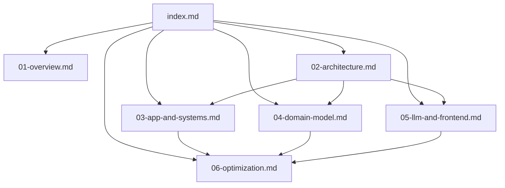
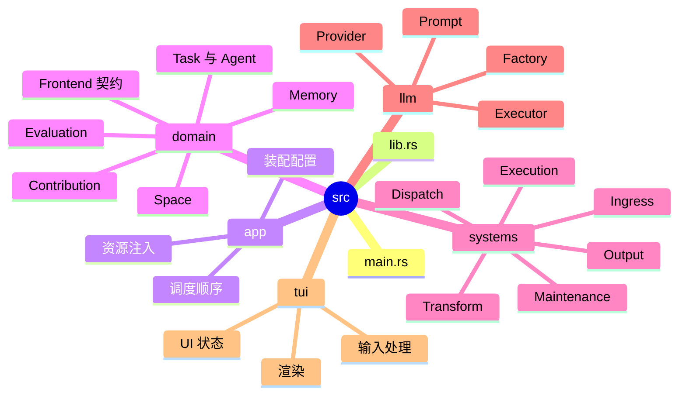

# AI Harness Wiki

## 文档导览

本目录用于记录 `Harness` 项目的代码级 Wiki，覆盖项目概述、架构设计、模块拆解与后续优化方向。

- [项目概述](./01-overview.md)
- [架构设计](./02-architecture.md)
- [应用装配与系统流转](./03-app-and-systems.md)
- [领域模型](./04-domain-model.md)
- [LLM 与前端适配](./05-llm-and-frontend.md)
- [待优化项](./06-optimization.md)

## 阅读顺序

建议按照以下顺序阅读：

1. 先看项目概述，建立整体认知。
2. 再看架构设计，理解分层、资源与主链路。
3. 然后阅读模块详解，进入具体实现。
4. 最后查看待优化项，明确当前代码的演进方向。

## Wiki 地图

## 代码目录映射

